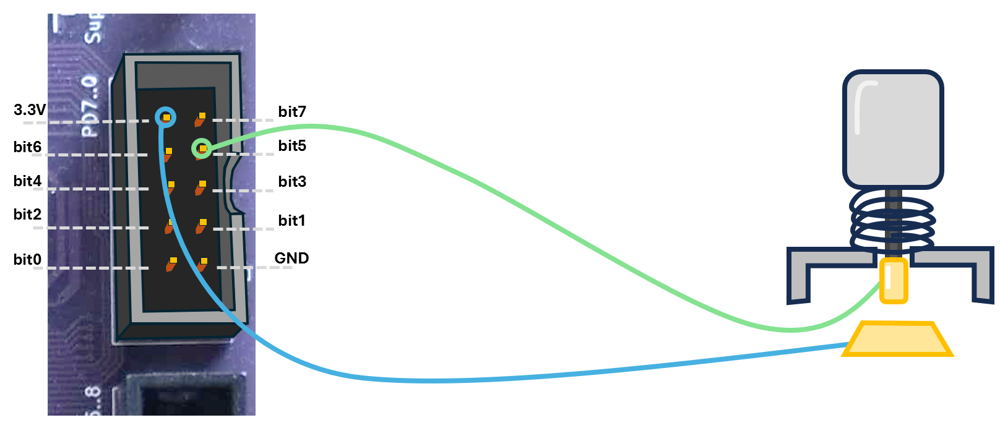
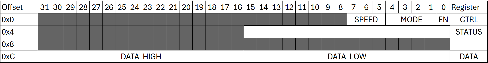
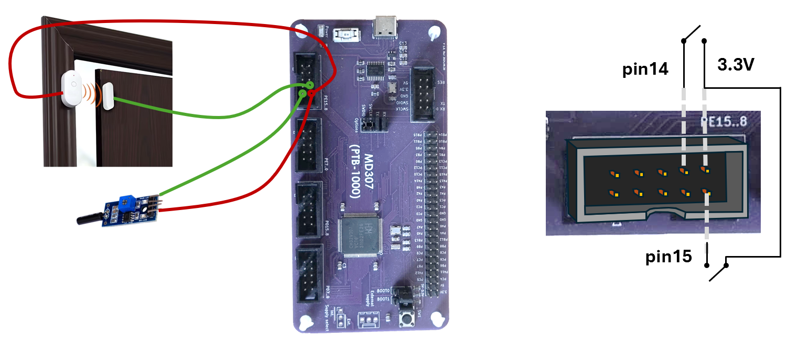

<!-- To generate html:
pandoc .\Exams\tenta_2026_03_14.md -o .\Exams\tenta.html --lua-filter=quickguide-generator/include-html.lua --standalone --css ../style.css
-->
<style>
body {
    max-width: none !important;
    font-size: 1.1em;
}
h1, h2, h3, h4, h5, h6 {
    font-size: revert;
}
h1 {
    background-color: #ffffff;
    color: #000000;
    padding: 0.4em 0.1em;
    border: none;
    font-size: 1.5em;
    border-bottom: 2px solid black;
}
h2 {
    font-size: 1.1em;

}
pre, code {
    background-color: #f2f2f2;
}
pre {
    padding: 0.4em 0.6em;
}
td pre {
    padding: 0.1;
    margin: 0.0 0.0;
    background-color: transparent;
}
td pre code {
    padding: 0.1em 0.1em;
    white-space: pre;
    background-color: transparent;
}
td:has(pre) {
    padding: 0.1rem 0.1rem;
}
table {
    width: 100% !important;
    table-layout: fixed;
}
</style>

# Uppgift 1 (-1.5 ... 9p) 
<!-- (Alignment) -->

**a)** Givet följande variabeldeklarationer i C kod:

```
char a; 
short b[5];
int c;
```

Välj det svar som i assembler-kod allokerar minnesutrymme för variablerna och förhindrar alignmentfel.
<br>(-0.5...3p)

## Svarsalternativ

<table width="100%">
<tr style="border-bottom: 1px solid black;">
<td>A</td><td>B</td><td>C</td><td>D</td><td>E</td><td>F</td>
</tr>
<tr>
<td>

```
.align 2
a: .space 1
.align 1
b: .space 10
c: .space 4

```

</td>
<td>

```
a: .space 1
.align 1
b: .space 10
.align 1   
c: .space 4

```
</td>
<td>

```
a: .space 1
.align 2
b: .space 10
.align 1 
c: .space 4

```

</td>
<td>

```
.align 2
a: .space 1
b: .space 10
.align 2
c: .space 4

```

</td>
<td>

```
a: .space 1
b: .space 10
.align 1
c: .space 4


```

</td>
<td>

```
.align 1
a: .space 1
.align 2
b: .space 10
.align 1
c: .space 4
```

</td>
</tr>
</table>

**b)** Följande variabler är deklarerade i C kod: 
<!-- (array offset calculation) -->

```
int i;
short arr[255];
```

och vi vill utföra följande tilldelningsoperation:


```
arr[i+1] = 0;
```

Vilken assembler-kod nedan implementerar det korrekt? (-0.5...3p)

## Svarsalternativ

<table width="100%">
<tr style="border-bottom: 1px solid black;">
<td>A</td><td>B</td><td>C</td>
</tr>
<tr style="border-bottom: 1px solid black;">
<td>

```
lw   t0, i
la   t1, arr
slli t0, t0, 1      
addi t0, t0, 1      
add  t0, t0, t1
sh   zero, 0(t0)
```

</td>
<td>

```
lw   t0, i
la   t1, arr
addi t0, t0, 1   
slli t0, t0, 2       
add  t0, t0, t1     
sh   zero, 0(t0)
```

</td>
<td>

```
lw   t0, i
la   t1, arr
addi t0, t0, 2
slli t1, t1, 1       
add  t0, t0, t1      
sh   zero, 0(t0) 
```

</td>
</tr>
<tr style="border-bottom: 1px solid black;">
<td>D</td><td>E</td><td>F</td>
</tr>
<tr>
<td>

```
lw   t0, i
la   t1, arr
addi t0, t0, 1       
slli t0, t0, 1       
add  t0, t0, t1      
sh   zero, 0(t0) 
```

</td>
<td>

```
lw   t0, i
la   t1, arr
slli t0, t0, 2      
addi t0, t0, 1      
add  t0, t0, t1
sh   zero, 0(t0)
```

</td>
<td>

```
lw   t0, i
la   t1, arr
addi t0, t0, 2       
slli t0, t0, 1       
add  t0, t0, t1      
sh   zero, 0(t0) 
```

</td>
</tr>
</table>


**c)** Följande variabler är deklarerade i C kod: 
<!-- (Load-Store and types) -->

```
unsigned int k;
signed char a[5];
unsigned short s;
```

och vi vill utföra följande tilldelningsoperation:

```
a[0] = k - s;
```
Vilket svarsalternativ nedan implementerar det korrekt i assemblerkod? (-0.5...3p)

<div style="page-break-after: always;"></div>
<!-- ERIK: Ändrade från "sbu" som inte finns till "sh" som också är fel-->

## Svarsalternativ

<table width="100%">
<tr style="border-bottom: 1px solid black;">
<td>A</td><td>B</td><td>C</td>
</tr>
<tr style="border-bottom: 1px solid black;">
<td>

```
lw   t0, k
lh   t1, s
sub  t2, t0, t1
la   t3, a
sb   t2, 0(t3)
```

</td>
<td>

```
lw   t0, k
lh   t1, s 
sub  t2, t1, t0
la   t3, a
sh   t2, 0(t3)
```

</td>
<td>

```
lw   t0, k
lw   t1, s 
sub  t2, t0, t1
la   t3, a
sw   t2, 0(t3)
```

</td>
</tr>
<tr style="border-bottom: 1px solid black;">
<td>D</td><td>E</td><td>F</td>
</tr>
<tr style="border-bottom: 1px solid black;">
<td>

```
lb   t0, k 
lhu  t1, s
sub  t2, t0, t1
la   t3, a
sw   t2, 0(t3)
```

</td>
<td>

```
lw   t0, k
lhu  t1, s
sub  t2, t0, t1
la   t3, a
sb   t2, 0(t3)
```

</td>
<td>

```
lw   t0, k
lh   t1, s 
sub  t2, t0, t1
la   t3, a
sh   t2, 0(t3)
```

</td>
</tr>
</table>

# Uppgift 2 (-2.5 ... 8p) 
<!-- (C->ASM ABI register use with functions, and a bit of stack) -->

**a)** Givet följande C kod:

```
int current_mA;
int load_mode;

int estimate_power_mW(int current_mA);
int calculate_factor(int load_mode, int base_power);
```

skall följande kod implementeras i assembler:

```
int compute_power_output(void) {
    int base_power_mW = estimate_power_mW(current_mA);
    int adjusted_power_mW = calculate_factor(load_mode, base_power_mW);
    return adjusted_power_mW * base_power_mW;
}
```

Välj det svarsalternativ nedan som implementerar `compute_power_output` korrekt i assembler (-1...3p).

## Svarsalternativ

<table width="100%">
<tr style="border-bottom: 1px solid black;">
<td>A</td><td>B</td><td>C</td><td>D</td>
</tr>
<tr style="border-bottom: 1px solid black; vertical-align: top;">
<td>

```
compute_power_output:
addi sp, sp, -8
sw   ra, 0(sp)

lw   a0, current_mA
call estimate_power_mW
sw   a0, 4(sp)

lw   a1, load_mode 
lw   a0, 4(sp)
call calculate_factor

lw   a1, 4(sp)
mul  a0, a0, a1

lw   ra, 0(sp)
addi sp, sp, 8
ret
```

</td>
<td>

```
compute_power_output:  
lw   a0, current_mA
call estimate_power_mW
sw   a0, 0(sp)     

lw   a0, load_mode
lw   a1, 0(sp)
call calculate_factor

lw   a1, 0(sp)
mul  a0, a0, a1

ret
```
</td>

<td>

```
compute_power_output:  
lw   a0, current_mA
call estimate_power_mW

mv   s0, a0        
lw   a0, load_mode
mv   a1, s0
call calculate_factor

mul  a0, a0, s0
ret

```

</td>

<td>

```
compute_power_output:
addi    sp, sp, -8
sw      ra, 0(sp)

lw      a0, current_mA
call    estimate_power_mW 
sw      a0, 4(sp) 

lw      a0, load_mode
lw      a1, 4(sp)
call    calculate_factor

lw      a1, 4(sp)
mul     a0, a0, a1

lw      ra, 0(sp)
addi    sp, sp, 8
ret
```
</td>

</tr>
</table>
<div style="page-break-after: always;"></div>

**b)** Vi vill implementera `apply_mask(int *array, int size, char mask)`-funktionen som applicerar en `mask` på **fjärde** byten (mest signifikanta byten) av varje element i `array`.
<!-- (C pointers) mostly arithmetic -->

Att applicera en mask är en enkel bitvis `AND`-operation.

Välj det svarsalternativ nedan som implementerar denna funktion korrekt (-1...3p).

## Svarsalternativ

<table width="100%">
<tr style="border-bottom: 1px solid black;">
<td>A</td><td>B</td>
</tr>
<tr style="border-bottom: 1px solid black;">
<td>

```
void apply_mask(int *array, int size, char mask) {
    for (int i = 0; i < size; i++, array++) {
        char *byte_ptr = (char *)(array + 3); 
        *byte_ptr &= mask;
    }
}
```

</td>
<td>

```
void apply_mask(int *array, int size, char mask) {
    for (int i = 0; i < size; i++) {
        char *byte_ptr = (char *)(array + i);
        byte_ptr[3] &= mask;
    }
}
```

</td>
</tr>

<tr style="border-bottom: 1px solid black;">
</tr>
<tr style="border-bottom: 1px solid black;">
<td>C</td><td>D</td>
</tr>
<tr style="border-bottom: 1px solid black;">
<td>

```
void apply_mask(int *array, int size, char mask) {
    for (int i = 0; i < size; i++) {
        char *byte_ptr = (char *)(array + i * sizeof(int)); 
        byte_ptr[3] &= mask;
    }
}
```

</td>

<td>

```
void apply_mask(int *array, int size, char mask) {
    char *byte_ptr = (char *)array;
    for (int i = 0; i < size; i++, byte_ptr++) { 
        byte_ptr[3] &= mask;
    }
}
```

</td>


</tr>
<tr style="border-bottom: 1px solid black;">
</tr>
</table>


**c)** Givet koden nedan: 
<!-- (C pointers and parameters) -->


```
void foo(int x, int *y) {
    x = x + 2;
    *y = *y + 3;
    y = &x;
    *y = 100;
}

int main() {
    int a = 5;
    int b = 5;

    foo(a, &b);

    printf("%d %d\n", a, b);
    return 0;
}
```

Vad kommer att skrivas ut? (-0.5...3p)

## Svarsalternativ

<table width="100%" style="border-collapse: collapse;">
<tr style="border-bottom: 1px solid black;">
<td style="border-right: 1px solid black; text-align: center;">A</td><td style="border-right: 1px solid black; text-align: center;">B</td><td style="border-right: 1px solid black; text-align: center;">C</td><td style="border-right: 1px solid black; text-align: center;">D</td><td style="border-right: 1px solid black; text-align: center;">E</td><td style="text-align: center;">F</td>
</tr>
<tr style="border-bottom: 1px solid black;">
<td style="border-right: 1px solid black;">

```
5 5
```

</td>
<td style="border-right: 1px solid black;">

```
7 8
```

</td>

<td style="border-right: 1px solid black;">

```
100 8
```

</td>

<td style="border-right: 1px solid black;">

```
5 100
```

</td>
<td style="border-right: 1px solid black;">

```
5 8
```
</td>
<td>

```
100 5
```
</td>

</tr>
</table>


<!-- 
*******************************************************************
************* Open questions **************************************
*******************************************************************
-->
<div style="page-break-after: always;"></div>

# Uppgift 3 (6p) 
<!-- (GPIO #define, GPIO config) -->

En knapp är kopplad till pin 5 i port D som visas på bilden nedan.

<center>

</center>


**a)** Skriv makrodefinitioner för registren `CFGLR`, `OUTDR` och `INDR` i GPIO port D. Skriv dessutom en makrodefinition för `OUTDR_LOW` som endast ger tillgång till bitar [0..7] i `OUTDR` registret. (2p)


**b)** Vilket GPIO-läge bör väljas för pin 5 i port D för att på ett tillförlitligt sätt läsa av knappens status? Motivera ditt svar i en eller två meningar. (Tips: Du kan rita en diagram om det hjälper.) (2p)

**c)** Konfigurera pin 5 i GPIO port D i det läge du valde i del **b)**. Konfigurationen av andra pins får inte ändras. (2p)


# Uppgift 4 (7p) 
<!-- (SysTick config, CMPLR calculation, wait loop) -->
Vi vill skriva en delay-rutin som kommer närmare en exakt delay genom att vi delar upp den i en konfigureringsfunktion och en delay funktion som sedan kan användas flera gånger. 

Antag en systemklocka på 144MHz. 

Ni får anta att makrodefinitioner för pekare till varje SysTick register (med namn enligt quickguiden) är givna. 

a) Skriv funktionen `void config_delay(int us)`, som konfigurerar SysTick för att räkna från 0 upp till det antal klockcykler som motsvarar `us` mikrosekunder. Denna funktion skall *inte* starta SysTick. (3p)
b) Skriv funktionen `void delay()` som startar SysTick, väntar tills den nått det angivna värdet, och sedan stannar klockan. Funktionen skall gå att kalla flera gånger, med samma delay som resultat. (3p)
c) Hur lång tid hade SysTick som mest kunnat räkna, om `STCLK` vore satt till noll, och `CNT` bara vore ett 16-bitars register (1p)? 


# Uppgift 5 (5p) 
Ett nytt peripheral har lagts till i MD307, med basadress 0xE0008000 och register layout som visas nedan. De gråmarkerade fälten får *inte* läsas eller skrivas. 



**a)** Skriv en struct-definition som ger tillgång till de tre registren `DATA`, `CTRL`, och `STATUS`, och visa hur din struct kan användas för att skriva till DATA registret (32 bitar). (3p)

**b)** Skriv en bitfältsdeklaration för `CTRL` registret som ger tillgång till `EN`, `MODE` och `SPEED` fälten. (1p)

**c)** Skriv en union som tillåter referens till `DATA_LOW` och `DATA_HIGH` fälten separat som 16-bitars värden, samt ger tillgång till hela 32-bitars registret `DATA`. (1p)

# Uppgift 6 (7p) 
<!-- (Interrupt, Vector table config, PFIC_IENx) -->
Två MD307-kort är anslutna via USART1-modulen. Ett kort samlar information från ljussensorer och skickar den till styrenheten som tar ett beslut om att stänga eller öppna persienner på en kontorsbyggnad. USART1 modulen är redan korrekt initialiserad och konfigurerad för att generera en interrupt när data tas emot (RXNEIE bit --- RX Not Empty Interrupt Enable --- i register `USAR1_CTLR1` är satt). En interrupthanterare, `usart_isr()`, är redan implementerad. 

Din uppgift är att konfigurera styrenheten så att ett interrupt från USART1 modulen kommer att exekvera `usart_isr()` funktionen.
Du kan utgå från att makrodefinitioner för pekare till alla nödvändiga register är givna, med namn enligt quickguiden. 

**a)** Konfigurera PFIC så att USART1 interrupt är aktiverat. (2p)

**b)** Färdigställ funktionen `init_interrupts` i assemblerkoden nedan så att så att processorn använder mode `01` (vektorerade insterrupts) och `mtvec` pekar på `vector_table`. (2.5p)

**c)** Färdigställ `vector_table` nedan så att den är korrekt konfigurerad för att hantera USART1 interrupt. (2.5p)
       <br>Hint: QuickGuiden innehåller information om lämpliga assemblerdirektiv, om du glömt dem. 

```
.section .text
.global init_interrupts
.extern usart_isr

init_interrupts: 
    <Din kod här>

.align 2
vector_table: 
    <Din kod här>
```
# Uppgift 7 (7p) 
<!-- (EXTI, AFIO_EXTICR, EXTI ISR) -->
Vi utvecklar ett hemlarmssystem. För att säkra dörrar har vi bestämt oss för att använda en magnetisk sensor som fungerar som en strömbrytare: när en dörr är stängd är strömbrytaren också stängd, när en dörr är öppen är strömbrytaren öppen. Dessutom är en vibrationssensor placerad på dörren för att förhindra att tjuvar skär ett hål i dörren utan att upptäckas. Elektriskt sett beter sig vibrationssensorn också som en strömbrytare: när rörelse sker stängs strömbrytaren. (Tänk dig en tråd upphängd med icke-ledande fjädrar i ett ledande hölje.)

<center>

</center>

Som ni ser på bilden ovan så är både den magnetiska sensorn och vibrationssensorn anslutna till GPIO port E. Den magnetiska sensorns utgång är ansluten till pin 14, och vibrationssensorns utgång är ansluten till pin 15.
PFIC och vektortabell är redan konfigurerade för att starta en interrupt handler när en extern interrupt sker på pin 14 eller 15 i port E.
Antag att makrodefinitioner för pekare till alla nödvändiga register är givna, med namn enligt quickguiden.
Antag också att MD307-kortet används för andra säkerhetskomponenter, och dina modifikationer får inte påverka dem.

**a)** Skriv koden för att initiera EXTI och AFIO_EXTICR så att interrupt genereras när den magnetiska sensorn eller vibrationssensorn detekterar intrång (3p)

**b)** Färdigställ interrupt handlern nedan så att den, vid detekterat intrång, anropar funktionen `sound_alarm(int source)` med rätt `source`-värde (1 för magnetisk sensor, 2 för vibrationssensor). (4p) 
```
__attribute__((interrupt("machine")))
void interrupt_handler() {
    <Din kod här>
}
```