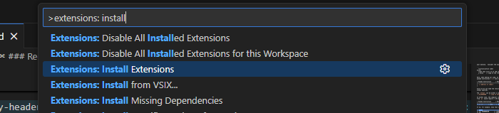
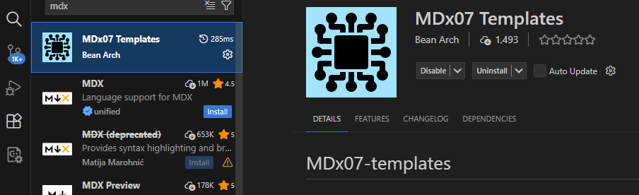
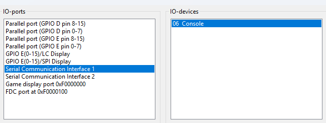
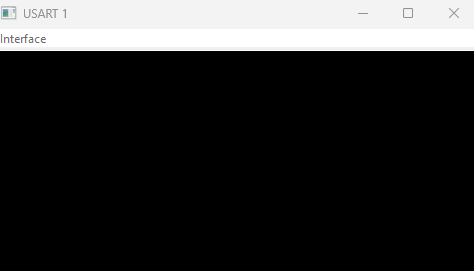
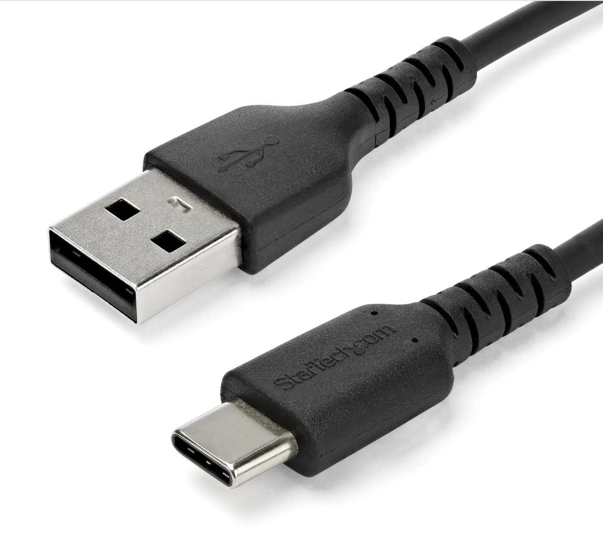
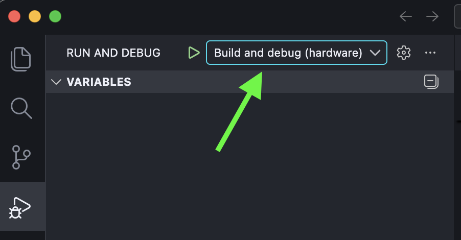

# Getting Started with Visual Studio Code <!-- omit in toc -->
These are the instructions for setting up the programming environment you will use throughout the course.
# Table of contents <!-- omit in toc -->
- [Setting up VSCode](#setting-up-vscode)
- [Creating a project](#creating-a-project)
- [Debugging with simulator](#debugging-with-simulator)
- [Debugging with hardware](#debugging-with-hardware)
  - [Windows](#windows)
  - [Linux](#linux)
  - [MacOS](#macos)
- [Turn off your AI "friend"](#turn-off-your-ai-friend)


# Setting up VSCode
* Install Visual Studio Code from [https://code.visualstudio.com/](https://code.visualstudio.com/).
    * ⚠️ Are you using Windows on an ARM computer? Pick the x64 user installer from here: https://code.visualstudio.com/download
* Launch Visual Studio Code.
* Bring up the command palette by pressing <kbd>Ctrl</kbd>+<kbd>Shift</kbd>+<kbd>P</kbd> (<kbd>Cmd</kbd>+<kbd>Shift</kbd>+<kbd>P</kbd> on Mac). Type and select "Extensions: Install Extensions"

<p align="center">
  
</p>

* Search for "MDx07 Templates" and install it.
<p align="center">
  
</p>

* **Install development tools**: Bring up the command palette again (<kbd>Ctrl</kbd>+<kbd>Shift</kbd>+<kbd>P</kbd>). Select "MDx07: Install MD307 Development Tools".
  * This will take a little while, and you should have at least 2GB of free space on your system harddisk.

# Creating a project

* Create a folder where you want your project code to reside. 
  * **Note**: It is easiest to avoid using a path that contains non ascii characters. If you really want to use such a path, see notes below. 
* Go the top menu and select "File → Open Folder..." and open this (empty) folder.

* **Create your project**: Once again bring up the command palette and select "MDx07: Initialize project". Then select "Basic Templates" and then "MD307 Assembly Project".

## If you have 'åäö' in your project path on Windows<!-- omit in toc -->

If you have any non-ascii-character like 'åäö' in your username, your "Documents" or "Desktop" paths will have that as well. This may cause problems in GDB. You can circumvent the problem either by creating your projects in directories without the problematic charachters (like "C:\MOP\") or by activating support for UTF-8 in paths: 

  1. Rightclick in your start-menu  →  Run
  2. Run intl.cpl
  3. Choose the tab Administrative.
  4. Choose Change system locale...
  5. Check the box "Beta: Use Unicode UTF-8 for worldwide language support".
  6. Press Ok and restart the computer.

# Debugging with simulator

* **Start the MD307 simulator**: In the command palette, select "MDx07: Launch Simserver". The Simserver window will now open. 
  * The first time you start simserver, choose "Server → Set Target..." from the menu, and select MD307
  * In the Simserver window, select "Server → IO Setup". 
    * Under "IO-Ports", select "Serial Communication Interface 1" and then select "06 Console" under "IO-Devices".
<p align="center">
  
</p>
    * Press the "Connect" button and then the "OK" button.
    * You should now see a little console window, like this: 
    
<p align="center">
  
</p>

* **Run a little program to make sure everything works**: 

   * Go back to Back to Visual Studio Code and press <kbd>F5</kbd> ("Start Debugging") and wait until the little yellow arrow appears at the first instruction.
   * Then, step through the instructions with <kbd>F11</kbd> ("Step Into") until you get a greeting on the console window.

If you have any problems, go to one of the exercise sessions and ask a TA to help you. Otherwise, you are done and can start the course!


# Debugging with hardware
If you wish to debug with the MD307 hardware on your own laptop, please note that it's still on a experimental stage! If it works, consider yourself lucky and maybe buy a lottery ticket!

⚠️ Always use a USB-A → USB-C cable. (USB-C → USB-C cable won't work due to a hardware design flaw.)

<p align="center">
  
</p>

Change debug configuration to "Build and debug (hardware)" (don't forget to change back next time switch to the simulator!)

<p align="center">
  
</p>

Next, follow the OS-specific instructions below.

## Windows
* Install the proper USB drivers by bringing up the command palette in VSCode and choose "MDx07: Install WCH-Link drivers (Windows only)"
* A dialogue will appear "Do you want to allow this app from an unknown publisher to make changes...". Press "yes"

A terminal window will appear and report whether the installation was successful or not.

## Linux
* Open a terminal and run the command
```sh
sudo adduser $USER dialout 
```
* Reboot your computer

## MacOS
Congratulations on your computer choice, it should work out of the box!

# Turn off your AI "friend"

Finally a word of advice. *If* you have GitHub copilot installed, it will immediately start "helping" you by suggesting the next instruction for you. This can be extremely useful for you in the future, when you know assembly programming well, but is disastrous for learning purposes. So (for your own sake) turn it off by unchecking the boxes in the image below.

<p align="center">
  
</p>


