# Inledande Övning 1 - Utvecklingsmiljön och Inledande Assemblerprogrammering
I den här övningen introduceras utvecklingsmiljön vi använder i kursen. Vi går igenom hur ni skriver och kör assemblerkod på MD307 (i simulatorn). Ni skall bekanta er med Visual Studio Code (hädanefter VSCode), som vi senare också kommer använda för utveckling i C.

## Skapa ett assemblerprojekt
Innan ni drar igång med den här övningen förväntas ni ha gått igenom Föreläsning 1, och sedan installerat simulatorn och VSCode enligt anvisningarna [här](https://www.cse.chalmers.se/edu/resources/mop/lecture_notes/introductory_exercises/Getting_Started_with_Visual_Studio_Code.html). Om ni inte startat om VSCode sedan installationen, gör detta nu (annars hittar inte VSCode's terminal GDB!) Starta sedan VSCode i ett nytt, tomt directory. Skapa ett tomt assemblerprojekt: 

* Tryck Ctrl+Shift+P (Cmd+Shift+P på mac) för att öppna kommandopaletten
* Skriv sedan "MDx07: Initialize Project" i textrutan

  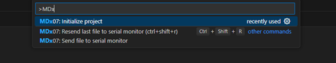

Så fort ni börjat skriva kommer alternativet att dyka upp. Kommandopaletten används till det mesta i VSCode, och vi kommer stöta på den igen senare i övningen. Tryck på `<enter>` för att välja kommandot och välj sedan foldern "Basic templates" och i denna “MD307 empty assembly project” för att initiera ett assemblerprojekt.
Ni skall nu se något i den här stilen på skärmen (om ni inte gör det så klicka på den inringade ikonen som öppnar "explorer" vyn): 

  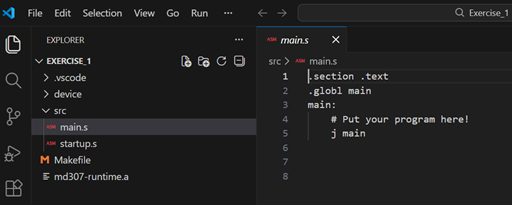

I listan till vänster ser ni alla filer som ligger i mappen där ni startade VSCode. Följande filer har skapats av initieringskommandot: 

* Underkatalogen `.vscode`: Denna innehåller inställningar för VSCode, och kan oftast ignoreras.
* Underkatalogen `device`: Innehåller konfigurationsfiler för vår utvecklingsmiljö. 
* Underkatalogen `src`: Här ligger assemblerkodfilerna som skall bli till ett program.
    * `main.s`: Det här är filen där ni skall skriva er kod. Från början innehåller den bara ett program som inte gör någonting.
    * `startup.s`: Den här filen innehåller lite initialiseringskod som körs innan varje program. Ni behöver inte bry er om den förrän i slutet av kursen. 
* `Makefile`: Detta är en textfil som beskriver hur programmet skall kompileras. Ni kommer lära er lite mer om kompilatorn senare i kursen. För tillfället kan ni låta den vara.
* `md307-runtime.a`: Det här är ett "runtime bibliotek", grundläggande funktioner som behövs för att C skall fungera. Vi pratar mer om det senare i kursen. 

## Stäng av din AI "kompis"
*Om* du har GitHub copilot installerat så kommer den omedelbart börja föreslå vilka instruktioner du skall skriva. Det här kan vara extremt användbart senare, när du kan assemblerprogrammering, men är katastrofalt dåligt när man skall lära sig. Så, för din egen skull, stäng av AI hjälpen genom att avchecka boxarna i bilden: 

  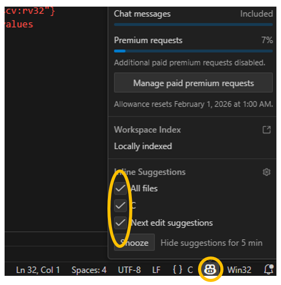

## Starta simulatorn
Eftersom ni inte har en MD307 till hands kommer ni att köra er kod på en simulator. Vi kompilerar och kör våra program precis på samma sätt som om koden körde på riktig hårdvara. Senare i kursen (Laboration 1) kommer ni lära er lite mer om hur detta fungerar och kommer få testa att köra er kod på riktig hårdvara. 
Allt ni behöver göra än så länge är att: 

* Starta simulatorn genom att trycka `Ctrl`+`Shift`+`P` -> "Launch Simserver..."

som genast lägger sig och väntar på att VSCode skall ladda upp ett program.

## Skriv och starta ett assemblerprogram
Ändra nu koden i `main.s` så att den ser ut så här:

  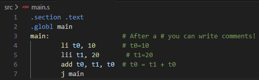

Vi har på mening skrivit en felaktig instruktion ("lii" är inte en RISC-V assembler instruktion) för att ni skall se hur VSCode hjälper er att upptäcka enkla misstag. Låt misstaget vara kvar och försök nu kompilera och köra programmet:

  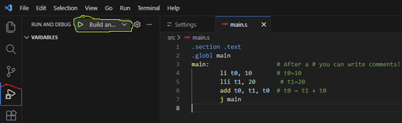

* Välj först "Build and Debug" vyn (ikonen är inringad i rött i bilden)
* Och tryck sedan på "Build and debug" knappen (ikonen är inrutad i grönt i bilden). Alternativt kan du bara trycka på "F5".

Kompilatorn kommer nu skriva ut en massa information i "terminal" fönstret, och kommer sedan poppa upp ett fönster: 

  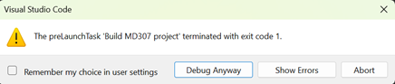

som berättar för dig att kompileringen misslyckades. Tryck på "abort". 

Titta på koden igen så ser du att VSCode har varit vänligt nog att visa för dig vad som gick snett:

  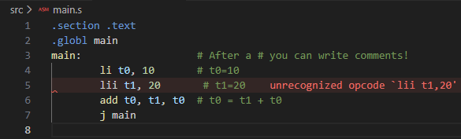

Oftast räcker den här informationen för att man skall se vad som gått snett, men ibland blir man tvungen att läsa igenom hela texten som kompilatorn spottade ur sig i "terminal" fönstret. 

I det här fallet visste vi ju redan vad som var fel, så fixa koden och tryck sedan på F5 för att bygga och köra programmet igen. 

Efter en liten stund kommer eran skärm se ut så här: 

  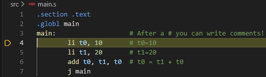

VSCode har nu kompilerat assemblerkoden till maskinkod och laddat upp den till simulatorn. Sedan instruerades simulatorn att starta programmet, men att avbryta ("break") så fort den kommit fram till funktionen "main". Den gulmarkerade raden visar nästa instruktion som kommer att köras. Vi skall nu stega igenom vårat lilla program och se vad som händer. 

Säg åt debuggern att exekvera den gulmarkerade instruktionen genom att trycka på "step into" knappen (eller trycka på F11): 

  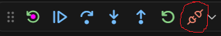

Instruktionen `li t0, 10` borde ha lagt värdet 10 i register `t0`. För att se om det verkligen hänt öppnar ni "Registers" fliken i "Build and Debug" vyn till vänster:

  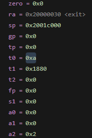

Här kan ni se värdet på alla processorns register, och i `t0` ligger mycket riktigt 0xa som är hexadecimalt för 10. Stega nu över nästa rad och kontrollera att register `t1` får värdet 0x14 (hexadecimalt för 20). Om ni stegar över nästa instruktion igen så kommer ni till `j main` instruktionen och nu kan ni se att `t0` fått värdet 0x1e d.v.s. 30 decimalt. Om inte `j main` instruktionen funnits hade all information om register och den gula raden försvunnit eftersom VSCode försöker visa nästa instruktion, men det då inte funnits någon nästa instruktion att visa.

När du vill avsluta programmet och återgå till att koda trycker du på "disconnect" knappen (eller Shift+F5):

  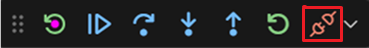

## Undersök minnet
Förutom att se registrenas värden när man debuggar kan det vara viktigt att se vad som ligger på en speciell plats i minnet. Lägg till några instruktioner som kopierar resultatet av vår addition till addressen 0x20001000 och kompilera och kör ditt program: 

  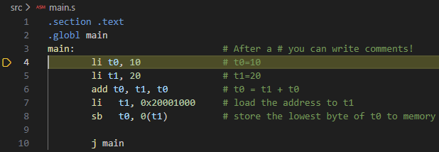

Programmet har stannat på första instruktionen som vanligt. Vi vill nu köra programmet till dess att `sb` instruktionen har exekverats. Vi kan förstås stega instruktion för instruktion, men det blir lätt tjatigt, om programmet är långt. Istället flyttar ni markören ner till `j main` instruktionen, och trycker på `F9` för att lägga till en brytpunkt (breakpoint). Vi kan nu låta programmet köra fritt (genom att trycka på "Continue" knappen eller `F5`), så kommer det att avbrytas igen när det når vår brytpunkt. Testa det:

  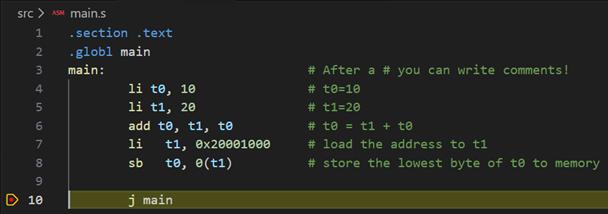

Processorn borde nu ha lagt ihop talen 10 och 20 och lagt resultatet på minnesaddressen 0x20001000. Undersök detta genom att öppna "memory" fliken i fönstret under koden (inrutat i grönt i bilden nedan):

  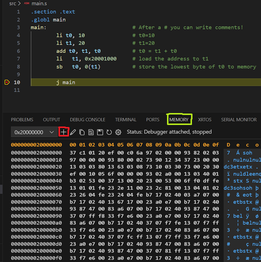

Vi vill undersöka minnet med början på address 0x20001000, så tryck på "Add new memory view" (inrutat i rött i bilden ovan) och skriv in 0x20001000 i fönstret som poppar upp.

  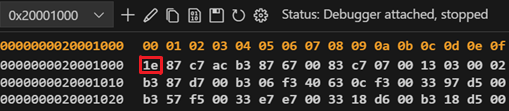

Minnet listas här med 16 bytes per rad, och vi kan se att på address 0x20001000 ligger mycket riktigt byten 0x1e, som är hexadecimalt för 30 (summan av vår addition).