# Inledande Övning 2 - Utveckling i C
I den här övningen skall vi gå vidare med Visual Studio Code och lära oss hur man kompilerar och kör ett C program på MD307, via simulatorn. Vi kommer sedan att ta en titt på hur man debuggar ett C program. Ni kommer att lära er hur man kan kombinera C och assembler, och slutligen skall vi testa att koppla in lite lampor till MD307:an och få dem att lysa. 

Innan ni börjar förväntas ni ha medverkat i lektionerna fram till Lektion 4 - *Portar och Introduktion till C*. Ni skall ha gjort Inledande Övning 1 - *Utvecklingsmiljön och Inledande Assemblerprogrammering* - så att ni har VSCode, kompilatorer, och simulator fungerande på er maskin. 

## Skapa ett C projekt
Vi skapar ett C projekt på samma sätt som vi tidigare skapat ett assemblerprojekt. Öppna VSCode i en tom mapp (*File → Open folder...*) och:

* Tryck <kbd>Ctrl</kbd>+<kbd>⇧</kbd>+<kbd>P</kbd> (<kbd>⌘</kbd>+<kbd>⇧</kbd>+<kbd>P</kbd> på Mac) och skriv sedan `MDx07: Initialize Project` i textrutan. Tryck return.
* Välj sedan `MD307 C Project` som template och tryck <kbd>enter↵</kbd>.

Precis som när vi startade ett assemblerprojekt så skapas nu ett gäng filer i mappen:

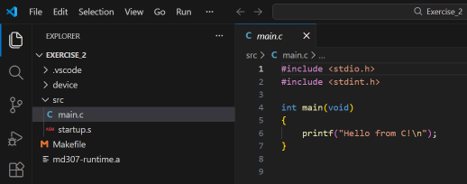

Filerna är desamma som förra gången, men istället för `main.s` finns nu en `main.c` fil. 

## Skriv ett första C program
**Starta simulatorn** (`MDx07: Launch simserver` i kommandopaletten), precis som när du tidigare arbetat med assembler. 

Knacka sedan in den här koden i main.c:
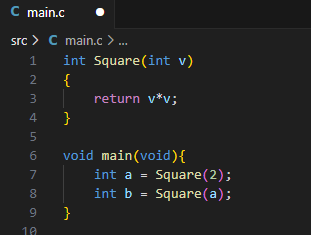

Titta på ditt program och se till att du förstår vad det borde göra (återvänd annars till lektionsanteckningarna). Sätt sedan en brytpunkt (<kbd>F9</kbd>) på rad 7 och tryck på <kbd>F5</kbd> för att kompilera och köra programmet.

Nu skall en bunt saker ha hänt. Först kompilerades programmet, och du kan se kompilatorns output i Terminal fönstret:

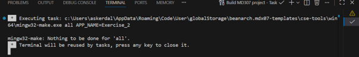

Du kan få en sammanfattning av kompilatorns output i "Problems" fliken: 

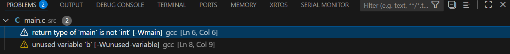

Och VSCode har till och med parsat texten och visar information om error och varningar direkt vid källkoden:

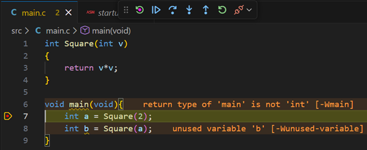

I det här fallet kompilerade programmet, men kompilatorn *varnar* om att variabeln `b` aldrig används till något. Normalt sett skulle det vara ett tecken på att vi gjort ett misstag, men i det här fallet är det okay. 

Vi ser också att programmet har startat, och sedan avbrutits på rad 7, precis som vi ville. 

Vi kan nu exekvera koden på rad 7 genom att trycka på <kbd>F10</kbd> (eller den inringade knappen i bilden nedan): 

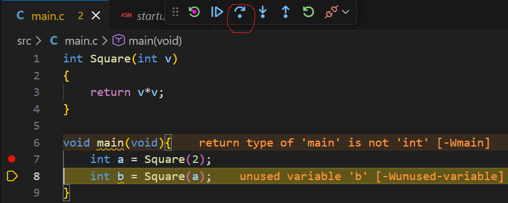

Vi ser nu att raden exekverats (nästa rad är gulmarkerad) och i listan till vänster kan vi se att variabeln a har fått värdet 4 (kvadraten av 2, som väntat). 

Vi skall nu testa att följa med debuggern *in* i funktionen Square. Detta gör vi genom att trycka på <kbd>F11</kbd>, eller på den inringade ikonen i bilden nedan:

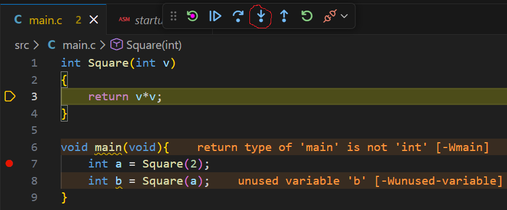

Om vi vill köra vidare tills funktionen returnerat och vi är tillbaks i den kallande funktionen kan vi fortsätta stega rad för rad med <kbd>F10</kbd>, eller så trycker vi direkt på <kbd>⇧</kbd>+<kbd>F11</kbd>, eller på den inringade ikonen i bilden nedan:

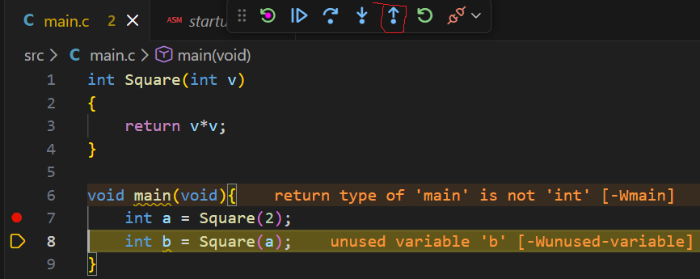

Debugkommandona sammanfattas i bilden nedan: 

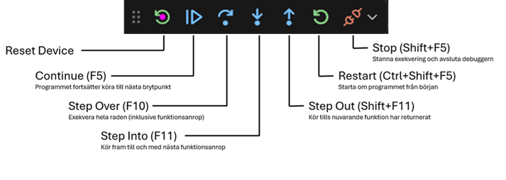

## Kombinera C och assembler
Vi skall nu utforska hur vi kan skriva en funktion i assembler och kalla den från ett C program. Vi börjar med att skapa en ny assemblerfil. Högerklicka på "src" mappen i Explorer-vyn till vänster och välj "New File...". Ge den nya filen namnet assembly.s: 

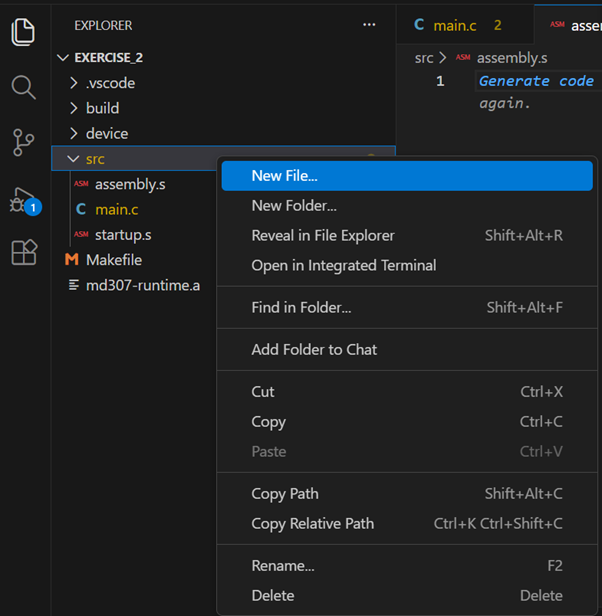

Filen kan egentligen heta vad som helst, så länge den har ".s" som extension. Makefilen kommer då att anta att detta är en assemblerfil, som skall länkas med projektet. 

Vi skriver nu en liten assemblerfunktion som tar en integer som argument och returnerar argumentet i kvadrat:

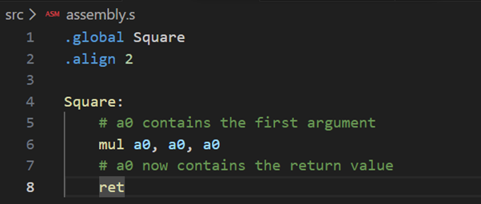

Ändra nu koden i main.c så att den bara deklarerar en funktion som heter Square (definitionen av funktionen är nu i eran assemblerfil):

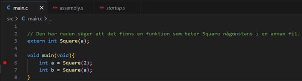

Ni kan nu starta programmet igen (<kbd>F5</kbd>) och stega er igenom det för att se att det fungerar. Om ni väljer "Step Into" när programmet är på rad 6 eller 7 kommer debuggern att låta er stega igenom assemblerkoden. 

Hittills har vi debuggat vårat program på källkodsnivå. Det är oftast vad man vill, men ibland kan det vara viktigt att se den faktiska maskinkoden och debugga den instruktion för instruktion. Starta om debuggern och, när den stannat vid första raden, tryck på höger musknapp någonstans i källkodsfönstret. I menyn som dyker upp väljer ni "Open Disassembly View". Nu öppnas ett nytt fönster där maskinkoden översatts till text:

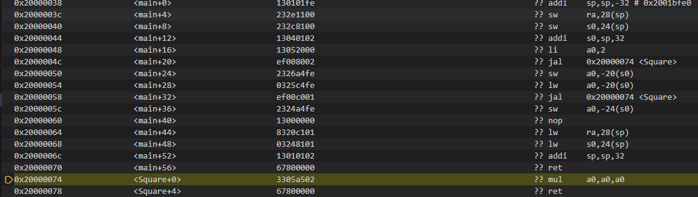

Ni kan använda debuggern precis som innan i denna vy. Pröva att stega er igenom koden.

## Kommunicera med en GPIO port
Vi skall nu testa att koppla en en "bargraph" till vår simulerade MD407:a. Bargraphen är en mycket enkel komponent där varje pinne på utporten är kopplad till en liten lysdiod. Börja med att öppna simserver och välj "IO Setup..." i menyn:

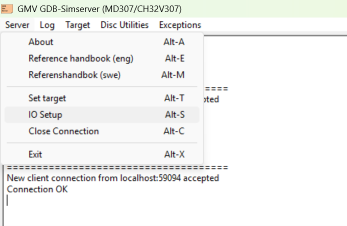

Sedan väljer ni att ni vill koppla in en "8-segment Bargraph" på GPIO port D, pinnarna 0-7. Tryck på "Connect" och sedan på "OK".

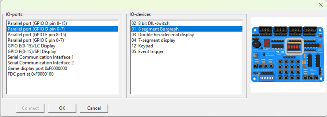

Nu skall ett litet fönster ha dykt upp där bargraphen simuleras. Skriv nu en liten assembler funktion (i assembly.s) som tar ett nummer som argument och tänder motsvarande lampa på bargraphen. 

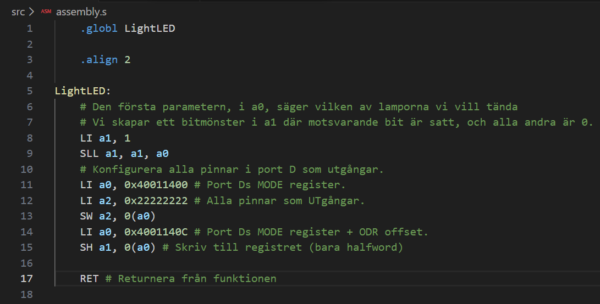

Sedan skriver vi kod i mainfunktionen som kallar den här funktionen en gång för varje lysdiod:

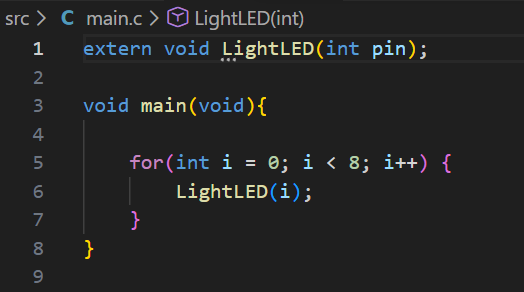

Starta nu programmet och stega er igenom koden och kolla så att lamporna lyser upp, en i taget.

## Hello World!
Slutligen skall vi testa att skriva ut lite text. Först måste vi koppla in en textkonsoll till simulatorn. Öppna fönstret för SimServer och välj "Server"→"IO Setup" i menyn. Välj sedan "Serial Communication Interface 1" som IO port och "06 Console" i listan till höger.

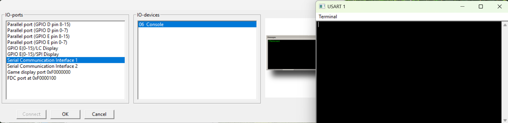

Skriv sedan in följande program i main.c:

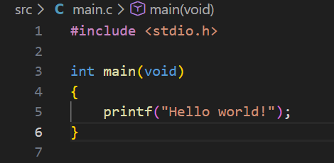

Och kör programmet. Ni skall nu se texten "Hello world!" skrivas till Konsollfönstret som i bilden ovan.  

