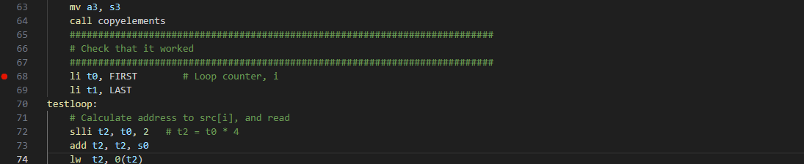
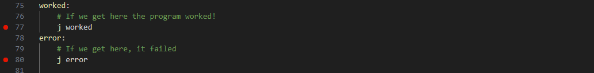
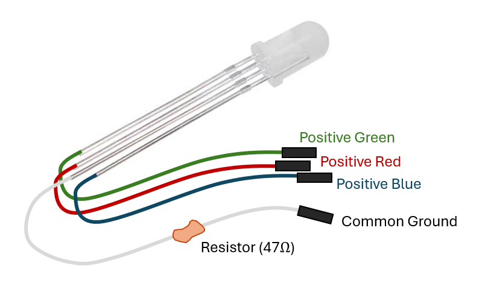
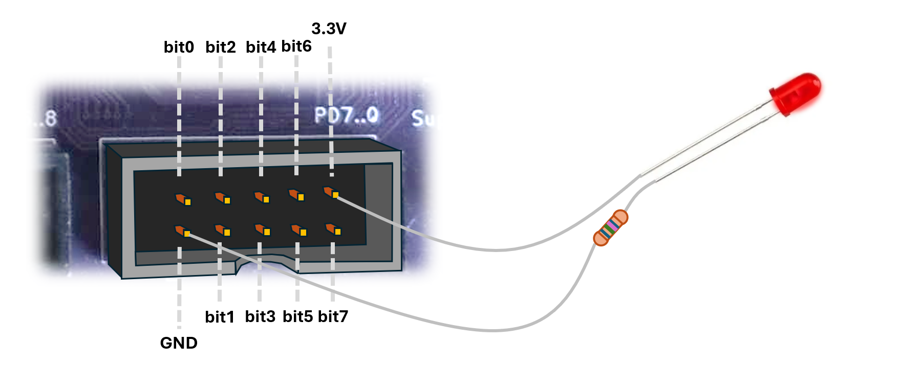
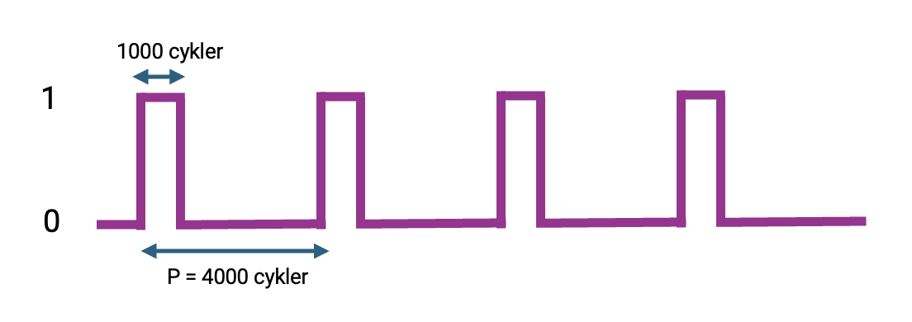

# Laboration 1

In this lab, you will finally get to run some code on, and connect rome real hardware to, the real MD307 microcontroller. By the time you take this lab you should know quite a lot about assembly programming on a RISC-V system, you should know the basics of how to put signals onto the GPIO pins, and you should be familiar with creating, compiling, and running an assembly program in the simulator environment. 

## Preparations
You MUST have done the preparation task for this lab, and have submitted your answers to Canvas. If you have not, this will take too much time so talk to a TA and see if there is room on a later Lab session. 

## Lab environment
**When connecting your MD307, make sure to connect the USB cable to the little usb hub behind the screen, *not* the screen itself.**

In all program development, but *especially* when you are programming close to the metal (machine oriented), it is essential to be able to run your program through a *debugger*. 

When you are ready to ship your program, you will compile it to an `.elf` file and use a tool to send it to your microcontrollers flash memory (so that it starts any time you turn the device on), but while developing the program, uploading, starting, and stopping is handled by the debugger. 

In this course, we do all development is *Visual Studio Code* (VSCode), and so far you have been running your programs on a simulator. From VSCode's point of view, the process is exactly the same. When you press `F5` to run the program, VSCode will start a `*GDB Client`. 

**Before you start, you have to install the mdx307 extension, and then CTRL+SHIFT+P -> "MDx07: Install Development Tools"**

GDB (GNU DeBugger) is a command line tool, and a protocol. In the good old days, you would start GDB from the command line and write things like: 

```
$ riscv32-unknown-elf-gdb excercise02.elf
GNU gdb ('riscv32-embecosm-gcc-win64-20230813') 14.0.50.20230813-git
Copyright (C) 2023 Free Software Foundation, Inc.
For help, type "help".
Reading symbols from excercise02.elf...
(gdb) target extended-remote localhost:1234
Remote debugging using localhost:1234
0x00000000 in ?? ()
(gdb) load
Loading section .text, size 0x3e6c lma 0x20000000
Loading section .eh_frame, size 0x3c lma 0x20003e6c
Loading section .data, size 0x5c lma 0x20003ea8
Start address 0x20000000, load size 16132
Transfer rate: 7876 KB/sec, 849 bytes/write.
(gdb) break assignment.s:20
Breakpoint 1 at 0x20000304: file src/assignment.s, line 22.
(gdb) continue
Continuing.
```

Sometimes we still have to use this command line tool (and it *is* worthwhile learning the basic commands) but in general we click buttons in VSCode and let VSCode turn that into text commands to talk to the debugger. 

The GDB client is connected via TCP to a GDB *server*. When we are using the simulator, `SimServer` (the simulator) is also our GDB server. When you press the play (▷) symbol, VSCode will turn that into gdb commandd, that are sent over TCP to the SimServer. It will first send the compiled `.elf` file into the microcontrollers SRAM, and then tell the SimServer to start executing the machine code.

When (like today) you are connecting the real hardware to the machine, you do not start a simulator. Instead you will start a program called `OpenOCD` (this is done automatically when you start your program). `OpenOCD` is a GDB server that talks GDB to VSCode on one end, and "forwards" commands over a USB cable on the other end. 


At the other end of the USB cable is your MD307. It has a little chip (the GDB Module in the image) that talks directly to the USB port. When it recieves a command on the USB port, it will translate this command into a serial protocoll that talks directly with the microcontrollers debug module. The details of this protocol are *way* out of scope for this course (and, unfortunately, proprietary) but it is important to understand this basic picture of how your program gets loaded into memory, started and stopped. 

From a practical perspective, there is very little difference between developing on the simulator and on the real hardware. Just open your program as usual, then press "Build and Debug" and then choose "Build and Debug (hardware)" from the dropdown list. 


After that (assuming that OpenOCD and necessary drivers are installed), you can set breakpoints, inspect memory and so on exactly like you do when using the simulator. 


## Lab Exercise 1 - Debug somebody else's code


> **Important:** You should spend a maximum of one hour on this exercise. If you get stuck at some point for more than 15 minutes, grab a TA --- they will guide you to the next step. It is important that you proceed to the second exercise within an hour.

Time to try it. Open an empty folder and do: `CTRL+SHIFT+P->MDx07: Initialize Project...->Lab Assignments->Lab 1->Assignment 1`. This code is an attempt at solving the same task as you solved for the preparation, but unfortunately whoever wrote this was not as bright as you and it is riddled with bugs!

In fact, if you try to run the code, it will just crash. So, start the program (`F5`, "build and run") and then slowly step through the program (use F11, "step into", rather than "F10, step over"). **Where did it crash** (it will probably just stop showing the yellow arrow that points to the next instruction)? 

Now stop the program (`Shift+F5`), and start again (`F5`). Step until you are at the instruction where it crashed last time (but don't execute it, or it crashes again). Look at the register values, in the "Variables->Registers" dropdown to the left. **Why will this instruction crash the machine**? Look at the surrounding code and you should be able to fix the first bug. Write down what it was, so you can show the TA.

If you run the program again it will still crash, but this time you should make it through the copyelements function. Place a breakpoint right after that function:

and run the program until you hit the breakpoint. Now keep stepping until you see where it crashes. **Where does it crash?** Restart the program and run to this line again. Look at the registers. Do the contents of the registers make sense? Where did they stop making sense (step through the program)? **Fix the bug.**

Now place breakpoints at both of these lines: 


Run the program again (`F5`) and when it breaks on the first instruction, continue (`F5`) and the program will stop at the second of those lines, so there are still problems!

Figure out why the program does not pass the test, then find a TA and show them your findings.

## Lab Exercise 2 - Let there be light!
Finally time to play with LED lights. In the box next to your MD307 you should have found a spider-like contraption looking something like this (or maybe just a single colored LED light with two legs): 


You next task is to make this light turn on. You can test it immediately by connecting the ground leg (the one with the resistor) to GND, and (one of) the other legs to 3.3V: 



But obviously, the goal is to control it from your program, so connect the anode to one of the GPIO pins instead (PD6 could be a good one). Open an empty folder and do: `CTRL+SHIFT+P->MDx07: Initialize Project...->Lab Assignments->Lab 2->Assignment 2`. There is not much code there, so it's up to you now. 

> ⚠️ **Important:** You will probably not have time to complete all of these assignments. It is much more important that you understand what you are doing than that you complete all the tasks.

### Task 1: Turn it on. 
You have seen this in the lectures and you might have done something very similar in exercises already. Configure your chosen pin as a Push-Pull, Output, pin and write a `1` to the corresponding bit in the `ODATA` register. 
Step through your code and make sure the light goes on when you expect it to. 

### Task 2: Make it blink
Write a little `delay` function that is just a for loop that keeps the machine busy for a while. Then write a loop where you: 
```
    Turn the light on
    delay
    Turn the light off
    delay
    repeat
```

### Task 3: Making it pulsate...
Now we want the light to go from off, to stronger and stronger. But how can we do that when all we can do is turn it on or off? We will use a trick call *Pulse Width Modulation* (PWM). The idea is that we divide time into a very short interval, just a few thousand clock-cycles (4096 will work pretty well). We will call this time interval a *period* (P). Then we say that the light will be *on* for a part of this interval (0-100%, we call this the *duty cycle*) and off for the remainder of the interval. 

In other words, we make the lamp blink very very quickly. If our period is short enough, we will not percieve this as blinking; we will just see the light glowing with different strength. With a low duty cycle (say, 10% or 400 cycles), it will be very dim, and with a high duty cycle it will shine brightly.



Start by making the light glow dimly, with a low duty cycle, and then try to write a loop where you increase the duty cycle gradually until you hit max. In pseudo code: 

```
duty cycle = 0
loop: 
    increase duty_cycle
    if duty_cycle > 4096, set to 0
    for i = 0 to 4096: 
        if i < duty_cycle: 
           light should be on
        else 
           light should be off
    jump to loop
```

### Task 4: RGB Lights!
If you have made it this far, great work! If you have time to complete this task as well, **wow!** Go find the TA and ask for an RGB LED, if you don't have one already. Then connect it and make it pulsate with all the colors of the rainbow. Then record it and show your lecturer for a gold star sticker[^1].

[^1]: The gold star has no monetary value and does not affect your grade. It might also be a virtual gold star sticker if I cannot find a real one. 

### Task 5: Getting Approved

After thoroughly testing and verifying that your program works as expected,
demonstrate your solution to a TA. Show them that the program works. Explain the
bugs you found and how you fixed them. Answer any questions they may have.

***If you are approved by the TA, it is YOUR responsibility to verify that it
has been documented in Canvas under 'Grades'. Do so before leaving!***
