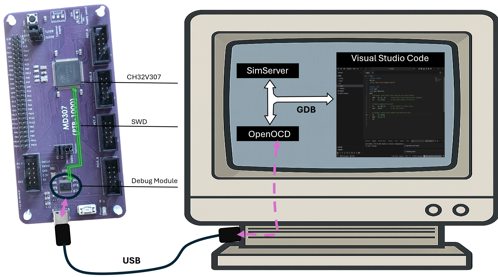
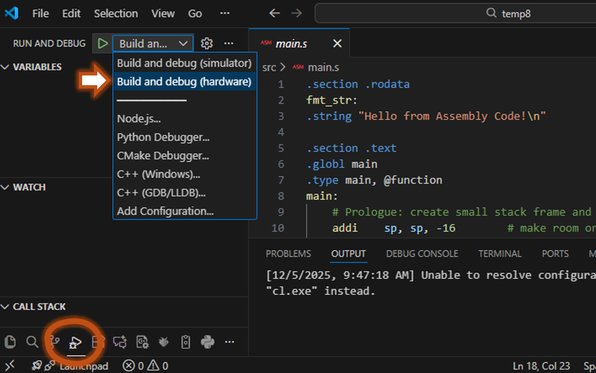

# Laboration 1

In this lab you will finally get to run some code on, and connect rome real hardware to, the real MD307 microcontroller. By the time you take this lab you should know quite a lot about assembly programming on a RISC-V system, you should know the basics of how to put signals onto the GPIO pins, and you should be familiar with creating, compiling, and running an assembly program in the simulator environment. 

## Preparations
You MUST have done the preparation task for this lab, and have submitted your answers to Canvas. If you have not, this will take too much time so talk to a TA and see if there is room on a later Lab session. 

## Lab environment
In all program development, but *especially* when you are programming close to the metal (machine oriented), it is essential to be able to run your program through a *debugger*. 

When you are ready to ship your program, you will compile it to an `.elf` file and use a tool to send it to your microcontrollers flash memory (so that it starts any time you turn the device on), but while developing the program, uploading, starting, and stopping is handled by the debugger. 

In this course, we do all development is *Visual Studio Code* (VSCode), and so far you have been running your programs on a simulator, but from VSCode's point of view, the process is exactly the same. When you press `F5` to run the program, VSCode will start a `*GDB Client`. 

GDB (GNU DeBugger) is a command line tool, and a protocol. In the good old days, you would start GDB from the command line and write things like: 

```
$ riscv32-unknown-elf-gdb excercise02.elf
GNU gdb ('riscv32-embecosm-gcc-win64-20230813') 14.0.50.20230813-git
Copyright (C) 2023 Free Software Foundation, Inc.
For help, type "help".
Reading symbols from excercise02.elf...
(gdb) target extended-remote localhost:1234
Remote debugging using localhost:1234
0x00000000 in ?? ()
(gdb) load
Loading section .text, size 0x3e6c lma 0x20000000
Loading section .eh_frame, size 0x3c lma 0x20003e6c
Loading section .data, size 0x5c lma 0x20003ea8
Start address 0x20000000, load size 16132
Transfer rate: 7876 KB/sec, 849 bytes/write.
(gdb) break assignment.s:20
Breakpoint 1 at 0x20000304: file src/assignment.s, line 22.
(gdb) continue
Continuing.
```

Sometimes we still have to use this command line tool (and it *is* worthwhile learning the basic commands) but in general we click buttons in VSCode and let VSCode turn that into text commands to talk to the client. 

The GDB client is connected via TCP to a GCB *server*. When we are using the simulator, `SimServer` (the simulator) is also our GDB server. When you press the play (▷) symbol, VSCode will turn that into gdb commandd, that are sent over TCP to the SimServer. It will first send the compiled `.elf` file into the microcontrollers SRAM, and then tell the SimServer to start executing the machine code.

When (like today) you are connecting the real hardware to the machine, you do not start a simulator. Instead you will start a program called `OpenOCD` (this is done automatically when you start your program). `OpenOCD` is a GDB server that talks GDB to VSCode on one end, and "forwards" commands over a USB cable on the other end. 



At the other end of the USB cable is your MD307. It has a little chip (the GDB Module in the image) that talks directly to the USB port. When it recieves a command on the USB port, it will translate this command into a serial protocoll that talks directly with the microcontrollers debug module. The details of this protocol are *way* out of scope for this course (and, unfortunately, proprietary) but it is important to understand this basic picture of how your program gets loaded into memory, started and stopped. 

From a practical perspective, there is very little difference between developing on the simulator and on the real hardware. Just open your program as usual, then press "Build and Debug" and then choose "Build and Debug (hardware)" from the dropdown list. 



After that (assuming that OpenOCD and necessary drivers are installed), you can set breakpoints, inspect memory and so on exactly like you do when using the simulator. 


## Lab Exercise 1 - Debug somebody else's code
Time to try it. Open an empty folder and run `CTRL+SHIFT+P->MDx07: Initialize Project...->Basic Templates->MD307 Assembly project`. Remove everything in main.s and replace with this code: 

```
```