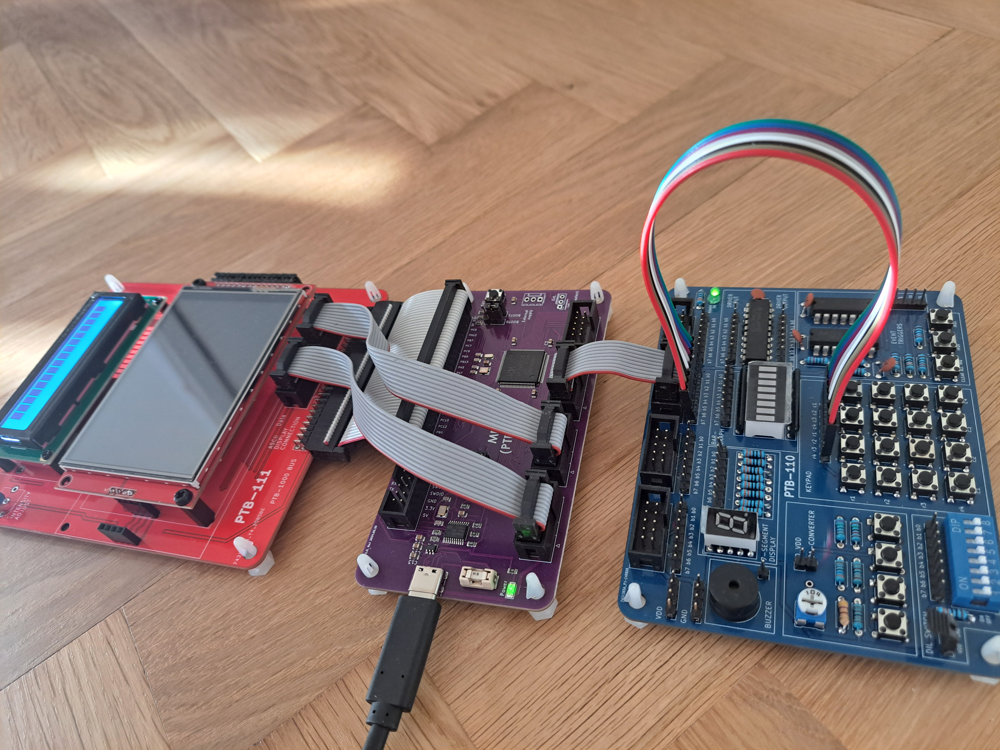
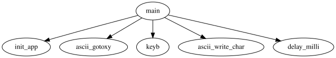
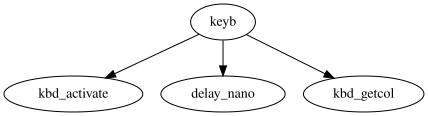
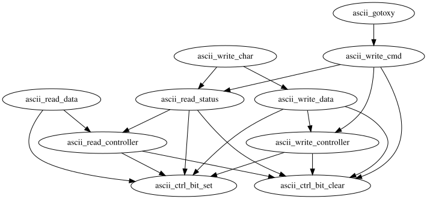

# Laboration 2

I denna laboration får du köra och felsöka ett C-program på riktig hårdvara.

## Förberedelser

Du *måste* ha gjort de förberedande upggifterna ("Laboration 2 – förberedelse" på Canvas) för denna laboration. Om
du inte har gjort det kommer du troligtvis inte att hinna slutföra laborationsuppgiften i
tid.

## Laborationsmiljö

Laborationsmiljön är densamma som i föregående laboration (MD307 + VSCode), med
tillägg av lite kringutrustning:

* PTB-110, med en keypad, en DIL-switch, ett bargraph och ett 7-segmentsdisplay
* PTB-111, med en ASCII-display och en grafisk display

Denna laborationsuppgift kommer huvudsakligen att behandla keypaden och ASCII-displayen.
DIL-switchen kommer att användas för felsökningsändamål.

## Uppgift 0: Komma igång

Skapa en ny projektmapp och initiera ett projekt med mallen `Lab2`
(<kbd>Ctrl</kbd>+<kbd>⇧</kbd>+<kbd>P</kbd> → MDx07: Initialize project → Lab Assignments → Lab2).

Anslut *keypaden* till *Port D 15..8*. Anslut *PTB-111* till *MD307* via
PTB-1000-bussen. Anslut *ASCII-displayen* till *Port E* (*Data* till *15..8*,
*Control* till *7..0*).

Anslut slutligen *MD307* till din dator via USB. Till slut bör det se ut ungefär så här:



Det förväntade beteendet är att programmet ska skriva ut tecken från vänster till
höger på den översta raden på ASCII-displayen när du trycker på tangenter på keypaden.
När slutet av raden nås ska det börja om från början av raden och skriva över befintliga
tecken. Tabellen nedan visar vilka tecken som ska skrivas ut när man trycker på
motsvarande tangent på keypaden (t.ex. ska tangenten längst upp till vänster skriva
ut `1`, och tangenten längst ned till höger ska skriva ut `D`).

```
|---|---|---|---|
| 1 | 2 | 3 | A |
|---|---|---|---|
| 4 | 5 | 6 | B |
|---|---|---|---|
| 7 | 8 | 9 | C |
|---|---|---|---|
| E | 0 | F | D |
|---|---|---|---|
```

Dags att köra programmet. Gå till vyn *Run and Debug* (<kbd>Ctrl</kbd>+<kbd>⇧</kbd>+<kbd>D</kbd>), välj
*Build and debug (hardware)* i rullgardinsmenyn och tryck på *Start Debugging*
(<kbd>F5</kbd>).

När debuggern automatiskt har stannat i början av `main`, tryck på
*Continue* (<kbd>F5</kbd>) och testa om programmet beter sig som förväntat.

*Åh nej! Det funkar inte!*

Som tur är *älskar* du att fixa trasig programvara.

**I denna laboration, precis som i den föregående, kommer du först att felsöka ett befintligt program och sedan prova ditt eget om du har tid kvar. Endast den första delen är nödvändig för att bli godkänd på laborationen.**

## Uppgift 1: Fixa programmet

Programmet är fullt av buggar. Med tanke på din bekantskap med liknande kod från
den förberedande uppgiften *kan* det vara möjligt att helt enkelt läsa koden från
början till slut och åtgärda alla buggar utan att köra den, men gör inte det!
Poängen är att du ska lära dig att felsöka ett program på ett *strukturerat*
sätt. Som du kanske redan har märkt är felsökning (att fixa buggar) vanligtvis en mycket mer tidskrävande del av mjukvaruutveckling än att faktiskt skriva koden.
Problemet bör *inte* angripas genom att försöka lära sig att skriva felfri kod från
start – det är ouppnåeligt. Istället bör man lära sig att hitta buggar effektivt –
när buggen väl är lokaliserad är lösningen vanligtvis uppenbar.

*OBS*: *När man felsöker kod (särskilt kod skriven av någon annan) kan det vara
frestande att korrigera mindre viktiga saker (som hur koden är formaterad), men*
***avstå*** *från att göra det! Vid felsökning är det användbart att kontrollera*
***exakt*** *vilka ändringar som har gjorts i källkoden (handledarna kan vilja göra
detta om du stöter på problem), och en massa irrelevanta ändringar gör det svårare.*

Nu ska vi titta på programmet uppifrån och ned med start från `main`, bara ett steg ned i
anropshierarkin:



Vi börjar med initieringen. Om GPIO-portarna är felaktigt konfigurerade kommer det
att vara svårt att testa programmet. Så låt oss börja där.

### Uppgift 1.1: Kontrollera GPIO-portarna

**OBS**: *Du kan anta att definitionerna i header-filen `gpio.h`, som
inkluderar port-makrona, är korrekta. Du behöver inte kontrollera dessa.*

Börja med keypaden (ansluten till *Port D 15..8*); kom ihåg att de övre fyra pinnarna (*15..12*) ska konfigureras som *digital output (open drain, 2
MHz)* och de fyra nedre pinnarna (*11..8*) som *digital input (pull up)*.

Konsultera QuickGuide och härled noggrant vilka värden som ska skrivas till vilka register för att denna konfiguration ska fungera.

Titta på koden i `init_keypad` och se om du kan hitta buggarna. Om du hittar
dem, modifiera koden och notera dina korrigeringar. Om inte, konsultera en handledare.

**Innan du går vidare:** Du måste *väldigt* säker på din visuella inspektion du gjort ovan.
De kommande uppgifterna förlitar sig på korrekt konfigurerade GPIO-pinnar – om
du har gjort ett misstag kan du komma att slösa värdefull tid. Du kan be en handledare att verifiera att din nya konfiguration är korrekt, om du vill.

För att spara tid behöver du inte bry dig om att kontrollera `init_ascii` –
den är korrekt implementerad.

Nu när du har modifierat koden bör du kompilera om projektet, köra
programmet och kontrollera om det fungerar som avsett.

*Huh, programmet fungerar fortfarande inte!*

Fördröjningsfunktionerna används i de flesta delar av programmet, så låt oss
kontrollera dem härnäst.

### Uppgift 1.2: Kontrollera fördröjningsfunktionerna

Ta en titt i filen `systick.c`. Det verkar som att `delay_milli`, `delay_micro` och
`delay_nano` alla i grunden är kopior av varandra, där den enda skillnaden är den
initiala beräkningen av variabeln `count`.

Om fördröjningsfunktionerna hade definierats i termer av varandra på något rimligt
sätt hade det räckt med att testa en av dem för att verifiera korrektheten hos alla.
Det är dock inte fallet, så vi är tvungna att testa var och en separat. Låt oss inte
bry oss om matematiken i den initiala beräkningen; istället utformar vi ett enkelt
test (det hade vi ändå behövt göra) och hanterar problemet om testet misslyckas.

Vi kan använda debuggern för att stega över en fördröjningsfunktion och mäta hur
lång tid den tar att slutföra. Lägg till koden nedan i början av `main`.

```c
#define MS 0 // Change the number to something reasonable!
  delay_milli(MS);
  delay_micro(1000 * MS);
  delay_nano(1000 * 1000 * MS);
```

Försök att tänka på ett rimligt målvärde för testet och ändra definitionen av `MS`
i enlighet med det. Tänk på att du måste mäta det manuellt med ett stoppur på din
telefon eller liknande. Om målet är för kort kommer din reaktionstid (att märka att
debuggern stannade och faktiskt stoppa tidtagningen) att vara för stor och göra
testet oanvändbart. Om målet är för långt kan du bli alltför uttråkad för att
faktiskt slutföra testet.

För var och en av fördröjningsfunktionerna, använd debuggern för att *Step Over*
(<kbd>F10</kbd>) och registrera hur lång tid det tar att slutföra steget.

Var fördröjningarna rimligt noggranna? Om någon av fördröjningarna avvek för
mycket, rätta till beräkningen och testa den igen för att verifiera korrektheten.

Notera dina korrigeringar, om sådana finns. Ta bort testkoden och kontrollera
om programmet fungerar nu.

*Ugh! Fortfarande trasigt.*

Koden för *ASCII-displayen* är ganska komplex och beror på indata från
*keypaden*. Om vi har tur behöver vi bara åtgärda koden för *keypaden!*

### Uppgift 1.3: Kontrollera keypaden

Om vi återigen tittar på anropshierarkin från tidigare märker vi att det enda
*keypad*-relaterade anropet i `main` är till `keyb`.

Sätt en brytpunkt vid anropet till `keyb`, starta programmet och *Continue* (<kbd>F5</kbd>)
för att komma till brytpunkten. Håll ned en av knapparna på *keypaden* och
*Continue* (<kbd>F5</kbd>). Kontrollera returvärdet. Är det vad du förväntade dig? Fortsätt
prova olika indata tills du har hittat ett indata som ger ett felaktigt returvärde.

För att få en bättre bild av situationen, låt oss titta på anropshierarkin nedan
med start från `keyb`.



Som tur är inte den särskilt komplex. Du kan ignorera anropet till `delay_nano` –
det behöver vara där för att ge tillräckligt med tid för radaktiveringen att få
effekt. Det lämnar oss med `kbd_activate` och `kbd_getcol`.

Använd debuggern för att *Step Into* (<kbd>F11</kbd>) `keyb`. Sätt brytpunkter på
return-satserna. Håll ned en knapp som tidigare gav ett felaktigt returvärde och
*Continue* (<kbd>F5</kbd>). Uppfyller värdena för variablerna `row` och `col` dina
förväntningar? Svaret bör ge dig en ledtråd om buggen ligger i `kbd_activate`
eller `kbd_getcol`.

Gå djupare in i anropshierarkin baserat på dina fynd. Stega noggrant igenom
funktionen och korrigera eventuella buggar du stöter på. Om du fastnar, be en
handledare om hjälp.

Efter eventuella korrigeringar, gå tillbaka och testa `keyb` igen och verifiera
att den returnerar de värden du förväntar dig.

Notera dina korrigeringar, håll tummarna och kontrollera om programmet fungerar.

*Nej... nej, nej, nej!*

Du vet vad det innebär. Vi får äntligen nöjet att felsöka *ASCII-display*-koden.

### Uppgift 1.4: Kontrollera ASCII-displayen

Om vi återigen tittar på anropshierarkin från `main` ser vi två anrop relaterade
till *ASCII-displayen*, nämligen `ascii_gotoxy` och `ascii_write_char`. Låt oss
titta på deras anropshierarkier (exklusive fördröjningsfunktioner, eftersom du
redan har åtgärdat dessa) nedan.



Den här är lite mer komplex men fortfarande hanterbar. Det finns många inkommande
pilar i det nedersta lagret, d.v.s. många anrop görs till `ascii_ctrl_bit_set`
och `ascii_ctrl_bit_clear`. Om de inte fungerar kommer inte heller de som beror
på dem att fungera.

Låt oss därför arbeta oss upp nerifrån, kontrollera lagren ett i taget och
testa programmet efter varje buggfix tills programmet fungerar.

Eftersom funktionerna i det nedersta lagret (definierade som makron i `ascii.h`)
bör ha motsatta effekter kan vi enkelt testa dem med koden nedan.

```c
  *GPIO_OUTDR(GPIO_E) = 0;
  ascii_ctrl_bit_set(1 << 7);
  unsigned char ctrl = *GPIO_OUTDR(GPIO_E);
  // Check here that bit 7 of ctrl is set
  ascii_ctrl_bit_clear(1 << 7);
  ctrl = *GPIO_OUTDR(GPIO_E);
  // Check here that bit 7 of ctrl is cleared
```

Stega igenom koden med debuggern, kontrollera om det uppstår oväntat beteende och
åtgärda och dokumentera eventuella buggar du stöter på.

Från och med nu får ni jobba på egen hand! Använd det ni har lärt er för att systematiskt felsöka nästa lager.

*Ledtråd: Det finns en bugg per lager i de två nedersta lagren. Förutom dessa
två buggar finns det inga fler buggar att hitta.*

### Uppgift 2: Prova ditt eget program

Om du har tid kvar, prova ditt eget program från laborationsförberedelsen. Det kan
hända att hårdvaran är mindre förlåtande än simulatorn och att du behöver göra en
del ytterligare felsökning för att få det att fungera, men nu är du bra på det!

### Uppgift 3: Bli godkänd

Visa handledaren de buggar du hittade och demonstrera att det korrigerade programmet
fungerar som avsett. Om du även fick din egen kod att fungera, visa det för
handledaren också.

*När du har blivit godkänd av handledaren är det DITT ansvar att verifiera att
det faktiskt har lagts in i Canvas under "Omdömen" / "Grades". Gör det innan du lämnar salen!*
