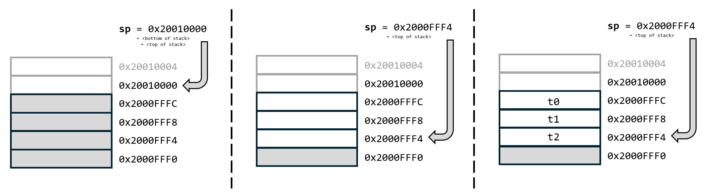

# Jumping around

**Links:**
https://projectf.io/posts/riscv-cheat-sheet/

**Text and excercises in the Workbook (Arbetsboken)**
Chapter 1, Pages 34-

**Things that are in the Workbook that should possibly be in this lecture**
Sign Extension

**Notes:** Try to make it the goal of this lecture to call a C function.

> *"I came to get down, I came to get down
> So get out your seat and jump around"*
>
>  -- House of Pain, 1992

This lecture will focus on *Program Control Flow*, i.e., how to make jumps in our code, call subroutines, and make function calls. This will include using the ABI conventions for function parameters and return values, understanding how the *stack* works, and how to deal with *register spilling* (i.e., what to do when we do not have enough registers).


## Jump and Link
There are only two instructions in RISC-V that perform unconditional jumps (`jal` and `jalr`). These are used for a number of pseudoinstructions that make the code easier to read. The table below describes these two instructions.

| Instruction | Mnemonic            | Meaning                                      |
|------------------|----------------|----------------------------------------------|
| `jal ra, offset` | Jump And Link  | Store return address in `ra`.                |
|                  |                | Jump to `pc + offset`.                       |
|                  |                | `offset` must fit in 20 bits                 |
| `jalr ra, offset(rs)` | Jump And Link Register | Store return address in `ra`    |
|                       |                        | Jump to `rs + offset`           |

The word "Link" in these mnemonics means that we store the return address, so that we can return from the jump later.

There are two versions of the jump and link instruction because the simpler one, `jal`, only allows us to jump a certain offset (which is limited to +/- 1MB) [^1] from the current value of `pc`. Since our SRAM (where the code normally resides) is only 64KB in size, that is not normally a problem for us. However, if we need to jump to code in FLASH memory, the distance would be too far for `jal` so we must put our address into a separate register, and then use `jalr`, instead. There are other reasons for using `jalr` which we will encounter shortly.

[^1]: 💡 **Note:** *If you are very awake, you might have noticed that a 20-bit offset should only allow us to jump +/- 0.5MB. However, since all instructions are guaranteed to be 2-byte aligned, the offset in the machine instruction is multiplied by 2 before being added to `pc`.*

### Jump
Sometimes, all we want to do is jump to some other part of the code. Let's say you want to make an LED lamp blink continuously as soon as you start your machine.  Consider the example below:

```
  <initialization code>
blink:
  <code that turns on an LED lamp, waits 1 second, turns it off, waits 1 sec>
  j blink    // Jump to the "blink" label
```

Here, when making our jump, we have no interest in what the return address is (so we do not need "Link") but the assembler will still translate this pseudo instruction (`j`) into the real instruction (`jal`):

| Instruction      | Mnemonic | Implementation     |
|------------------|----------|--------------------|
| `j offset`       | Jump     | `jal zero, offset` |

Since we do not need the return address for this pseudo instruction, `jal` simply stores it into the `zero` register (writes to `zero`, or `x0`, are always ignored).

The `offset` can be either a label (like in the example), or an absolute address:
`j 0x20000000    // Jump to the start of our program`

In either case, the compiler (or linker) will complain if the address we want to jump to is too far away from the current address (i.e., if the offset from `pc` would require > 20 bits). In such cases, we have to use the `jr` (Jump Register) instruction instead.

| Instruction      | Mnemonic | Implementation     |
|------------------|----------|--------------------|
| `jr rs`       | Jump     | `jalr zero, 0(rs)`    |

If we, for example, knew that we had some useful code at address 0x00000100 (in FLASH memory), we could write:

```riscv
li t0, 0x00000100       // Load the address into t0
jr t0                   // Jump to that address
```

## Branching
Conditionally jumping based on some condition is called "branching" and we wouldn't be able to do much with our computers without it. The real instruction that we use for branching are listed in the table below: 

| Instr   | Description                | Use                  | Result                        | 
|---------|----------------------------|----------------------|-------------------------------|
| beq     | Branch Equal               | beq rs1, rs2, imm    | if(rs1 == rs2) pc += imm      |
| bne     | Branch Not Equal           | bne rs1, rs2, imm    | if(rs1 ≠ rs2) pc += imm       |
| blt     | Branch Less Than           | blt rs1, rs2, imm    | if(rs1 < rs2) pc += imm       |
| bge     | Branch Greater or Equal    | bge rs1, rs2, imm    | if(rs1 ≥ rs2) pc += imm       |
| bltu    | Branch Less Than Unsigned  | bltu rs1, rs2, imm   | if(rs1 < rs2) pc += imm       |
| bgeu    | Branch Greater or Equal Unsigned | bgeu rs1, rs2, imm | if(rs1 ≥ rs2) pc += imm   |

You might think that this looks limited. Why is there no "Branch Greater Than" or "Branch Less or Equal"? The answer, as usual, is that this functionality can be implemented with existing instructions. Since a < b => b > a, `bgt rs1, rs2, label` (Branch Greater Than) can be written as `blt rs2, rs1, label`. There are pseudoinstructions that cover all of the missing operations: 

| Instr   | Description                | Use                  | Result                        | 
|---------|----------------------------|----------------------|-------------------------------|
| bgt     | *Branch Greater Than (p)*  | bgt rs1, rs2, imm    | if(rs1 > rs2) pc += imm       
| ble     | *Branch Less or Equal (p)* | ble rs1, rs2, imm    | if(rs1 ≤ rs2) pc += imm       
| bgtu    | *Branch Greater Than Unsigned (p)* | bgtu rs1, rs2, imm | if(rs1 > rs2) pc += imm      
| bleu    | *Branch Less or Equal Unsigned (p)* | bleu rs1, rs2, imm | if(rs1 ≤ rs2) pc += imm      

Many of these instructions exist in a signed and an unsigned version (e.g., `blt` and `bltu`). This is necessary since the processor does not know if you consider the value in a register to be a signed or an unsigned number. Consider the instruction `blt x1, zero`. If `x1` contains `0xFFFFFFFB`, it is less than zero if we consider it a signed integer (-5), but *much* more than zero if we consider it unsigned (4294967291).

In addition, there are a number of pseudoinstructions that compare a register's value to zero. These are just for convenience and are easily implemented using the correspoding instructions and using `zero` as one of the operands: 

| Instr   | Description                | Use                  | Result                        | 
|---------|----------------------------|----------------------|-------------------------------|
| beqz    | *Branch Equal Zero (p)*    | beqz rs1, imm        | if(rs1 == 0) pc += imm        | 
| bnez    | *Branch Not Equal Zero (p)*| bnez rs1, rs2, imm   | if(rs1 ≠ 0) pc += imm         |
| bltz    | *Branch Less Than Zero (p)*| bltz rs1, imm        | if(rs1 < 0) pc += imm         | 
| bgtz    | *Branch Greater Than Zero (p)* | bgtz rs1, imm       | if(rs1 > 0) pc += imm         | 
| blez    | *Branch Less or Equal Zero (p)* | blez rs1, imm       | if(rs1 ≤ 0) pc += imm         | 
| bgez    | *Branch Greater or Equal Zero (p)* | bgez rs1, imm      | if(rs1 ≥ 0) pc += imm         | 


Let's put this to use. We want to calculate the factorial of 5 (5! = 5 * 4 * 3 * 2 * 1). In C, or any C-like high-level language, this could look like: 
```c
int y = 1;
for(int i=1; i<=5; i++) {
  y = y * i;
}
```

We can write this same program in RISC-V assembly language as (read and make sure you follow):

```riscv
li t0, 1              # Use register t0 for `y`, and set it to 1
li t1, 1              # Use register t1 for `i`, and set it to 1
forloop:
  li t2, 5               # Put the value 5 in a temporary register
  bgt t1, t2, end        # Check if `i` is more than 5 
                         # and jump to `end` if it is
  mul t0, t0, t1         # y * i -> y
  addi t1, t1, 1         # i++
  j forloop             # Repeat
end:
  # t0 now contains the answer.
```

Note that there are no *immediate* versions of the branch instructions. We cannot write `bgt t1, 5, end`, for example, but have to put the value you want to compare against into a register first. 

💡 **Note:** *If you’ve worked with other CPU architectures (perhaps in a previous course), you may notice that branch handling is different on RISC-V. In many older architectures, a branch instruction is preceded by a compare instruction, which compares two values using the ALU and sets condition flags (e.g., Negative, Zero, etc.) in a flag register. In contrast, RISC-V performs these comparisons directly as part of the branch instruction. This design avoids the need for a global condition-code register, simplifying the hardware and reducing potential pipeline dependencies.*

### Branchless (Advanced)
Explain why branchless can be very good. (branch prediction...)
Show a = min(b, c) branchless
Connect to a = (b<c)?b:c
(there should also be an example where the comparison is reused several times... perhaps not important)

## The Stack
Before we move on to discuss how function calls are implemented, let's quickly recap the *Stack* and learn how it is used on a RISC-V architecture. The stack is a memory area where computer programs can store temporary data. The number of registers on any CPU are limited, so sometimes we need to *push* data to memory, temporarily, and then *pop* it back into registers when we need it. 

On many architectures, the process might look like this: 

```
  <code that does stuff>
  <we need to perform a calculation, but we have no free registers>
  PUSH {t0, t1, t2}       # Copy the contents or registers x1, x2, and x3 to the stack
  <do calculations that might overwrite x1, x2 and x3>
  POP {t0, t1, t2}        # Copy the values from the stack, back into x1, x2, and x3
```

A stack has one associated register called the *stack pointer* (the ABI convention is to use register `x2`/`sp`). This register always holds the address to the *top of the stack*, i.e., where the last value was pushed. The stack pointer needs to be initialized to point at *the end of* some memory area that is known to be free (called the *bottom of the stack*). Then, when we need to store a value (let's say a 4 byte integer) on the stack, we can store it in memory, at the address held by `sp`, and then reduce the address stored in `sp` by 4 bytes. 

On many architectures, *push* and *pop* are actual instructions, implemented by the hardware, but in RISC-V it is done explicitly with existing instructions. To push register `t0` to the stack, you would write: 

```
  add sp, sp, -4       # Reduce the stack pointer so it points to where we will store t0
  sw  t0, 0(sp)        # Store t0 at the address held by sp
```

As you will see soon, we often want to push several registers to the stack at the same time. If we needed to push `t0`, `t1`, and `t2` to the stack, we could write: 

```
0:  add sp, sp, -12      # Reduce the stack pointer so it points to where we will store
1:                       # the LAST value we push (t2)
2:  sw t0, 8(sp)         # Store the three registers
3:  sw t1, 4(sp)
4:  sw t2, 0(sp)
```


<figure>
  
  <centre>
  <figcaption style="text-align: center;"><em> Left: Initial state, stackpointer is at end-of-stack. Middle: At Line 2, stack pointer moved. Right: Line 5: All registers copied to stack.</em></figcaption></centre>
</figure>

The process is also illustrated in the Figure above. 

To pop the values, we just do the same thing in reverse. We first use the current address in the stack-pointer to read out the last three values that were pushed, and then we increase the stack pointer. We do not *remove* the values from the stack, but any subsequent push operation will overwrite that memory: 

```
  lw t2, 0(sp)    # Read the values back into registers
  lw t1, 4(sp)
  lw t0, 8(sp)
  add sp, sp, 12  # Restore the stack pointer to where it was before we pushed
```

## Function Calls
passing arguments

return values

Stack frame. 
Frame pointer.
Return address.


## Register Spilling
##I Arrays
(slightly out of place in this lecture, but probably won't fit in the previous)


### RISC-V Jumping and Branching Instructions

| Pseudoinstruction | Real Instruction(s) | Description |
|------------------|------------------|-------------|
| `j label`        | `jal x0, label`  | Unconditional jump to `label`. Does not save return address. |
| `jalr rd, rs1, imm` | `jalr rd, imm(rs1)` | Jump to `rs1 + imm`, storing return address in `rd`. |
| `jr rs1`         | `jalr x0, 0(rs1)` | Jump to address in `rs1`, do not save link. |
| `ret`            | `jalr x0, 0(ra)` | Return from subroutine. Jump to address in `ra`. |
| `call label`     | `jal ra, label`  | Call subroutine at `label`; save return address in `ra`. |
| `beq rs1, rs2, label` | `beq rs1, rs2, label` | Branch if `rs1 == rs2` to `label`. |
| `bne rs1, rs2, label` | `bne rs1, rs2, label` | Branch if `rs1 != rs2` to `label`. |
| `blt rs1, rs2, label` | `blt rs1, rs2, label` | Branch if `rs1 < rs2` (signed) to `label`. |
| `bge rs1, rs2, label` | `bge rs1, rs2, label` | Branch if `rs1 >= rs2` (signed) to `label`. |
| `bltu rs1, rs2, label` | `bltu rs1, rs2, label` | Branch if `rs1 < rs2` (unsigned) to `label`. |
| `bgeu rs1, rs2, label` | `bgeu rs1, rs2, label` | Branch if `rs1 >= rs2` (unsigned) to `label`. |
| `j label`        | `jal x0, label`  | Pseudoinstruction alias for unconditional jump. |
| `jal label`      | `jal ra, label`  | Jump and link; used for function calls. |
| `nop`            | `addi x0, x0, 0` | No operation (used in delay slots or padding, sometimes with branches). |
| `li rd, imm`     | `addi rd, x0, imm` or `lui+addi` | Load immediate (can be used to set up jump addresses in some pseudo branches). |

