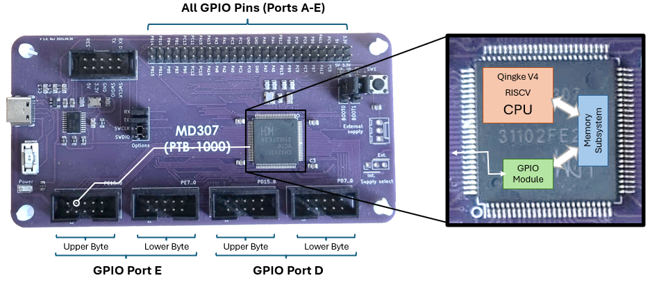
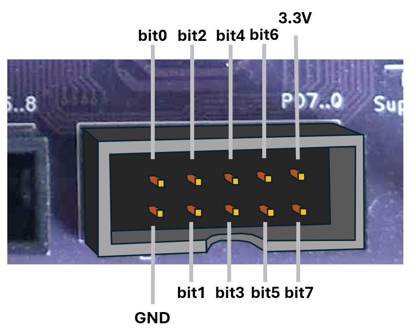
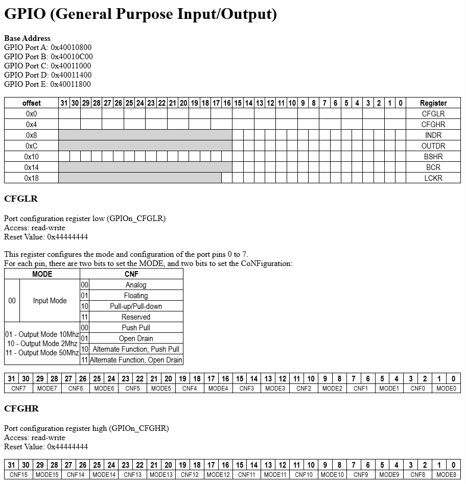
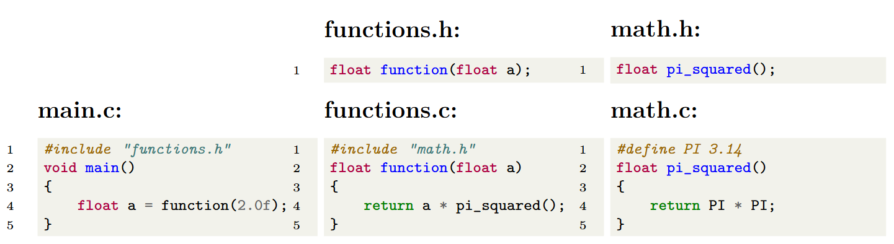
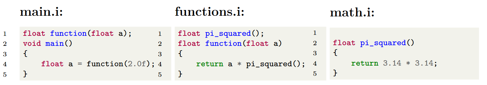
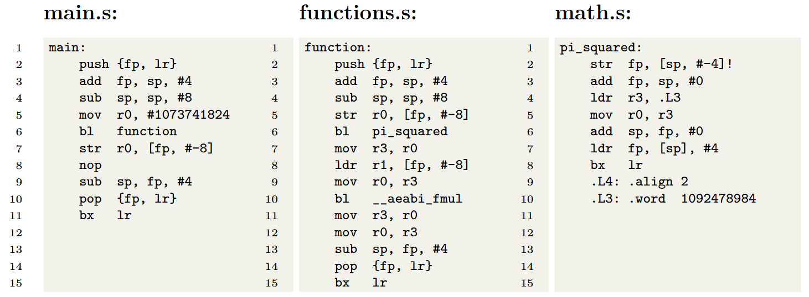

# Introduction to GPIO and C

**Links:**

Reference Manual: https://www.wch-ic.com/downloads/CH32FV2x_V3xRM_PDF.html
**Text and excercises in the Workbook (Arbetsboken)**

**Things that are in the Workbook that should possibly be in this lecture**

So far, we have focused on the *core* of our processor, the *Qingke V4F*, and how to move data between memory and registers. This would be quite pointless unless the processor was connected to the outside world somehow. Today we will start introducing how to communicate with off-chip devices using the GPIO ports.

We will also start looking at the programming language C, which we will start using to program our machine. You know the basics of the RISC-V assembly language now, and you have probably noticed that this quickly becomes impractical for larger programs. Throughout the rest of the course, we will switch over to the (relatively) high-level language C, but we will keep showing you how C is *compiled* into assembly language. Understanding how a high-level language gets translated to assembly, and then machine code, is very important for writing performant and secure code, on any machine.

## GPIO (General Purpose Input/Output)
A processor chip talks to the outside world through its tiny metal legs, called *pins*. In desktop and laptop computers, most of these pins are already spoken for - they connect directly to memory (so you can plug in RAM) or to standard buses like PCI Express (so you can add devices like graphics cards). Microcontrollers, however, are much simpler. They often don’t have separate memory chips or standard expansion slots, so most of their pins can be used more flexibly as General Purpose Input/Output (GPIO) [^1].

[^1]: As you will see later, the pins are actually multiplexed and can also be used for standardized protocols, like USART, SPI, etc.

By allowing the processor to directly read or control the logical status of these pins, they can be connected to almost anything, as long as the software drives them with the right values at the right time. In this course, you will go from connecting a single pin to an LED to make it turn on and off, to communicating with an ASCII display via a number of pins. In theory, there is nothing stopping you from connecting some of the pins to an HDMI cable, to drive a monitor, or to a bunch of motors, to drive a radio-controlled car.



The picture above illustrates how the processor chip is connected to the GPIO pins on the MD307. If you look close enough (and turn the board over at times) you can follow a very thin wire from most of the CH32V307's tiny pins to one of the more accessible pins on the top of the board. On this MCU, the pins are divided into 16-bit *ports*, labeled A-E. On the bottom of the board, you can see that the pins that make up the ports labeled E and D are also available in a nice little connector layout, that allows us to connect peripheral devices with a standard ribbon cable.

To read or set a pin's value, we read or write to a specific memory location (the GPIO Port's *In or Out Data Register*, which we will discuss soon). When the memory subsystem sees that the address we are trying to write to from the CPU is, e.g., `0x4001400C` it knows (this is implemented at the hardware level) that that write operation should be sent on to the *GPIO Module*. The GPIO Module, in turn, knows that this address means "the Out Data Register for Port D". If the value we write is `0b00001111` it will set the first four GPIOD pins (some of the little spider legs in the image of the chip, above) to 1 (3.3V) and the others to 0 (0V). These pins are connected with wires to the pins in the connector. 

### Blink
When learning programming in almost any language, the starting example is "Hello World.". Similarly, when starting MCU programming, the first thing to try is "Blink", so let's start there. We want to plug in an LED to our MCU and make it blink. This will serve as a first introduction to GPIO programming, and then we will go through the details in the next lecture.

<p align="center">
  
</p>

The image above illustrates the physical connector corresponding to the lower byte (pin 0-7) of Port D. Eight of the pins carry a voltage (0 or 3.3V) depending on whether the corresponding bit is high or low. There are two additional pins: one is always 0V (GND) and one is always 3.3V.

If we want to connect an LED we can do that as in the figure above. We connect the cathode of the LED (through a resistor) to the GND pin, and the anode to one of the data-carrying pins (the one corresponding to bit 6, in this case). The resistor is required to stay within the maximum current allowed by the LED.

Now, if we *set* bit 6 in Port D, the pin will be at 3.3V, and a current will run through the LED, making it glow. If we *clear* bit 6, the pin will be at 0V (same as the GND pin) and there will be no current, and no light.

### Configuring a pin for output
Each pin in the port can *either* be an input pin *or* an output pin, at any given time. If the pin is configured as an input pin, we can read the corresponding bit to find out if the pin is at 3.3V (bit is 1) or 0V (bit is 0). Right now, we want pin 6 to act as an output bit, so we have to configure Port D accordingly.

As previously mentioned, any communication between the processor core and the outside is achieved by reading from or writing to the memory subsystem. We have, for instance, seen that we can access the SRAM module by writing to the `0x20000000` - `0x2000FFFF` region. In the same way, to communicate with the GPIO module, we read and write to the `0x4001800`-`0x40011BFF` region. In that region, there are a number of registers for each GPIO Port. To find out which registers there are, and how to configure our GPIO Module, we consult the [QuickGuide](TODO_nolinkyet). The section about the GPIO Module looks like: 

<p align="center">
  
</p>

This text is pretty dense, but in a few weeks' time you will find it an invaluable resource when programming.

> 💡 **Tip:** *The QuickGuide is the only help you are allowed to bring to the exam, so learn to find your way around it as soon as possible!*

Let's parse this text to find out what we need to do to get pin number 6, on Port D, to 3.3V so that our LED lights up: 

For each GPIO port, the configuration information for its pins is stored in two registers:

* CFGLR (Configuration Low Register) → holds settings for pins 0–7.
* CFGHR (Configuration High Register) → holds settings for pins 8–15.

Inside these registers, each pin has is assigned 4 bits:

* 2 bits define the MODE (input/output modes).
* 2 bits define the CNF (the pin’s specific configuration, what the bits mean depend on whether the pin is in *input* or one of the *output* modes).

To find the address to a specific register, you must pay attention to the base addresses of each port, and the offset of each of its registers. Example: to determine the address of Port D's CFGHR, we calculate `base address` + `offset` (`0x40011400` + `0x4` = `0x40011404`.)

We want to set pin 6 as an *output* pin. From the table we can see that we then want to set `MODE` to be `01`, `10`, or `11` depending on what *maximum frequency* we need. If the frequency is set to 10Mhz, that means that we can flip the value of the pin 10 million times per second, and get a reliable output. If we were going to use the pin to send out some digital signal that changed quickly, we might need to worry about that, but since we are just going to turn a light on and off, 2Mhz is more than enough (and this consumes the least energy). So we want to set `MODE` to `10`.

Since `MODE` is an *output* mode, the `CNF` value lets us choose between `Push-Pull`, `Open Drain`, `Alternative Function Push-Pull`, and `Alternative Function Open Drain`. We will go through the meaning of this in the next lecture. For now, we set it to `Push-Pull` (`00`), which means that it will output 0V if the corresponding bit in `OUTDR` is set to 0 and 3.3V if set to 1. 

So, we want to set `MODE` for pin 6 (bits 25:24 in `CFGLR`) to 10, and `CNF` for pin 6 (bits 27:26 in `CFGLR`) to 00. We do not care about the other pins, and will just set them to 0, so we should write the binary value 0000 **1000** 0000 0000 0000 0000 0000 0000, or, in hexadecimal `0x08000000` to `CFGLR` to configure our pin. 

In assembly, that looks like: 
```
la t0, 0x40011400    # Address of CFGLR to t0
li t1, 0x08000000    # Configuration value to t1
sw t1, 0(t0)         # Write the configuration to CFGLR                    
```

### Turning on the LED
Now that the configuration is done, all we have to do is set bit 6 in the *out data* register for GPIO Port D. We look at the [QuickGuide](TODO_nolinkyet) again (or the snippet above) to see that the *base address* for GPIO Port D is still `0x40011400`, and that the *offset* for the out data register, `OUTDR`, is `0xC`. So the address to `GPIOD_OUTDR` is `0x40011400 + 0xC` = `0x4001140C`. 

We want to set bit 6 to make pin 6 go to 3.3V and turn on the LED: 

```
la t0, 0x4001140C  # Address to GPIOD_OUTDR to t0
li t1, 0b1000000   # Set bit number 6 in t1 (equivalent to 0x40)
sh t1, 0(t0)       # Set pin 6 to 3.3V (and all others to 0V)
```

Nothing new here, the only thing you should note is that when we write to `OUTDR` we only write a halfword, because we can see in the quickguide that the register is only 16 bits. 

Let's put all of this together into a little Blink program: 

```
la t0, 0x40011400    # Address of CFGLR to t0
li t1, 0x08000000    # Configuration value to t1
sw t1, 0(t0)         # Write the configuration to CFGLR                    

loop: 
la t0, 0x4001140C  # Address to GPIOD_OUTDR to t0
li t1, 0b1000000   # Set bit number 6 in t1
sh t1, 0(t0)       # Set pin 6 to 3.3V (and all others to 0V)

la t0, 0x4001140C  # Address to GPIOD_OUTDR to t0
li t1, 0b0000000   # Clear all bits in t1
sh t1, 0(t0)       # Set all pins to 0V

j loop             # Loop forever
```

If we connect an LED as described above and run this program... nothing seems to happen. 

But that is not very strange, since we will be turning the light on and off every 20 nanoseconds, or so. If we step through the program instead, we can see that the light turns on and off every time we write to `OUTDR`. Hurrah!

## Introduction to the C programming language
We will now step away from our microcontroller for a minute, and take a first look at the C programming language instead. We will start by looking at a very small example program from a very high-level view. Later on in the course, we will dive into some of the details, so do not worry if there are things you don't fully understand yet. 

### A simple C program

C is a *procedural programming language* which means that the program’s state can be changed by executing some *procedure*. A procedure, in this context, is simply a *subroutine* or, as they are called in C, a *function*. Specifically, every C program must contain exactly one function called `main`, where the program starts.

To introduce the structure of a C program, we will start by looking at a very small example: 

```c
#include <stdio.h>

// A function that calculates the square of the input
int square(int x) 
{
    return x * x;
}

int number = 5; 

void main()
{
    int square_of_number = square(number);
    printf("The square of %i is %i.\n", number, square_of_number);
}
```

Starting from line one, we see that the program begins with an `#include` statement: 
```c
#include <stdio.h>
```
This line says that the contents of the file `stdio.h` will be included at the top of this c file before compilation. This file is part of the C Standard Library (which we will talk more about later) and contains *declarations* of a number of useful functions that deal with user input and output. This is similar to they way the `import` statements work in Java or Python but the `#include` statement is much more rudimentary. 

The next line: 
```c
// A function that calculates the square of the input
```
is just a comment. Comments can either begin with `//` and end at the end of the line, or be enclosed between a `/*` and `*/`. Comments are completely ignored by the compiler and are only used to make the code easier to understand. 

```c
int square(int x) 
{
    return x * x;
}
```
Next, we define a *function*. The function is called `square` and has one integer parameter (named `x`). It calculates `x * x` and returns the result as an integer. This is a function *definition*, meaning that we provide the code that will be run when the function is called. In many cases (as in the `stdio.h` file included earlier), we only provide a function *declaration* which tells the compiler the name, return type and parameters of a function that is defined elsewhere (later on in the file, or in a different file).

```c
int number = 5; 
```

Here, we declare a *global variable* of type `int` (a four-byte integer), and assign the value 5 to it. It is *global* because it is declared outside of any function, and will be visible to all subsequent code. This variable will have its position in memory allocated during compilation and will exist throughout the whole program. 

```c
void main()
{
    int square_of_number = square(number);
    printf("The square of %i is %i.\n", number, square_of_number);
}
```

We now provide the function definition of the `main` function. This is where program execution will start. This function returns `void`[^2], which is how we write in C that it does not return anything. 

[^2]: Actually, main *should* return `int`, and the returned value should indicate if the program succeeded, but a `void` return value is allowed by most compilers.

Next, we define a new integer variable, `square_of_number`, also of type `int`. Because it is defined inside a function, this is a *temporary* variable which only exists (on the stack, or in registers) while we are executing this function. We call the function `square` with the global variable `number` as an argument, and store the returned value in `square_of_number`. 

Finally, we print the result to the console. This is achieved by calling the function `printf` which has been declared in the `stdio.h` file. The `printf` function takes as its first argument a string [^3]. Within this string we have inserted *tags*, on the form `%i`. The first such tag means that `printf` should substitute the tag with the value of the second parameter and that that parameter is of type `int`. The next tag will be substituted for the third parameter, and so on[^4]. The final two characters in the string, `\n`, denote a `newline` character and mean that the next text sent to the console will appear at the beginning of the next line.

[^3]: To be precise, it takes a pointer to a string of characters (bytes) in memory.
[^4]: More detailed descriptions of `printf` are widely available on the [internet](https://cplusplus.com/reference/cstdio/printf/)

As you can see, the general structure and syntax of a C program is very similar to other imperative languages (Java, C++, C#, Javascript, Go, Rust, Swift, ...).

In the next lecture, we will start using C to program our microcontroller, and learn more details about the language, but the course will not teach you everything. If you would like to dive deeper There are several books and online sources that delve much deeper, and provide online learning examples [^5].

[^5]: Some good places to start are: https://www.w3schools.com/c/index.php, https://www.programiz.com/c-programming, and https://www.tutorialspoint.com/cprogramming/index.htm


### Compiling a C program to machine code
We will now briefly explain how the C code is turned into a binary file that can be executed on your computer or microcontroller. To describe the process of compiling a whole C program, we will use a small example, consisting of a few files: 



The program consists of three C files: `main.c`, `functions.c`, and `math.c`. With each C file (except `main.c`) there is an accompanying `.h` file that *declares* the functions that we want to be visible to other `.c` files.

Normally, when compiling a program from inside an *Integrated Development Environment* (IDE), like CodeLite or Visual Studio Code, we simply press the "build" button and do not have to care much about what actually happens. In this section, however, we will go through the actual compilation steps, since it can be very useful to know how this works when things go wrong. 

#### Preprocessor
The first step in compiling a program is to run the *preprocessor* on all `.c` files. We can invoke the preprocessor alone on the command-line like this: 

```bash
gcc -E -P main.c -o main.i
gcc -E -P functions.c -o functions.i
gcc -E -P math.c -o math.i
```

Doing that will generate these three files: 



##### The #include statement
As you can see, the job of the preprocessor is mostly quite simple. When it comes across an `#include "filename"` statement, it will simply cut and paste the contents of the provided file into the `.c` file being preprocessed. For example, in `main.i` it has removed the include statement and inserted the function declatation from `functions.h`.

It is important to realize that the preprocessor is not smarter than this. Whatever text is in the included file will be inserted, in its entirety, into the preprocessed file. 

##### The #define statement
The file `math.c` begins with the statement `#define PI 3.14`. This tells the preprocessor that whenever it comes across the word "PI", in the subsequent code, it will replace it with the text "3.14". Note that this is very different from declaring a *variable* called PI and assigning a value to it. The preprocessor does not understand the code at all, it simply replaces text, exactly as it has been told. 

The define statement can also be used to construct slightly more complex *macros*, but we will not come across them in this course.

#### Compiler
The next step is to take the preprocessed `.i` files and generate assembly code [^6]. This is the job of the \textit{Compiler}. We can run the compiler to produce assembly files with: 

```bash
gcc -S main.i
gcc -S functions.i
gcc -S math.i
```

[^6]: In practice, the compiler might skip creating the actual assembly code and merge the compilation step with the assembler step that produces machine code, but sometimes it is very handy to see the human readable assembly code.

The resulting assembly files are: 
> ⚠️ **TODO:** Replace with RISCV example


You are not expected to understand this assembly code, but we will note a few important things about them. First, we can compile, for instance, the `main.i` file into assembly code *indepenently* of the other files. To create the assembly code for `main.i`, the compiler needs to know that *there exists* a function called `function`, that it returns a `float`, and that it takes a `float` as parameter, but it does not need to know what that function *does*. 

Secondly, this assembler code can be created without any knowledge of where this code will reside in memory. Connecting the symbols between the assembly files and placing them at specific places in memory is the job of the *Linker*, which we will discuss soon.

In larger projects, it is very important that we can recompile a single `.c` file and that we do not have to recompile *all* files, whenever one of them changes. 

#### Assembler
The next step is to assemble all of the `.s` files into *object* files. This can be done on the command line with: 

```bash
as -c main.s
as -c functions.s
as -c math.s
```

An object file is a binary file[^7], containing the machine code that will eventually run on the processor. Note, however, that this file is not an executable program. We still don't know the final addresses of variables and functions. The `bl function` command in `main.s`, for instance, has been assembled into the appropriate machine code for the `bl` instruction, but the *address* it should jump to is not yet available. 

> ⚠️ **TODO:** Replace with RISCV example


[^7]: The actual format of this file depends on the compiler. `gcc` will produce files on the ELF format.

#### Linker
The final step in producing our executable program is called *linking* the program. The linker takes as input all of the object files, and produces an executable: 

```bash
ld main.o functions.o math.o -o program
```

The linker's main job is to arrange the code in memory, and turn all *symbols* (such as the call to a function called `function`) into actual memory addresses. 

If you have run all of these commands on your host computer, with the appropriate gcc toolchain, the output will be an executable file that will run on your operating system (although it won't actually *do* anything visible). 

If you are cross-compiling for another machine (like the MD307) and have used the appropriate gcc toolchain, this last linking stage will not quite work. You will also have to supply some flags to inform the compiler that it should not expect to find a *runtime* library (which we will talk about later), and you would need to supply a *linker script* that tells the linker in what part of memory to place the functions and variables and where to start running the code.

