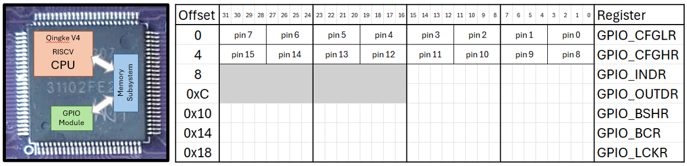

# Introduction to GPIO and C

**Links:**

**Text and excercises in the Workbook (Arbetsboken)**

**Things that are in the Workbook that should possibly be in this lecture**

So far, we have focused on the *core* of our processor, the *Qingke V4F*, and how to move data between memory and registers. This would be quite pointless unless the processor was connected to the outside world somehow. Today we will start introducing how to communicate with off-chip devices using the GPIO ports.

We will also start looking at the programming language C, which we will start using to program our machine. You know the basics of the RISC-V assembly language now, and you have probably noticed that this quickly becomes impractical for larger programs. Throughout the rest of the course, we will switch over to the (relatively) high-level language C, but we will keep showing you how C is *compiled* into assembly language. Understanding how a high-level language gets translated to assembly, and then machine code, is very important for writing performant and secure code, on any machine.

## GPIO (General Purpose Input/Output)
Any communication between the processor chip and the outside world has to happen via one of the *pins* that connect the chip to the PCB. On your desktop or laptop computer, the majority of these pins are connected directly to the memory subsystem (allowing us to plug in DRAM modules), and to I/O interface buses (allowing us to plug in any PCI Express device, for instance). A microcontroller, on the other hand, might not even have an off-chip memory and often needs to communicate with external peripherals that do not use any standard bus protocol. Therefore, the majority of pins on a microcontroller are often connected to *General Purpose Input/Output* (GPIO) pins [^1].

[^1]: As you will see later, the pins are actually multiplexed and can also be used for standardized protocols, like USART, SPI, etc.

By allowing the processor to directly read or control the logical status of these pins, they can be connected to almost anything, as long as the software drives them with the right values at the right time. In this course, you will go from connecting a single pin to an LED to make it turn on and off, to communicating with an ASCII display via a number of pins. In theory, there is nothing stopping you from connecting some of the pins to an HDMI cable, to drive a monitor, or to a bunch of motors, to drive a radio-controlled car.

The picture above illustrates how the processor chip is connected to the GPIO pins on the MD307. If you look close enough (and turn the board over at times) you can follow a very thin wire from most of the CH32V307's tiny pins to one of the more accessible pins on the top of the board. On this MCU, the pins are divided into 16-bit *ports*, labeled A-E. On the bottom of the board, you can see that the pins that make up the ports labeled E and D are also available in a nice little connector layout, that allows us to connect peripheral devices with a standard ribbon cable.

## Blink
When learning programming in almost any language, the starting example is "Hello World.". Similarly, when starting MCU programming, the first thing to try is "Blink", so let's start there. We want to plug in an LED to our MCU and make it blink. This will serve as a first introduction to GPIO programming, and then we will go through the details in the next lecture.

  

The image above illustrates the physical port corresponding to the lower byte of Port D. Eight of the pins carry a voltage (0 or 3.3V) depending on whether the corresponding bit is high or low. There are two additional pins: one is always 0V (GND) and one is always 3.3V.

If we want to connect an LED we can do that as in the figure above. We connect the cathode of the LED (through a resistor) to the GND pin, and the anode to one of the data-carrying pins (the one corresponding to bit 6, in this case). The resistor is required to stay within the maximum current allowed by the LED.

Now, if we *set* bit 6 in Port D, the pin will be at 3.3V, and a current will run through the LED, making it glow. If we *clear* bit 6, the pin will be at 0V (same as the GND pin) and there will be no current, and no light.

### Configuring a pin for output
Each pin in the port can *either* be an input pin *or* an output pin, at any given time. If the pin is configured as an input pin, we can read the corresponding bit to find out if the pin is at 3.3V (bit is 1) or 0 (bit is 0). Right now, we want pin 6 to act as an output bit, so we have to configure Port D to that effect.

As previously mentioned, any communication between the processor core and the outside is achieved by reading from or writing to the memory subsystem. We have, for instance, seen that we can access the SRAM module by writing to the `0x20000000` - `0x2000FFFF` region. In the same way, to communicate with the GPIO module, we read and write to the `0x4001800`-`0x40011BFF` region. More specifically, we have:

| GPIO Port | Base Address |
|---|-------------|
| A | 0x40010800  |
| B | 0x40010C00  |
| C | 0x40011000  |
| D | 0x40011400  |
| E | 0x40011800  |

