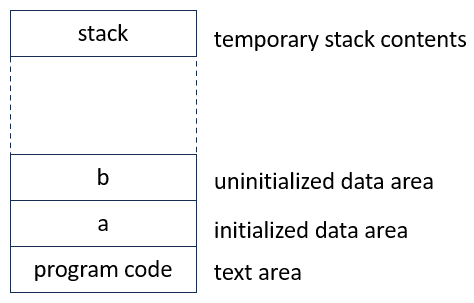
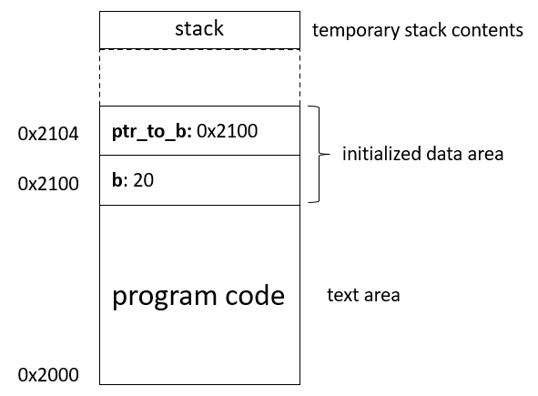
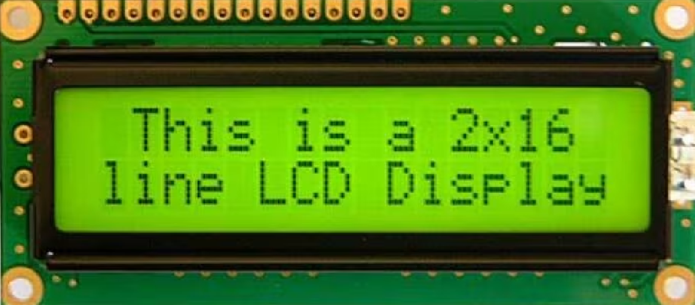
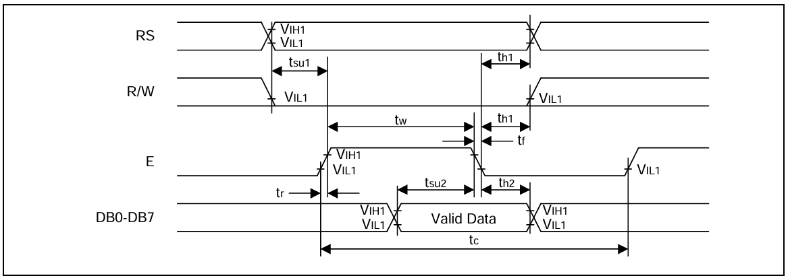

# Pointers and Synchronization

In this lesson, we will combine all the things we have learned about GPIO and C so far, and finally do some machine oriented programming and get an LED to light up, all in C. To do that, we will first have to go through the concept of *pointers*.

In the second part of the lecture, we will start looking at an *ASCII Display* which is controlled by following a specific protocol. This protocol requires precise *timing*, and so we will look into how the basic system timer (SysTick) works. 

## Variables' locations in memory
If you learn one thing in this lecture, let it be that *a pointer is simply an address to a variable*. So, before we go any further, it is high time that we start thinking about where, in memory, our variables actually reside. Consider this toy C program: 

```C
int a = 5;
int b;

int count(int v) {
    if(v == 0) return 0;
    return 1 + count(v - 1);
}

int main()
{
    b = 20;
    int c = count(a + b);
}
```

The variables `a` and `b` are both global variables, and their location in memory is known when the program starts. These variables will reside in the same place in memory throughout the execution of the program and can be read and written from anywhere. The variable `a` is assigned a value when it is declared in the global scope, and will be copied from the executable file into the *initialized data area* which, in memory, will come right after the program code: 

<p align="center">
  
</p>

The variable `b` is not initialized, and will be allocated a space in the *uninitialized data area*. The required size of this area is known from the executable file, and it will be initialized to 0 when the program starts.

All other variables in the program are declared inside functions. These are called *local variables* and will only "exist" while the function is executing.  Usually, this means that they will exist on the stack, which grows every time a function is called, and shrinks when the function returns. In some cases, local variables do not need to reside in memory at all, but only exist temporarily in processor registers.

#### Static and Constant variables
In some cases, we want a variable that ”exists” throughout the program, but that is only visible in a specific function or scope. This is achieved using the `static` qualifier:
```C
int counted_function(int v) {
    static int times_the_function_has_been_called = 0;
    times_the_function_has_been_called += 1;
    ...
}
```

A variable declared as `static` will reside in the initialized or uninitialized data area, just like a global variable, but is only visible in the scope that it was declared (i.e., the compiler will produce an error if we try to access it from outside the scope).

Both global and local variables can also be qualified by the keyword `const`:
```C
const int a = 5;
int function(int v) {
const int b = 20;
    ...
}
```

Using `const`, we are telling the compiler that this variable will not change, and trying to assign a new value to that variable will produce an error. `const`  variables will reside either in the initialized data area or in the text area (with the program code). In either case, they may be placed in read-only memory.

## Pointers

The use of *pointers* in C is usually the hardest part of the language for beginners to grasp. Understanding pointers is completely necessary for C to become a useful programming language, however. 

A pointer is a special variable containing a memory address that points to another variable somewhere in memory. We will illustrate this in a small example: 

```C
int b = 20;
int * ptr_to_b = &b;
int main()
{
    // At this line, b == 20
    *ptr_to_b = 40;
    // At this line, b == 40
}
```

On the first line, we create a global integer variable called `b` and initialize it with the value `20`. It will reside at the first memory location in the initialized data area when we start the program. In this  example, the address where b resides in memory is: 0x2100.

<p align="center">
  
</p>

On the next, we create another variable called `ptr_to_b`. The type of this variable is `int *`. The asterisk here means that `ptr_to_b` is of the type "pointer to integer". This variable resides in the next available memory in the initialized data area, address `0x2104`. 

We immediately initialize this variable to be `&b`. The ampersand (&) here means "the address of b", so the value stored at memory address `0x2104` is `0x2100`.

Next, in the `main` function, we *dereference* the variable `ptr_to_b` and assign a new value to it. Dereferencing a pointer means "give me the variable that this pointer points to", and is done by putting an asterisk (`*`) in front of the pointer [^1]

[^1]: So, in a *statement*, the asterisk means "dereference", but in a *declaration* it means "is a pointer".

So when the compiler sees `*ptr_to_b = 40` it will read the value stored at 0x2104 and read that as a memory address (`0x2100`). It then assigns the value 40 to the integer at memory address `0x2100`. Therefore, the next time we read the variable `b` (which resides at memory address `0x2100`) we will read the value 40.

If you're feeling lost right now, take a deep breath and try again. It is essential to understand that *a pointer is a variable containing the address of another variable, of a specific type*. Once that is clear, working with pointers will become second nature.

### Accessing absolute memory addresses
One reason that pointers are important in machine oriented programming is that
they allow us to express reading and writing from arbitrary memory addresses.
When we do not have an operating system and drivers, the only way for the processor to communicate with peripheral hardware is through memory load and store
operations.

You have already seen examples of this when writing to GPIO ports. Let us consider another toy example:  

Our program is loaded into a 32kb SRAM chip that is mapped to addresses `0x20000000` - `0x20007FFF`. Let's say there is also a second 128kb SRAM chip mapped to addresses `0x30000000`- `0x3001FFFF`. Our program needs to read some data into memory for future processing. Since there is a lot of data to read, this data will not fit together with our program on the smaller SRAM, so we will put it on the larger SRAM: 

```C
char ReadValue(); // We expect this function to exist in some other file.
int main()
{
    unsigned int BIG_SRAM_ADDRESS = 0x30000000;
    char * output_pointer = (char *) BIG_SRAM_ADDRESS;
    for(int i=0; i<44100; i++) {
        *output_pointer = ReadValue();
        output_pointer = output_pointer + 1;
    }
}
```

First, we store the known starting address (`0x30000000`) of the large SRAM into an unsigned integer called `BIG_SRAM_ADDRESS`. This variable is just a number. Then, on the next line, we define a pointer, `output_pointer`, that points to that address. Since we want to write a byte (a `char`) to the address, we declare it as a `char`-pointer (`char *`).

In the loop that follows, we read one value and place it at the address that `output_pointer` points to by *dereferencing* the pointer `*output_pointer = ReadValue()`. On the next line, we then increase the pointer by one (so that it points to the next byte in memory) and repeat the process until all values have been read.

## GPIO in C, with pointers
That's enough knowledge for now. We should be able to make an LED blink at this point, so that's what we will do. We have already written a 'blink' program in [Lecture 4](lecture04_GPIO_and_C_intro.html), but back then we only knew assembly. The program looked like this: 

```
la t0, 0x40011400    # Address of CFGLR to t0
li t1, 0x02000000    # Configuration value to t1
sw t1, 0(t0)         # Write the configuration to CFGLR                    

loop: 
la t0, 0x4001140C  # Address to GPIOD_OUTDR to t0
li t1, 0b1000000   # Set bit number 6 in t1
sh t1, 0(t0)       # Set pin 6 to 3.3V (and all others to 0V)

la t0, 0x4001140C  # Address to GPIOD_OUTDR to t0
li t1, 0b0000000   # Clear all bits in t1
sh t1, 0(t0)       # Set all pins to 0V

j loop             # Loop forever
```

If you don't remember how this worked, go back to the previous lecture. Now, we want to do the same thing but in C. In the first three lines, we write the configuration value `0x020000000` to the `GPIOD_CFGLR` register, to configure it as an output pin. 

We can do the same thing in C with: 
```C
unsigned int *GPIOD_CFGLR = (unsigned int *)0x40011400;
*GPIOD_CFGLR = 0x02000000;
```
On the first line here, we create a pointer that points to an `unsigned int` at address `0x40011400` (the GPIOD_CFGLR register). On the second line, we *dereference* that pointer and write the value `0x02000000` into the register. 

In fact, we don't even have to name this pointer, and could do all of this in a single line like: 

```C
*((unsigned int*)0x40011400) = 0x02000000;
```
But this is very hard to read for someone browsing your code, so we usually define helpful macros in a header file, or at the top of your program: 
```C
// Define a macro for CFGLR that we can use throughout the code
#define GPIOD_CFGLR *((unsigned int*)0x40011400)
// Write the value to the register
GPIOD_CFGLR = 0x02000000;
```
Note that this is exactly the same thing. The preprocessor will just cut'n'paste `*((unsigned int*)0x40011400)` whenever it sees `GPIOD_CFGLR`, to the code that gets compiled is exactly what we wrote above. 

The whole blinky program could look like: 
```C
#define GPIOD_CFGLR *((unsigned int *)0x40011400)
#define GPIOD_OUTDR *((unsigned int *)0x4001140C)

void main()
{
    // Configure pin 6 as output
    GPIOD_CFGLR = 0x02000000;
    while(1) { // Do forever
        GPIOD_OUTDR = 0b01000000; // Turn on the LED at pin 6
        GPIOD_OUTDR = 0b00000000; // Turn off the LED at pin 6
    }
}
```

If you write this program and step through it, you will *probably* see that the light turns on and off. There is one more thing we have to consider to get rid of the word "probably" in the previous sentence, though. 

### The `volatile` keyword
One nice thing about C is that modern compilers are extremely good at optimizing our C code until it is as fast as if we had written the assembly by hand. Using the optimizer can also be a problem, however. 

```C
void main()
{
    int a = 5; 
    a = 6; 
    printf("%i\n", a);
}
```

Let's look at the C code above. In the while loop, we first write the value 5 to a variable, and then we immediately set it to the 6. Since we never read the variable between these two writes, the optimzer is perfectly free to remove the first write, and just set a to 6 immediately. This will not affect the result of the program. 

Now look at these two lines from our little blinky program: 
```C
        GPIOD_OUTDR = 0b01000000; // Turn on the LED at pin 6
        GPIOD_OUTDR = 0b00000000; // Turn off the LED at pin 6
```
The optimizer will reason in exactly the same way here. There is no point in writing `0b010000000` to the variable, if we are just going to immediately overwrite it with `0b00000000`. So it will remove the first line. 

*We* know that this is stupid, because this "variable" is actually an output register, and everytime we write to it, some LEDs turn on or off, but *the optimizer does not know that*. 

In fact, when the optimizer was done, the final assembly code for our program would probably be: 

```
main: j main
```
So... we have to inform the optimizer that these particular pointers are not to be considered for these kinds of optimizations. The `volatile` keyword tells the compiler that any read or write to this variable *must* be performed and cannot be optimized away. 

To make our blinky program optimizer safe, we change the first two lines to: 
```C
#define GPIOD_CFGLR *((volatile unsigned int *)0x40011400)
#define GPIOD_OUTDR *((volatile unsigned int *)0x4001140C)
```

## Synchronization

So far, we have talked about plugging in an LED, a push-button, and simple keyboard to our microcontroller. These components are *passive* and instantaneously respond to the current state of the connected GPIO pins. When we plug in something more complicated, like a display, or a motor, or an old-school text terminal, we often have to follow a *communication protocol*. Many devices (such as the TFT display we will be using later in the course) use standardized protocols (RS-232, CAN, SPI, ...), which are supported by the microcontrollers hardware. These will be discussed later, but first we will look at a simpler, *active*, device: the 1602 ASCII LCD display: 

<p align="center">
  
</p>

A standard LCD display that you would buy [off-the-shelf](https://www.electrokit.com/lcd-2x16-tecken-rgb-seriell-qwiic) actually consists of an LCD *panel* and a *controller chip* (often confusingly called a *driver*). This controller chip is *itself* a little microcontroller that runs code to put characters on the display. So, when you want your LCD display to show a string of text, the code you write on the MD307 has to communicate with the microcontroller in the display, according to a specific communication protocol. The protocol is usually described in the display's *datasheet*. 

To communicate with our ASCII display, we can write *commands* (such as "clear the display" or "move the cursor") or *data* (the text we want to show) to it. To do this, we must follow a *timing diagram* that we can find in the datasheet: 

<p align="center">
  
</p>

This figure shows us that there are 11 signals (GPIO pins on our MD307, connected to pins on the display, via wires) that we use to communicate with the display: 

* **Register Select (RS)**: This signal is used to tell the display whether we are sending/receiving a command or data. 
* **Read/Write (R/W)**: This signal is used to tell the display whether we want to send data to it, or receive data from it. 
* **Enable (E)**: This signal is used to initiate communication with the display
* **Data Lines (DB0-DB7)**: These lines contain the command or data that we want to send (one byte).

To run a command, or read/write data from/to the display we have to follow the timing constraints given by this diagram. We *prepare* the device for a command by setting the **E**(enable) signal high, and then we *execute* the command by setting **E** low again. 

The important numbers are: 

* **t<sub>su1</sub>** - Before setting E high, we have to tell the display whether it should perform a *command* or a *data-transfer* and whether we want to write to the display or read from it. This is done by setting the **RS** and **R/W** signals. Since these signals are connected to GPIO pins on our MD307, we simply set the corresponding bits in the GPIO `ODATA` register, as we have done before. This will (almost) immediately set the corresponding *pins* to 0V, but it will take some time (*t<sub>su1</sub> = 40ns*) for the electrical signal to propagate through the display. 
* **t<sub>su2</sub>** - When we have told the display to prepare for a command, by setting E=1, it needs the data to be available on the GPIO pins for *at least* *t<sub>su1</sub> = 80ns* before we can tell it to actually execute the command. Again, this is to be certain that the signals have propagated.  
* **t<sub>w</sub>** - We *also* have to make certain that the E signal is high for at least *t<sub>w</sub> = 230ns* before E is set to 0 again.
* **t<sub>h</sub>** - After starting the command (by setting E=0), all signals must be available for another *t<sub>su1</sub> = 10ns*. 
* **t<sub>c</sub>** - Finally, the cycle time (the time between two commands) must be at least 500ns.

In the workbook, you will also find the timing diagrams for reading data from the device, what commands are available, and a suggestion of how to write code that follows this timing protocol. Before you start writing anything there is a much more fundamental question that we have to answer, however: *How do we tell our microcontroller to wait a specific length of time?*. 

### SysTick
The only way we can measure the passage of time on a processor is by the *clock signal*. As you have learned in a previous course, the CPU is pushed through its state-machine, every few nanoseconds, by a clock signal that goes up and down periodically. On the MD307, the clock *frequency* is 144MHz, so the time between each clock pulse is (1[sec]/144000000[Hz] ≈) **7ns**.

Since we know that our microcontroller will execute *approximately* one instruction per clock, we can get an approximate delay with just a little for loop. If we want to wait for 1 ms, and we know that amounts to approximately (1000ns/7ns ≈) **143** clock cycles, and the loop is two instructions, we could write:  

```
li t0, 143
loop: 
  addi t0, -2   # Two more instructions have been executed
  bnz loop      # If not zero, go again.
```

This is not very exact, however. Firstly, due to pipelining (see Lecture ??), and instruction caches, and other clever tricks that our processor might do, we do not *know* exactly how many clock cycles each instruction takes. Secondly, as you will learn in a future lecture, the processor is frequently *interrupted* by other processes, and when the CPU starts running our code again, we have no idea how many cycles have passed. 

Instead, all processors come with one or more *timer peripherals*. These are separate modules (on the same chip) that listen to the same clock signal as the CPU does, but whose only job is to count how many cycles have passed, and provide that information to the program running on the CPU. 

On the MD307, the simplest, and most commonly used, timer peripheral is called *SysTick* and it has the following register block: 
<hr>

<large><b>SysTick</b></large>

Base address: 

{{python quickguide-generator/main.py baseaddress SysTick}}

<p>
<b> Register Block Overview </b>

{{python quickguide-generator/main.py overview-table SysTick}}

</p>
<hr>

{{python quickguide-generator/main.py register-details SysTick .*CTLR}}

As you can see, this peripheral can be used in quite a number of ways, but for this lecture we will only focus on the most basic use. The registers `STK_CNTL` and `STK_CNTH` make up a 64 bit counter value. That means that the counter can count up to eighteen *quantillion* clock cycles, before it has to restart from zero. (That would take about 4 thousand years, at 144MHz). Usually, we need to count much shorter intervals than that and a long as we are looking at periods shorter than ~30sek (2^32 clocks), we can ignore the `STK_CNTH` register. 

So, if all we want to do is wait for a specific time interval, *t*, we would usually: 
* Calculate the number of clockcycles, `c` that t corresponds to: 
  - c = t [sec] * 144000000 [clocks/sec]
* Set `STK_CNTL` and `STK_CNTH` to zero. 
* Enable the timer, by setting the first bit (`STE: Enable`) in `STK_CTLR`.
* Wait until `STK_CNTL` has reached `c`

In C, this would look like: 

```C
#define SYSTICK_CTLR ((volatile uint32_t *)0xE000F000)
#define SYSTICK_CNTL ((volatile uint32_t *)0xE000F008)

void main()
{
  *SYSTICK_CNTL = 0;                // Clear counter
  *SYSTICK_CTLR |= 0b101;           // Start the clock and use the system clock (STCLK=1)
  while(*SYSTICK_CNTL < 144000000); // Wait for one second. 
  // ...
}
```

Alternatively, we can set the *compare value* (`STK_CMPLR` and `STK_CMPHR`) to the number of clock cycles we want to wait, and then check the lowest bit of the *status register*, `STK_SR`. This bit will flip over to 1 when `STK_CNT` reaches `STK_CMP`: 

```C
#define SYSTICK_CTLR ((volatile uint32_t *)0xE000F000)
#define SYSTICK_SR   ((volatile uint32_t *)0xE000F004)
#define SYSTICK_CNTL ((volatile uint32_t *)0xE000F008)
#define SYSTICK_CNTH ((volatile uint32_t *)0xE000F00C)
#define SYSTICK_CMPL ((volatile uint32_t *)0xE000F010)
#define SYSTICK_CMPH ((volatile uint32_t *)0xE000F014)
void main()
{
  *SYSTICK_CNTL = 0;                // Clear counter
  *SYSTICK_CNTH = 0; 
  *SYSTICK_CMPL = 144000000;        // Set Compare value
  *SYSTICK_CMPH = 0;  
  *SYSTICK_CTLR |= 0b101;           // Start the clock and use the system clock (STCLK=1)
  while(*SYSTICK_SR == 0); // Wait for one second. 
  // ...
}
```

Besides being a fairly exact way of measuring time, the SysTick timer also runs *independently* of the processor, so we are free to do other things while we are waiting.

In the next lecture, we will start looking at *interrupts*. We can ask SysTick to interrupt the processor when it has reached a specific value, and in that way we can make periodic things run completely independently from the main code. 

#### Waiting Very Short Intervals
When you start writing code for the ASCII display, you will find that some of the time intervals in that timing diagram are very short indeed. **t<sub>su</sub>**, the time we need to wait after setting the RS/RW signals before setting the E signal is, for example, only 40ns. That is less than six clock cycles on our machine, and setting up SysTick might take longer than that (!). 

For such small intervals, it is better to just run a few `NOP` instructions, that are guaranteed to take *at least* the interval we need. We can do that with *inline assembly* in C, in the following way:  

```C
__asm__("nop"); // Wait at least 3 cycles
__asm__("nop");
__asm__("nop");
```


### More about pointers

#### Pointer Arithmetic

#### Arrays

#### Pointers as Function Parameters

#### Strings

#### Pointers to Pointers

#### Function Pointers
