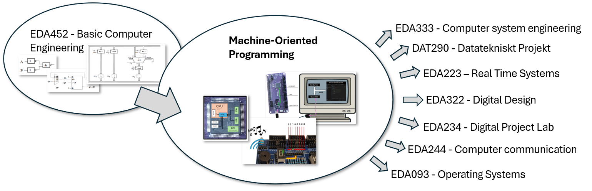
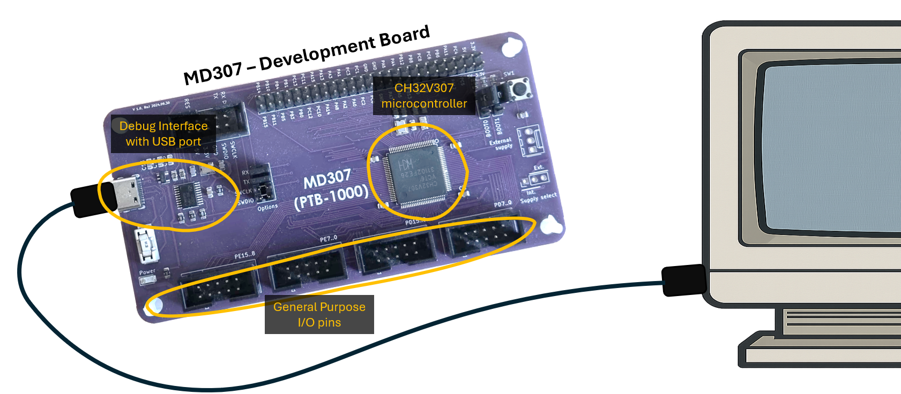

Machine Oriented Programming
===============================================================================

Welcome to this course in *Machine Oriented Programming*!
In a previous course, you have seen how simple logic gates can be combined to create an ALU, a data path, and finally a complete working tiny processor. In this course you will build on this knowledge and learn how to program a **real**, modern, off-the-shelf *microcontroller* [^microcontroller]. You will develop programs for this device using assembly and C and you will learn how to communicate with peripheral devices (lights, buttons, displays and a tiny speaker). As illustrated in the image below, the course is also a prerequisite for several upcoming courses.

[^microcontroller]: Read: "small processor" for now.

Many of you are probably accustomed to thinking of a microprocessor as one of the power-hungry beasts that control your desktop computer, your laptop, or your mobile phone. However, these account for only a *tiny fraction* of the processors you use every day. In fact, a modern mobile phone typically contains on the order of a hundred small, specialized processors and programmable controllers, responsible for tasks such as display control, radio communication, and power management.

In your immediate environment, microcontrollers are embedded in refrigerators and washing machines regulating temperature, motors, and safety interlocks; in microwave ovens and stoves controlling power delivery; in thermostats, smoke detectors, and ventilation systems maintaining indoor climate and safety; in cars and bicycles managing braking, lighting, and battery charging; and in lifts, doors, and access systems enforcing timing and safety constraints. Even seemingly inert objects such as power adapters, LED light bulbs, battery packs, and electric toothbrushes contain programmable controllers executing code continuously. In most cases these systems are designed to be invisible, reliable, and single-purpose. In short there are several *billion* microcontrollers being produced every year and all of these little processors need someone to write programs for them. 

If you do not find washing machine temperature regulation very thrilling (yet...) it is difficult not to be excited by the thousands of hobby projects that people around the world are doing using their newfound microcontroller programming skills. Have a look at [these](https://www.seeedstudio.com/blog/2021/03/26/10-raspberry-pi-pico-projects/) [sites](https://projecthub.arduino.cc/) and ask yourself if *you* wouldn't like building your own automatic plant watering station, guitar effect pedal, autonomous drone, or portable video game.

Even if you have decided, once and for all, that you only want to work with the most powerful general-purpose CPUs available, and have little interest in their smaller counterparts, don't worry. The RISC-V processor you will learn about in this course is exactly the same as the fundamental core of an multi-core 64-bit processor, and the concepts and techniques that you learn here are directly applicable (and in fact essential) to writing secure, high-performance, code for modern desktops and servers. 

What is a microcontroller?
===============================================================================
So, what *is* a microcontroller, and how does it compare to the CPU you plug into your desktop computer's motherboard? Both general-purpose CPUs and microcontrollers are *Integrated Circuits* (ICs) fabricated on silicon using CMOS VLSI technology. In other words, they are both little silicon chips with spider legs (these are called *pins*). The chips contain millions of transistors that make up all of the internal logic. Part of that logic is the ALU and data path that you have encountered before, but there are *many* more modules attached to this core processor. In both cases, the spider legs are their only means of communication with the outside world, so both must be placed onto a *Printed Circuit Board* (PCB). This is a plastic board with thin copper lines that connect all of the pins to various other subsystems, such as memory (Flash, SRAM, or external DRAM), I/O busses (PCI-Express/USB/Ethernet), or *General Purpose Input/Output* pins (more about these later). 

The main difference is that microcontrollers are *tiny* in comparison and lack a number of features that are standard on a general purpose CPU: 

* A modern microcontroller often has several orders of magnitude fewer transistors than a modern desktop CPU. 
* A single microcontroller chip might cost 1 to 50SEK, while a CPU costs several hundred, to thousands.
* The microcontroller is extremely energy efficient, and can be powered for quite some time from a standard 9V battery from the supermarket. 
* The microcontroller has *very* restricted memory; usually just a few kB of SRAM, while a CPU has a huge memory subsystem with several layers of caches.
* The microcontroller usually runs without any operating system, and is designed to run one specific task.

It is important to realize that while microcontrollers are relatively simple, and very cheap to buy, they are much too expensive to produce specifically for one product. Fabricating a single chip would cost *at least* 100k-1M SEK. They only become cheap when you produce (and sell) millions of them.

PCBs, on the other hand, are very cheap to make these days (you can design one and order 5 copies for 50 SEK), so when designing a product (let's say an alarm system) you would usually: 

* Buy the cheapest microcontroller *development board* that you think will fit your needs. A development board is (at minimum) a PCB with the microcontroller and some debugging equipment that lets you connect it to your computer for development. 
* Connect it to the sensors (movement sensors, for example) and other components (flash memory, or AD converters, perhaps) you need on a "breadboard" (see image below)
* Write the software you need on a desktop computer and send it over to the development board for testing. 

> TODO: image of pico with a few components on a breadboard

Once you are satisfied that the software works, you can design a schematic for a PCB [^kicad] and order the whole thing (with microcontroller and components soldered on) from a manufacturer.

[^kicad]: This is quite easy, and surprisingly fun. You can use free software like [KiCad](www.kicad.org) for this.

The lab computer, MD307
===============================================================================
In this course, you will learn to program the MD307 development board [^md307]. It consists of a [CH32V307](https://www.wch-ic.com/products/CH32V307.html) microcontroller, a debug interface so you can connect it to Visual Studio Code, and a number of *General Purpose I/O* (GPIO) pins, that you will connect to peripheral equipment. 

The CH32V307 is a RISC-V [^riscv] microcontroller running at 144MHz, with (up to) 192kB SRAM and (up to) 256kB FLASH memory. The chip also contains various I/O modules (like USB, USART, and Ethernet), DACs, ADCs, and several timers. You will learn how to program many of these in the course.

[^md307]: This is a reasonably student-proof development board developed at chalmers, but very similar boards are available to buy off-the-shelf.
[^riscv]: See next lecture.

The simulator
-------------------------------------------------------------------------------
Since we do not have enough MD307 development boards to hand out to all of you, much of your development will happen on a simulator. This is an *Instruction Set Simulator* (ISS), meaning that it decodes and runs machine code instructions and maintains a model of the processor's registers and state but simplifies many micro-architectural details. Thus, you can compile and run your code and expect the same behavior as if it was the real machine, but it will not be exact in terms of the number of cycles an instruction takes. This is usually sufficient for most development work, and is a common approach to developing software before hardware is available.

Course organization
===============================================================================
The course consists of lectures, labs, and self-studies. Since the course goals are to prepare you for programming real microcontrollers in the real world, you are expected to spend a lot of time actually programming and doing exercises; just attending lectures or reading through the lecture notes will not be enough to pass the exam.

## Lectures
There will be two lectures per week (but a few of the lecture slots will be used for repetition and exam preparation) and each lecture will introduce some new theory along with practical examples. The lectures are not mandatory, but history has shown a *clear* correlation between going to the lectures and passing the exam. Even if you feel like you can get all the theory through reading, just getting out of the couch and discussing the topics with your class-mates can be a good enough reason to go to class.

### Lecture notes
On Canvas, there is one module per lecture where you can find the lecture notes. These notes are intended as a text version of the lecture, and while *some* content may differ, they should suffice if you miss a class for some reason, or when you want to repeat parts of the lecture. 

### Quizzes
Each lecture module on Canvas also contains one or more quizzes. These quizzes have multiple choice answers and are intended mainly as a way for you to check if you have retained the information in the class or lecture notes. Doing them takes only a few minutes and should help you find what parts of the notes you need to re-read. Completing the quiz with a full score does *not* mean that you have mastered the lecture, however. You will also need practical experience with the topics of each lecture, and that is what the lab and exercises are for. 

### Exercises
The exercises for each lecture are built into our Visual Studio Code environment, and are meant to help you with practical experience. There are programming exercises for each lecture, that will force you too look back into the lecture notes and the QuickGuide. Please note that the exam does *not*, to any great extent, test what you remember of the text, or rote-learning. It will test if you are able to perform certain programming tasks, so doing exercises is essential to performing well in the course. 

### Workbook
In addition to the lecture notes and the exercises, there is a workbook (available at Chalmers Store) which contains alternative descriptions, a large number of examples, and several more exercises. It is highly recommended that you follow this book as well, especially if you are struggling. 

## Exercise Sessions
Every week you will have the opportunity to go to exercise sessions where TAs will be available to answer your questions. Having direct help from people who know the topic well while studying is one of the main luxuries of studying at a University, and it is highly recommended that you go to these sessions. 

On the exercise sessions there will also be hardware available to those who want to try developing directly for the machine instead. The exercise sessions are booked in advance on a first-come first-served basis (with some restrictions), so if you have a restrictive schedule it might be wise to book early.

## Labs
There are three mandatory labs, and one optional lab that can give bonus points on the exam. For each lab, there is a "lab preparation" assignment on Canvas. This assignment must be completed (and you need to understand what you did) before you come to the lab. The actual time-slot when you can do the lab in the lab room will be booked in advance like the exercises. 

In the lab room, you will get to try some tasks that are hard to do without access to the real hardware. While passing the labs is mandatory for completing the course, doing so is not going to be at all difficult as long as you have done the preparation. The point of the labs is to enforce your learning, and understanding the labs is essential (and almost sufficient) to passing the exam. 

