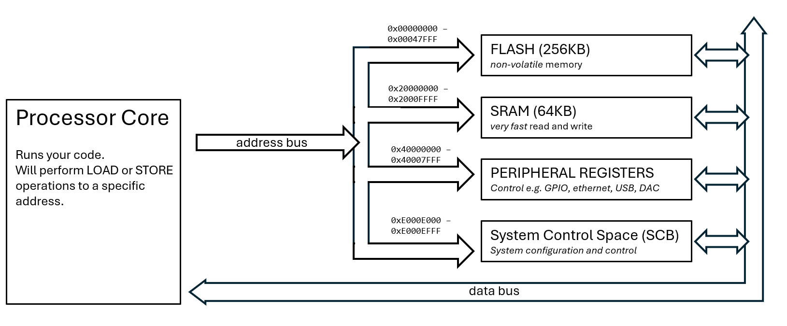
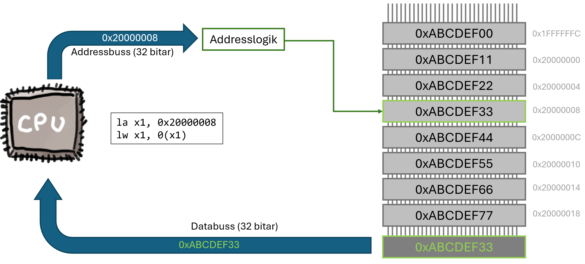
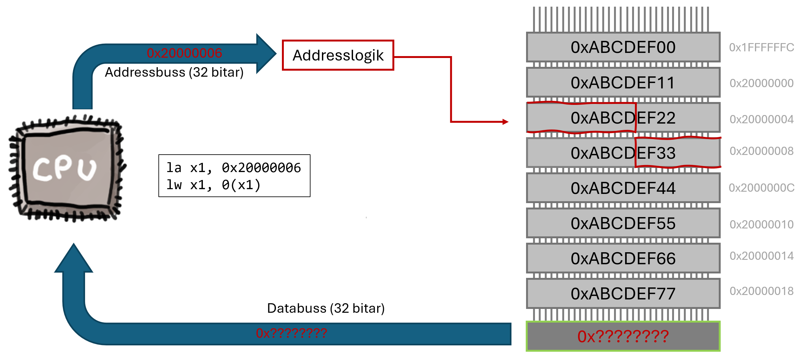
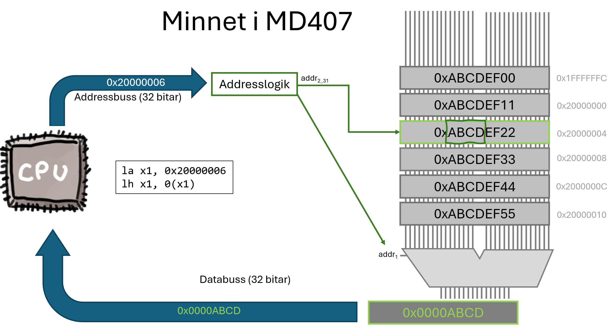
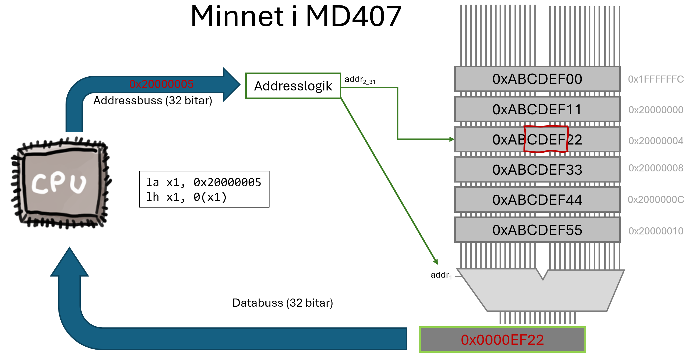

<!-- markdownlint-disable MD012 -->
<!-- markdownlint-disable MD022 -->


**Links:**
[Unprivileged ISA](https://drive.google.com/file/d/1uviu1nH-tScFfgrovvFCrj7Omv8tFtkp/view)
, [RISC-V Assembly Programmer’s Manual](https://github.com/riscv-non-isa/riscv-asm-manual/releases/download/v0.0.1/riscv-asm.pdf), [RISC-V ABI Specification](https://docs.riscv.org/reference/application-software/abi/_attachments/riscv-abi.pdf?utm_source=chatgpt.com)

**Text and excercises in the Workbook (Arbetsboken)**
Chapter 1, Pages 7-16
Chapter 1, Pages 24-33

<!-- **Things that are in the Workbook that should possibly be in this lecture**
MUL/DIV, (Arrays) -->

---
In this lecture you will learn about the basics of assembly programming on a small RISC-V processor. 

# The RISC-V Instruction Set Architecture (ISA)

In this course, you will learn to program a microcontroller based on a RISC-V processor. Today, almost every phone, computer, or smart device runs on a processor from one of a handful of companies (e.g. ARM, Intel). RISC-V changes that: it’s an open alternative that anyone can use, extend, and build on, and it is becoming increasingly important in both industry and research. In this course, you’ll learn to program real hardware built on RISC-V. So what does it mean to be a "RISC-V" processor?

RISC-V is an *Instruction Set Architecture* (ISA). That is, it specifies a processor's behaviour in terms of the *instruction set*, the *registers*, and the *memory model*, and how all of these components interact. Anyone is allowed to use this specification to *implement* their own processor, without paying anyone. For example, in this course we will use the MD307 lab kit, which contains a CH32V307 microcontroller (a chip developed by the company WCH), which in turn contains (as part of the chip) a QingKe V4 *processor core*, which is an implementation of the RISC-V ISA.

Other companies have implemented their own processor cores, in their own microcontrollers, that are also based on the RISC-V ISA. Raspberry Pi, for instance, has implemented a RISC-V core called Hazard3 in their RP2350 microcontroller, which is the heart of the Raspberry Pico 2. Since both machines use the same ISA, they can use the same compiler toolchains to produce executable code, and can in some cases even run the *same* binary code, even though the actual hardware is completely different.

## Variants and Extensions
RISC-V is intended to be used in a huge range of devices, from small microcontrollers in your car key or fridge, to CPUs in the nodes of a machine-learning data center. Therefore, the specification is divided into what is called the *base integer instruction set*, which only describes 47 separate instructions, and a large number of *extensions* that describe instructions for additional functionality. Anyone that decides to build a RISC-V processor will have to decide which of these extensions they want to support. Implementing more extensions naturally means more work, and probably means that the chip will be more expensive and draw more power. Similarly, anyone who *buys* a processor for use in their product will have to choose which extensions it should support.

Let's consider a few examples:

- **A TV remote control** will need a little microcontroller to recognize when you press a button and send the appropriate infrared signal to your TV. This microcontroller does not do any advanced processing of any kind, and does not have to be very fast. The basic 32-bit integer instruction set (called RV32I) will be sufficient.
- **A calculator** can be a similarly simple device, but will be quite useless if it cannot handle very large numbers. You would probably choose the 64-bit version of the basic instruction set for this (called RV64I). It would also be silly to create a calculator that can only handle integers, so you would want a microcontroller with the **F** (*single-precision floating point*) or **D** (*double-precision floating point*) extensions. If a processor implements these extensions, it means it can handle an additional set of instructions that deal with floating-point numbers.
- **A simple digital watch** needs to be extremely power efficient (so that you don't have to charge the battery several times every day). Among other things, that means reducing the amount of memory and the number of memory transactions required. Such a device might require the **C** (*compressed instructions*) extension. This extension adds a number of 16-bit wide machine instructions, and will be discussed a bit more later in the course.
<!-- LATER: Discuss this in depth when covering how instructions are executed -->
- **A modern desktop PC**, on the other hand, will require LOTS of memory and should be able to run many processes at once, and as quickly as possible. Power efficiency is not as important. A processor for a desktop computer will need to use the (RV64I) basic instruction set (so it can access more than 4GB of memory), it will need to use several additional extensions that allow for *virtual memory*, *atomic operations*, *vector processing*, etc. These extensions are all out of scope for this course.

The microcontroller used in this course (CH32F307) is a 32-bit processor (RV32I) with the M (integer multiplication and divide), A (atomic operations), F (floating point), C (compressed instructions), Zicsr (Control and Status Register instructions), and Zifencei (instruction-fetch fence) extensions. In the remainder of the course material, we will only focus on the base instruction set (RV32I), with the M and Zicsr extensions. We will compile our programs in such a way that only these instructions are used (except in special cases), to keep the complexity down. You can find information about *all* the extensions and variants on the official [RISC-V homepage](https://riscv.org/specifications/ratified/).

## The Application Binary Interface (ABI)
Before we go any further in describing how a RISC-V processor works, it's important to understand the **ABI**. While the ISA defines the rules that a hardware design must follow to qualify as a RISC-V processor, the ABI (Application Binary Interface) defines how compiled programs interact at the binary level. In other words, it provides rules for how machine code should be written so that independently compiled programs and libraries can work together.

For example, the ISA specifies that the processor must have 32 general-purpose 32-bit registers, but it doesn’t define what each register is used for. The ABI, on the other hand, specifies that when a function returns an integer, it should place the result in register x10 (also known as a0). If your assembly program - or your C compiler - follows that rule, it can seamlessly interoperate with other code that follows the same ABI.

In this course, all compilers and assembly code will adhere to the ABI. This not only ensures compatibility between different pieces of code, but also makes assembly programs much easier to understand and maintain.

## The Basic 32-bit Integer Instruction Set Architecture (RV32I)

Initially, we will only talk about the very basics of the RISC-V specification, RV32I. This part of the specification must be implemented by *any* 32-bit RISC-V processor. The specification tells us what *registers* shall be available, what the basic set of *machine instructions* are, and how they are encoded.

### Registers
A processor that implements RV32I must implement 33 registers. There are 32 *general purpose* registers, ``x0-x31`` and one program counter, `pc`. The general purpose registers can contain any 32 bit word and any instruction can use either of these registers interchangeably.

The first register, ``x0``, is special; it is hardwired to always be zero, and writes to it are ignored. This simplifies the hardware and instructions by always having a `0` to feed the ALU. We will see examples of this later on in the text. 


While the **ISA** puts no restrictions on how these registers are used, the **ABI** suggests which registers are to be used for what, and gives them special names.

{{include quickguide/registers_gp.md}}

We will return to all of these different uses later on, and for now it is sufficient that you are aware that, in assembly code, you can refer to either the register name (e.g., `x5`) or the ABI name (`t0`), and it really makes no difference other than for compatibility and readability.

Apart from the general purpose registers, the only other register is the program counter, ``pc``. This register always contains the address to the next instruction to be executed, and exists in almost all processor designs.

💡 **Note:** *If you have previous experience with assembly programming on other processors you might be surprised that all registers are general-purpose and that there is no specific stack pointer, link register, or even a flag register described in the ISA. There are good reasons for this, and we will address why RISC-V does not need them in upcoming sections.*


### Instruction Set and Assembly Code
The RV32I instruction set only contains 47 distinct instructions. RISC (Reduced Instruction Set Computer) architectures aim to keep instructions simple and limited in number, emphasizing a small set of frequently used operations. The idea is to keep the hardware as simple as possible, and leave it to the compiler (or programmer) to create more complex behavior by combining simple instructions. Using simple instructions often allows each one to execute in a single clock cycle, simplifies pipelining [^2], and improves processor scalability.

However, this also means that a program written directly in machine instructions is not always easy for a programmer to understand. Therefore, we usually use *assembly language* as the lowest-level language in which we write programs. The assembly language includes all the instructions that the machine understands, but also a number of *pseudo instructions* that the "assembler" translates into one or more machine instructions.

As a simple example, you will have seen in previous courses that one thing we often want to do is to copy a value from one register to another. In assembly language, this looks like:


```s
mv x1, x2              // Move (actually copy) the contents of x2 to x1
```
However, the RV32I instruction set does not include a specific instruction for copying values between registers. Instead, the `mv` pseudo-instruction will be translated by the assembler into:

```s
add x1, x2, x0        // Add 0 to x2 and store the result in x1
```

This might look strange (to someone reading the machine code), but has exactly the same effect: the contents of x2 are copied to x1. Since we can implement `mv` with `add`, the processor simply reuses the `add` instruction. We will see many more examples of how pseudo-instructions are compiled into machine code later.

<!-- TODO: Add an "enrichment" box about pipelining, or bring it up in a last lecture -->

### Load/Store architecture.

Another important principle behind the development of the RISC-V architecture is that it is a "Load/Store" architecture. This means that the "load" and "store" instructions are the *only* instructions that communicate with the memory bus. All other instructions (e.g., arithmetic instructions, shifts, or branches) operate only on registers. As an example, other processors (like the Intel x86 architecture) have instructions like:


```
add register_0, M(register_1)     // Take the value in memory at the address 
                                  // pointed to by r1, and add it to r0
```

In RISC-V, this is expressed in two instructions:

```s
lw x3, 0(x2)         // Load the value in memory at the address pointed to by x2
add x1, x1, x3       // Add that value to x1
```

This might seem unnecessary, but there are several reasons behind this choice. Firstly, it greatly simplifies the hardware design (simpler hardware usually means faster and less error-prone hardware). Secondly, it makes pipelining simpler [^2] and allows the compiler to make optimizations that make the code run faster.

[^2]: Pipelining is when the processor executes several instructions at once, and will not be covered in this course. It is explained in detail in the Computer Architecture course.


### Instruction Cycle
Before we go on to write a first little program, let's recap how a processor executes code. We will introduce a simple model that will do for now, and then extend it a little when we get to interrupts and exceptions, later on in the course.

When the machine turns on, it will enter a `RESET` phase, which initializes registers and puts the processor into a known state. After that, the following "state machine" starts running (one step every clock cycle):

1. **Fetch Instruction -** In this state, whatever address is in the `PC` register will be used to fetch the next instruction. In a basic RV32I architecture *every* instruction (including all operands) is exactly 32 bits[^3]. When the instruction has been fetched from memory, the address in PC is increased by 4 bytes (32 bits) so that it points to the next instruction.
2. **Decode Instruction -** The 32 bits in the machine code instruction are used to pack the "op-code" (which instruction this is, e.g., `add`) and the operands (e.g., source register x1 and destination register x2). The processor will now look at these bits and decide on the operation to execute. For example, if the instruction is `add x1, x2, x0`, it will make registers `x2` and `x0` available as the inputs to the ALU and will configure the ALU to do an addition.
3. **Execute Instruction -** In this state, the operation, whatever it was, is executed. This might mean performing the addition for an `add` instruction, or calculating the address of a `load` instruction.
4. **Store/Writeback -** The final phase writes the result un the bus into memory or into a destination register. 

[^3]: On other architectures, instructions may be followed by operands, and a RISC-V with the `C` extension allows for "compressed" instructions that are 16 bit wide, but in this course we will only use purely 32-bit instructions.

When the "store" phase is complete, the cycle starts again from the beginning.

💡 **Note:** *If all of this were strictly true, the processor would only execute an instruction once every four clock-cycles when, in fact, it will execute approximately one instruction every clock-cycle. This is due to pipelining and instruction pre-fetching, which is out of scope for this course.*

# Introduction to RISC-V Assembly Programming
We will now look at how to write assembly code for a very simple program, and examine what machine code the assembler produces. Let's say we want our program to do the following:

```
1. Put the value 10 in t0
2. Decrease the value in t0 by 2
3. If t0 > 0, go back to line 2
```

In RISC-V assembly code, we could write this as:
```s
    li t0, 10         # 1. Load 10 into t0
loop:
    addi t0, t0, -2   # 2. Subtract 2 from t0
    bgtz t0, loop     # 3. If t0 > 0, go back to 'loop'
```

* In the first line: `li t0, 10`, `li` stands for "Load Immediate", that is, we load a register with a value given immediately in the code (not a value from memory). The first operand, `t0`, is the *destination register*, and the second value is the value we want to put there.

* The second line is just a "label". When compiled, every instruction will be at a specific address in memory and the label, "loop" in this case, will be translated to that the address that the next instruction starts at. 

* On the third line, `addi t0, t0, -2`, `addi` stands for "Add Immediate". Again, "immediate" means that the value that we want to add to the source register is given directly in the instruction. The first operand is, again, the *destination register*. The second operand is the *source register*, and the third operand is the value we want to add to the source register and put in the destination register. Note that there is no "Subtract Immediate" instruction, because adding `-x` to a register is the same as subtracting `x`.

* Finally, on the fourth line: `bgtz t0, loop`, `bgtz` stands for "Branch if Greater Than Zero". The first operand is the register we want to check, and the second operand is the label (address) we want to jump to if the value of that register is greater than zero.

## Pseudo Instructions and Machine Code

Now let's see what happens if we compile this assembly program to machine code. If we take the machine code created by the assembler and ask the `objdump` tool to tell us what instructions it represents, the answer is:

```s
   addi    t0,zero,10
   loop:
   addi    t0,t0,-2
   blt     zero, t0, loop
```

This is slightly different from the code we wrote! Let's see what changed and why:

* `li t0, 10` ➔ `addi t0, zero, 10`: The "Load Immediate" instruction that we used is a pseudo instruction. The processor does not have to implement this instruction, because it already has the "Add Immediate" instruction. By adding the constant 10 to the "zero" register (which is always 0), and store the result in `t0`, we achieve the same thing.
* `bgtz t0, loop` ➔ `blt zero,t0`: In our assembly code, we used the "Branch if Greater Than Zero" instruction, but the assembler has translated this into the "Branch if Less Than" instruction. It compares if 0 is less than `t0`, and jumps if that is true. This is equivalent because (x > y) ➔ (y < x).

In this course, you will learn how to write *assembly code*, and we will not worry too much about what *machine code* it turns into, most of the time. It is important to understand, however, that even when writing assembly, the code you write is not always exactly the code that is executed. So far we have seen that the assembler will sometimes replace your pseudo instruction with an equivalent instruction and next we will see that some pseudo instructions will turn into *several* machine code instructions.

### Loading a large constant

We will now change the very first line of our program to:
```s
   li t0, 1000000
```
The only difference is that we load the register with one million, rather than 10. If we examine the machine code now, we will see that this turns into:
```s
   lui     t0,0xf4
   add     t0,t0,0x240
```
Feel free to raise an eybrow and shake your head a little at this point. When you are done, let's see what happened.
When we asked the assembler to put the value 10 into `t0`, this could be achieved with a single "addi" instruction. In machine code, any instruction is coded into a 32-bit value, and the processor knows how to decode this value. The value will consist of an "opcode" that identifies the type of instruction, and some operands to the instruction. In the case of the `addi` instruction, this looks like[^5]
:

|Opcode | Function | Source Register | Destination Register | Value
|-------|----------|-----------------|----------------------|---------
|7 bits | 3 bits   | 5 bits          | 5 bits               | 12 bits

So there are 7 bits for the opcode (which allows for 128 different opcodes), 3 bits for the "function" (different variants of the same instruction), 5 bits for the registers (which let's us point out any of the 32 general-purpose registers) and 12 bits for the value that we want to add. When the assembler is asked to load a value that does *not* fit into 12 bits, it simply cannot express that in a single, 32-bit, instruction.

Instead, it will translate your assembly instruction into *two* machine instructions. The first instruction, `lui`, stands for "Load Upper Immediate". It takes a destination register and a 20-bit value as operands, and it loads the 20-bit value into the 20 upper bits of the destination register.

Since 1000000, in decimal, is `0xf4240` in hexadecimal, `t0` will be loaded with the value `0x000F4000` after the `lui` instruction. The next instruction has to fill in the lower 12 bits, which can be achieved with an `add` instruction (where we have 12 bits for the value).

## Arithmetic and Logical instructions

The table below lists all the ALU instructions in RV32I (the instructions that perform some operation on the operands and stores the result in a register). These can be divided into "register-register" instructions where the operands consists only of registers, and "register-immediate" instructions, where one of the operands is a (small) constant that is embedded in the instruction's machine code. All immediate instructions end with i (for immediate), except for a few that use u to indicate unsigned interpretation of the immediate value.

Throughout this table, and the rest of the text, `rd` means "destination register" and `rs` means "source register".

<div class="boxed">

{{python quickguide-generator/instructions.py -short True -category Immediate|Arithmetic|Shifts|Unary -links False}}

</div>

Several of these instructions are actually pseudo instructions. You can find out how they are implemented and other useful information in the [QuickGuide](https://www.cse.chalmers.se/edu/resources/mop/lecture_notes/quickguide.html).

[^5]: This is not the exact ordering of the bits used in reality.

## Load and Store Operations
We have seen the basic instructions that let us perform calculations on constants and values in registers. But there is very little point in doing that if we cannot somehow communicate the results to a user, or store them in memory. This is all done by the Load and Store instructions, which we will discuss next.

It is important to understand that *all* communication with things outside the processor core happens via load/store operations. Our processor has an SRAM (a 64KB read/write memory module) mapped to the address range `0x20000000-0x2000FFFF`, so any reads or writes to addresses within that range will go to memory. Other memory areas are the "System Control Space" and the "Peripheral Registers" area. You can see an overview of the memory mapping in the figure below. We will talk about how these other areas are used later on in the course, but for now we will stick to the SRAM. 



### Loading data from memory

Let's say we want to read the third byte in SRAM into a register. You could write: 
```s
   la t0, 0x20000002
   lb t0, 0(t0)
```
The first instruction `la` (Load Address) takes two operands: a destination register (`t0`) and an address (`0x20000002`, the third byte in SRAM). Since we prepended the address with `0x`, the address will be expected to be in hexadecimal form. The result of this pseudoinstruction is that the address will end up in register `t0` and the instruction will be expanded into one `lui` and one `addi` instruction, just as for the `li` pseudoinstruction that we discussed in the previous section. 

The second assembler instruction, `lb` (Load Byte), takes three operands. The first operand (`t0`) is the destination register (as usual). The second operand (`0`) is the *offset* from the *base address*, which is the third operand (`t0`). 

When the address is put on the address bus, there is logic on the chip that will first note that this address is in the SRAM memory area (`0x20000000-0x2000FFFF`). It will subtract `0x20000000` from the address, and pass the resulting address (`2`) on to the SRAM module. Let's say the third byte contains the value `9`. The SRAM will read out this byte and put it on the 32-bit data bus by first sign-extending it to 32 bits [^6]. Whatever `t0` contained before, it will now contain the 32-bit value `0x00000009`.

There are a few important things to note about this simple read operation: 

* The processor core and compiler have no idea whether you are trying to read from SRAM, FLASH, or anything else. It will put an address on the bus and let the memory system figure out the routing. 
* The *name of the instruction* decides how many bytes you want to read, starting at the address. You can read 8 bits, 16 bits, or 32 bits with `lb` (Load Byte), `lh` (Load Halfword), or `lw` (Load Word) respectively. 
* If you read less than 32 bits (8 or 16) from memory, they will be placed in the lower part of the 32-bit register rest of the register will be overwritten. 

[^6]: We will discuss negative numbers and sign extensions in the next lecture. 

### Storing data to memory

Storing data works in very much the same way. We first load a base address into a register using `la` and then write a register's value to that address using the `sb` (Store Byte, 8 bits), `sh` (Store Halfword, 16 bits), or `sw` (Store Word, 32 bits) instruction.

As an example, let's say we want to store the values 1, 2, and 3 into the first three *half-words* of the SRAM [^7]. We could write: 

```s
   la x1, 0x20000000    // Put the base address 0x20000000 (start of SRAM) in x1
   li x2, 1             // Put the value 1 into x2
   sh x2, 0(x1)         // Store the lower two bytes of x2 into memory at address
                        // base register (x1) + offset (0) =  0x20000000
   li x2, 2             // Put the value 2 into x2
   sh x2, 2(x1)         // Store the lower two bytes of x2 into memory at address 0x20000002
   li x2, 3             // Put the value 3 into x2
   sh x2, 4(x1)         // Store the lower two bytes of x2 into memory at address 0x20000004
```
[^7]: Don't try this at home! The beginning of SRAM is usually where your code resides.

On the first line, we load the base address `0x20000000` into `x1`. We will then use this as the base address for *all three* store operations. On the second line, we just load the value 1 into another register (`x2`). On the third line we do the first actual store operation. The value in `x2` gets stored into memory at address `0x20000000`. The address is calculated by taking the value in `x1` (`0x20000000`) and adding the offset from the instruction (`0`). Note that the offset is always given in *bytes*, not words or halfwords. 

This is then repeated for the second and third values, where the offsets are 2 and 4, respectively. 

Things to note about the store instruction: 

* Again, the name of the instruction tells the processor how many bytes you are writing. If you write a byte, or a halfword, only the lowest bytes in the register will be written to memory. There is no sign extension needed here.
* The store instructions are the only instructions (that you will come across in this course) where the first operand is *not* the destination register. Instead, the first operand is the source register and the following operands define the destination.

## Variables

So far, we have read and written data to memory at *absolute addresses*. Sometimes that is exactly what we want to do, but often we just want to store data in a variable without caring where in memory it resides.

Let's look at a final example where we have two variables, `var_a` and `var_b`, each one byte in size, and we want to add them together and store the result in `x1`:

```s
   // Load the value of var_a into x2
   la x1, var_a
   lb x2, 0(x1)
   // Load the value of var_b into x3
   la x1, var_b
   lb x3, 0(x1)
   // Put the sum in x1
   add x1, x2, x3
   // x1 should now contain 30
   
   var_a: .byte 10
   var_b: .byte 20
```

When the assembler [^8] sees the first line: `la x1, var_a`, it replaces the variable name with the address of the label var_a. We *could* calculate that address ourselves (by counting the instructions that precede the label) but that would be terribly annoying and rather pointless.

At the end of the code, we "allocate" space for the variables: 
```s
   var_a: .byte 10
```
Here, `var_a:` is a label that marks a memory location, and `.byte 10` reserves one byte at that location and initializes it to 10. The same applies to `var_b`.

### Load and Store Global
Since loading variables to registers from memory and storing variables from register to memory are very common operations, there are very useful pseudo instructions available that simplify this in the assembly language. 

To load a variable, `var_a` from memory, into register `x1`, with a single (pseudo) instruction, you can write: 
```s
lb x1, var_a
```
To store the contents of register `x1`, into a variable `var b`, with a single (pseudo) instruction, you can write:
```s
sb x1, var_b, x2
```
Now, where did that `x2` come from? Think about the _actual_ instructions that this pseudo instruction has to create; In order to store the contents of x1 into the variable, it first has to calculate the address to the variable and put that into a register. The assembler cannot choose a register on its own, since it does not know what registers you (the programmer) want to preserve. Therefore, in the `sb` instruction, you supply a _temporary_ register that it can use for the address calculation. 

In the former example (with the `lb` instruction) we do not have to supply a temporary register, since the assembler knows that it is going to overwrite the contents of `x1` and can use the same register for address calculations. 

💡 **Note:** *If you look at the machine instructions created when using these pseudo instructions, you will probably see that they turn into two instructions, one `auipc` instruction and one `lb`/`sb` instruction, rather than the three instructions you would get from `la` and then `lb`. This is just the most efficient way of implementing it.*

[^8]: To be precise, the final address is actually calculated by the *linker*, but we will cover that in a later lecture. 

## Load/Store Instructions
To summarize, every load or store operation requires calculating the address where we want to read or write the value. Often, this is done with the pseudoinstruction `la` (Load Address): 

```s
la rd, address       // Put the address into the destination register rd
```

The `address` can either be an absolute address (e.g., 0x20000002) or a *variable name*. 
The load and store operations themselves are given in the following table. Some of these you have seen and some will be discussed further in the next lecture.

<div class="boxed">

{{python quickguide-generator/instructions.py -short True -category Store -links False}}

</div>

In all of these instructions, `offset` is a small number (12 bits) and `rs1` is a register containing the base address. `sext` means "sign extend", and `zext` means "zero extend". 


# Memory alignment

So far, we have carefully and skillfully avoided one thorny issue that most novice assembler programmers find a bit challenging: Memory Alignment. Hopefully, this section will help you realize that it is not very difficult at all.


## Why we need it
Whatever type of memory module you encounter, the data will be stored as *bits* that are either 0 or 1. To read or write data you will supply the memory with an address that is expressed in *bytes*. In the simplest, old, 8-bit, memories the address would be sent to the memory chip (one line per bit) and the memory chip would output the eight bits of data on that address onto the data bus. 

On more modern hardware, and specifically on our CH32F307, the registers are 32 bits wide, and it is much more common that we want to load or store 32 bits at once. Therefore, the data bus is 32 bits wide so that we can send an address to the memory "chip" [^9] and read a whole 32-bit word in one cycle. The figure below illustrates such a read operation, where the processor reads a 4-byte word, starting at the address `0x20000008`. 



> TODO: Make memory grow upwards. 

This works fine. The processor will put the *byte* address `0x20000008` on the address bus, and the address logic can divide this by 4 to find which *word* it should put on the data bus. Now consider what happens if the processor wants to read a 4-byte word starting at address `0x20000006` instead: 



Now we have a problem. A 4-byte word starting at `0x20000006` would span over *two* rows in the memory. The memory module cannot simply pick one of the words and put it on the data bus. The solution would be to first put the word starting on `0x20000004` in a register, then shift that two bytes to the right, then read the word starting at `0x20000008` in another register and shift that two bytes to the left, and finally ORing these two registers onto the data bus. 

While that is by no means impossible, it would mean much more complicated logic in the memory module, and it would mean that reading out the word would take at least two cycles, instead of one. Instead, most architectures simply do not allow these kinds of accesses [^10]: 

> **Rule:** 4-byte words must be 4-byte aligned (address divisible by 4)

Another way to say this is that a 4-byte word must be 4-byte *aligned* in memory. If we do not follow this rule, the program will simply crash (actually, it will cause an "exception", but more on that later).

What if we try to read or write a 2-byte word? This is illustrated in the two figures below: 

|  |  |
|------------------------|------------------------|

When trying to access a halfword (2 bytes) at address `0x20000006` the address logic can simply divide the address by four to find the row in memory containing the halfword. It can then use the remainder as input to a MUX that chooses the upper or lower part of the word to put on the data bus. This logic is simple enough to include in the memory chip, and completes in a single cycle, so this access is allowed. 

Consider the case on the right, however, where we want to read a halfword from address `0x20000005`. Now, even though the halfword *is* "inside" one row of memory, the simple MUX logic doesn't quite work. If we tried to read a halfword from, e.g., address `0x20000007` instead, the situation would be the same is above; the halfword resides in two different rows of the memory. For halfwords, the alignment rule simply boils down to: 

> **Rule:** 2-byte words must be 2-byte aligned (address divisible by 2)

Finally, if we read a single byte (with `lb`) there are no alignment rules. A byte will always reside in exactly one of the 32-bit rows, so the logic to extract it onto the databus is very simple. 

## How to do it
In this course, you will encounter many scenarios where you accidentally break one of these rules and crash your program, since we will do a lot of programming with absolute addresses. When working with variables, however, there is a simple syntax that makes sure that your data is correctly aligned. 

Let's revisit the example code with variables above, but this time, `var_b` is a four byte word: 

```s
   // Load the value of var_a into x2
   la x1, var_a
   lb x2, 0(x1)
   // Load the value of var_b into x3
   la x1, var_b
   lw x3, 0(x1)
   // Put the sum in x1
   add x1, x2, x3
   // x1 should now contain 30
   var_a: .byte 10
   var_b: .word 20
```
Since the first machine code instruction starts at 0x20000000, and all machine code is 32 bits on our platform, we know that `var_a` will be at an address that is divisible by 4. At that address, we make room for *one byte* so `var_b` will *not* be on an address that is dividible by 4! That means that if we compiled and ran this program, the `lw` instruction on line 6 would crash. 

To avoid this, we simply tell the compiler that we want `var_b` to be word aligned: 

```s
   var_a: .byte 10
   .align 2
   var_b: .word 20
```

The syntax here is a bit confusing. The `.align x` directive means that the compiler should insert a number of empty bytes here, so that the next address is divisible by `2^x`. So, if we want a word-aligned address, we say `.align 2` and if we want a halfword-aligned address, we say `.align 1`. 


[^9]: The SRAM we are accessing is actually not its own chip, but is built into the same chip that holds the processor. 

[^10]: To be perfectly honest, modern architectures, including CH32V307, actually *do* implement this logic and you can enable unaligned accesses. It is, however, good practise not to as it will affect performance, sometimes severely. 


<!--
## Stuff they should know after this lecture

* Difference between assembly and machine code, and why it needs to be different
* ... TBD

## Assignments we can give them to test their knowledge of this lecture
* Ask them to check how different assembly instructions turn into which machine instructions
* Some sort of concept-map where we ask them to connect the different concepts introduced (ISA/ABI/Processor/Processor Core, etc...).

-->
