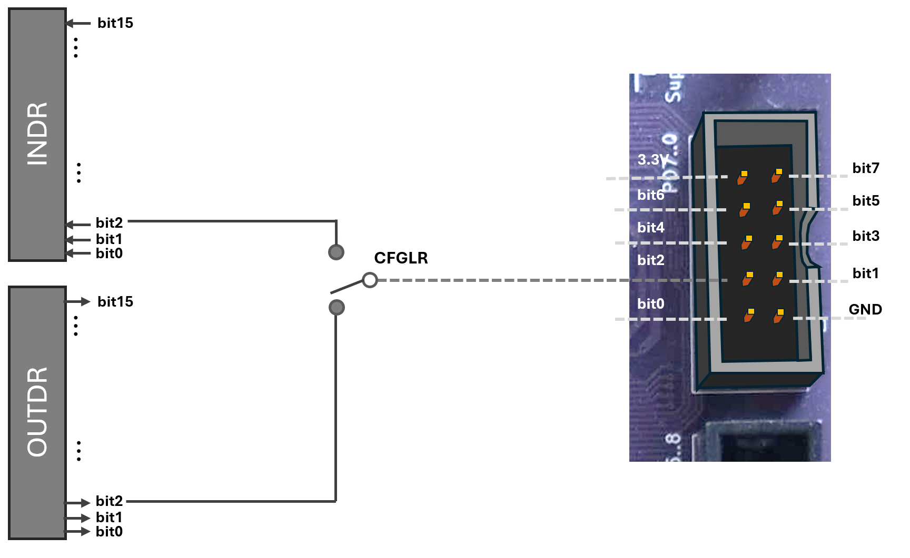
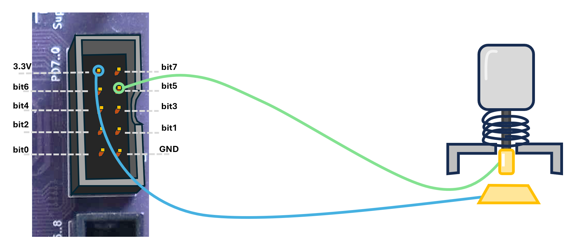
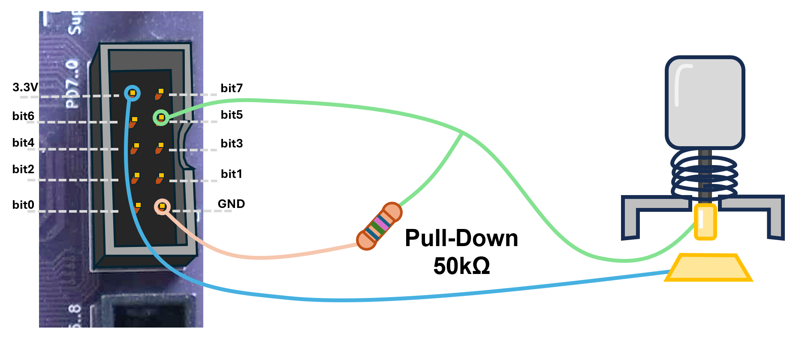
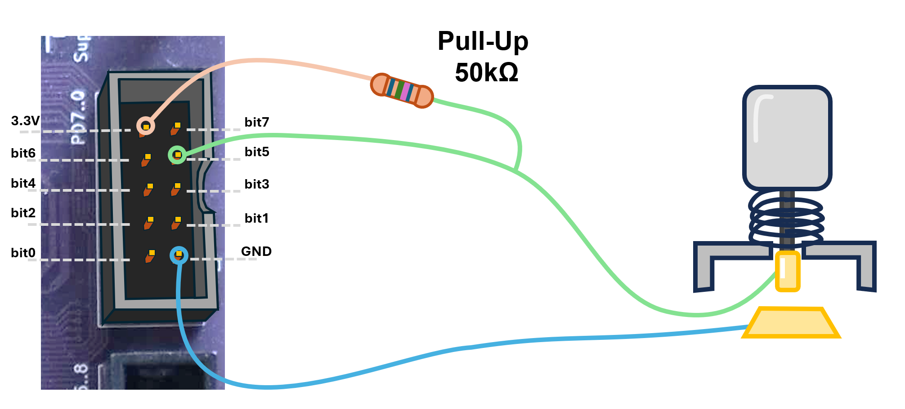
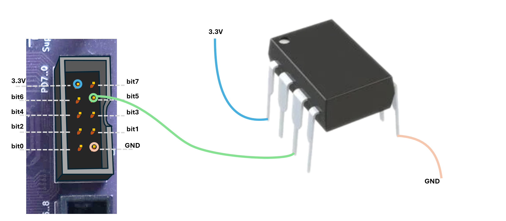
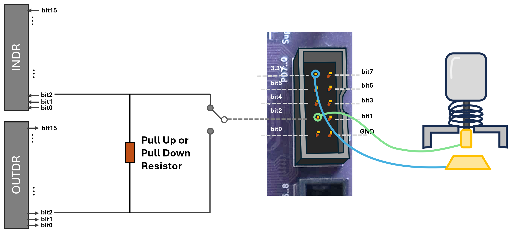
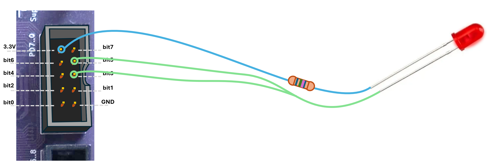
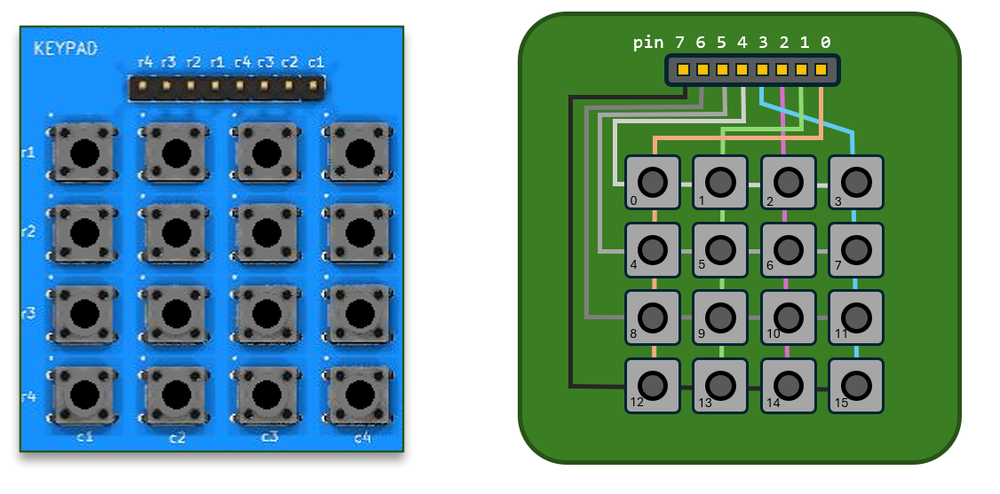

# Basics of GPIO and C

**Links:**

**Text and excercises in the Workbook (Arbetsboken)**

Chapter 2, up untill 2.2

**Things that are in the Workbook that should possibly be in this lecture**

Schmidt Trigger

In the previous lecture, we learned how to control the voltage on a GPIO pin to switch an LED on or off. We also saw how to configure a pin as either an output or an input, but we glossed over a few important details.

When we write software for regular computers, we can usually live in blissful ignorance of the fact that all those ones and zeros flying around are really electrical signals. But when we start connecting real devices to microcontrollers, that abstraction breaks down. To make our circuits work properly (and preferably not burn) we need to understand a few fundamental electrical concepts, which require us to think a bit when configuring our input and output ports.

In the second half of the lecture, we will continue with some basic C programming concepts.


## Digital Input

We saw in the previous lecture that the physical pins on the connector are connected to a register `OUTDR` and that, if properly configured, each pin will get a voltage of 0 or 3.3V depending on whether the corresponding bit in the `OUTDR` register is 0 or 1. By setting the bits differently in the `CFGLR/HR` register, we can instead connect each pin with the `INDR` register [^1]. In this mode, the function is reversed. The bits in the `INDR` register will be loaded with `1` if the physical pin has a voltage of 3.3V connected, and `0` if the pin is at 0V.

[^1]: Of course, in reality, both registers are physically connected to the pin all the time, but the connection can be switched by a transistor.

<p align="center">
  
</p>


### Pull Up and Pull Down

The simplest input device we could connect is arguably a single button, so let's start there. How does a button work? How can we connect it to our computer? This image suggests a pretty good start:

<p align="center">
  
</p>

On the right side, we illustrate a simple push button, of the kind you can buy from any [electronics outlet](https://www.electrokit.com/tryckknapp-12.2mm-1-pol-off-onrod). The button has cables connected to two terminals and when you push the button down, these come into contact and a current can run through the circuit.

We have connected one of these cables to the V<sub>dd</sub> (3.3V) pin, and the other to pin 5 (which is configured as an input pin). Thus, when the button is pushed down, we have 3.3V at the pin, and we can read `1` in the corresponding bit in the `INDR` register. But what happens when the button is released (and we are back to the situation in the image)?

We would like be certain that if we read the bit when the button is released, the answer should be `0`. But the pin is not connected to *anything* now, so the actual voltage at the pin is unknown. The pin is said to be *floating*, and if we read it we might get a 0, or a 1.

The standard way to solve this problem is to add a small "Pull-Down Resistor", as in the image below:

<p align="center">
  
</p>

Now, if the button is released (as in the image), pin 5 is still connected to ground through the resistor. Any tiny charge that may have built up on the pin quickly flows through the resistor to ground, so the pin’s voltage settles at 0 V. If we read the bit, it will be `0`. We say that this connection “*pulls*” the previously floating signal *down* to ground.

If the button is pushed, pin 5 is directly connected to 3.3 V again, so current flows from the supply into the pin until it rises to 3.3 V. Reading the bit now gives `1`.
A small *leakage current* will run through this connection, and some energy will be lost. If we use a resistor with a high resistance, the current will be very small, however, and the energy loss will be negligible.

Whether we need this pull down resistor or not depends entirely on what we have connected. We could, for instance, connect the same button but connect one of the terminals (the blue cable) to `GND` instead of V<sub>dd</sub>. In that case, we know that we will get a 0 when the button is pressed, but to avoid a floating value when the button is released, we need to connect a "Pull-Up Resistor", to 3.3V. This is illustrated in the left image below. We say that "the floating signal is *pulled* *up* to 3.3V".

<p align="center">
  
  
</p>

A push button is a *Passive Component*. In the right image above, we have connected an *Active Component* (Perhaps an OR gate, or a DAC). This chip will put *either* 0 or 3.3V on its output pin (it is never floating), and then we don't need any pull-up or pull-down resistors.

Since it is so common to connect passive components of various kinds to the GPIO pins, most MCUs have pull-up and -down resistors *built into* the chip. On the CH32V307, this is implemented as in the image below. When the pin is configured as an input pin, we can activate a pull-up/down resistor. This resistor is connected to the corresponding *output* bit, of the `OUTDR` register.

This might seem confusing at first. We have seen that the `OUTDR` register is used when the pin is configured as an *output* pin, and that the value of the bit sets the voltage of the pin. This is cleverly reused here. When the pin is configured as an input pin, the `OUTDR` register is instead used as a selector that decides whether the resistor should pull up or down. This is equivalent to physically connecting a resistor to either GND or V<sub>dd</sub>, as we did before.

So, if we need a pull-down resistor for the button connected to pin 2 (as in the image) we activate pull up/down, and we set bit 2 of the `OUTDR` register to 0 (GND). This will, exactly as before, ensure that a floating input is "pulled down" to 0V. If we instead set bit 2 of the `OUTDR` register to 1(3.3V) we have a "pull up" resistor.

<p align="center">
  
</p>

Now, let's revisit relevant parts from the [Quickguide](LINK) to see how we configure our pin:

<div class="boxed">

{{include quickguide/gpio-cfg.html}}

> TODO: Put CNF on left side, since it is first in the bit order

{{include quickguide/gpio-cfg-regs.html}}


</div>

We want to plug in a button as in the image above, so we want to configure pin2 as an input pin and activate a *pull-down* resistor on this pin. To configure the pin as input, we only need to set `MODE` to `00`.

To activate the pull up/down resistor, we set `CNF` to `10`. The possible configurations for an input pin are: 

* *Analog* (00) -- Used when the input voltage varies anywhere between 0 and 3.3V and we want to read its value. You might want to try this out towards the end of the course, but we leave it for now. 
* *Floating* (10) -- When we don't want any pull up/down resistor connected.
* *Pull-up/Pull-down* (10) -- Activates the resistor based on the value in `OUTDR`.
* *Reserved* (11) -- Not used.


To choose pull *down*, rather than pull up, resistor, we set bit 2 in `OUTDR` to 0.
Once the GPIO port is configured, we can read the current status of the input pin by reading the corresponding bit (bit 2 in this case) of the `INDR` register.

In assembly, a program that loops until the button has been pushed could look like:
```
la t0, GPIO_D_CFGLR      # Configure pin 2 as input with pull up/down active
li t1, 0x00000800        # Binary: ... 0000 1000 0000 0000
                         # Pin:    ...   3    2    1    0
sw t1, 0(t0)
la t0, GPIO_D_OUTDR      # Make it pull UP
li t1, 0x4
sh t1, 0(t0)

await_button:
  la t0, GPIO_D_INDR
  lh t1, 0(t0)
  bnez t1, await_button

```

## Digital Output

In the last lecture, we turned on an LED light by writing to the `OUTDR` register, and to configure the output pin, we set `CFG` to 00, without going into why. We can see in the table above that the possible configurations an output pin can have are: *Push-Pull* (00), *Open Drain* (01), *Alternate Function, Push Pull* (10), or *Alternate Function, Open Drain*. The *alternate function* setting is used when we want the pin to work with something *other* than the GPIO module (for example, the USB module) and we will leave that for much later. But we still have to clarify what *Push-Pull* and *Open-Drain* means.

The name “push-pull” originally comes from amplifier design, where two active devices alternately “push” and “pull” current. In digital electronics, a push-pull output stage means the pin is actively driven both high (e.g. 3.3 V when outputting 1) and low (0 V when outputting 0). This is the standard behavior, and probably what you would have expected it to do. With this configuration we can for example make the LED glow, as we have seen.

The interesting question is why we would ever do something else? You will see later that there are many cases where this configuration could cause problems, but let us start with a simple example that illustrates the main problem:

**Example:** *We have a system where pins 3 and 5 will be set to zero if some error has occurred. We want to connect a red LED that warns us if either of these error-pins are zero:*
<p align="center">
  
</p>

Now, consider what happens if we connect the LED as in the image above and configure pins 3 and 5 as push-pull outputs:

* If both bits are set to 1, no current flows through the LED (the anode and cathode are both at 3.3V), and it stays off.
* If both bits are set to 0, current flows from V<sub>DD</sub> through the LED to the pins, and the LED lights up.

*But if one pin outputs 1 and the other outputs 0*, we create a direct short: one pin is actively driving 3.3 V while the other is actively pulling to ground. This causes a large current to flow directly between the two pins instead of through the LED. This is very bad and might damage the transistors inside the microcontroller.

The solution to this problem is to configure the pins as "Open Drain" instead of "Push Pull". In an Open Drain configuration, writing `0` to the corresponding bit drives the pin to 0V, but writing `1` sets it in *floating* mode (it is as if it wasn't connected at all). Now:

The solution to this problem is to configure the pins as **Open Drain** instead of **Push Pull**. In an Open Drain configuration, writing `0` to the corresponding bit drives the pin to 0 V, but writing `1` places the pin in a **high-impedance (Hi-Z)** state. In this Hi-Z (or "floating") state, the pin behaves as if it isn’t connected at all.

Now:

* If both bits are set to 1, it is as if we had removed the two green lines in the image. No current can flow, and the LED is off.
* If both bits are set to 0, the pins are both set to 0V, and current flows from V<sub>DD</sub> through the LED to the pins, and the LED lights up.
* If one bit is set to 0 (pin is 0V) and the other is set to 1 (pin is floating) current still flows from V<sub>DD</sub> to the pin at 0V, and the LED lights up.


### Read-Modify-Write and BSHR/BCR
Especially when programming "close to the metal", as in this course, you will often find yourself wanting to change just a few bits in a word, and leave the rest as they are. Say, for instance, that your task is to turn a single led-light -- connected to pin 2 of GPIO_D -- on and off. We have previously configured the pin as output by writing a value to the *whole* `CFGLR` register. But other pins on that port might be used for something else, and might already have been configured, and you do not want to overwrite that configuration. 

The standard way of handling this is to break the operation into two operations, where you first *clear* all the bits you want to want to change with an AND operation, and then *set* the desired bits with an OR operation: 

```
la t0, 0x40011400    # GPIO_D_CFGLR
lh t1, 0(t0)         # Load the current value of CFGLR into t1
li t2, 0xFFFFF0FF    # Load a mask into t2
and t1, t1, t2       # Clear the four bits you want to change
li t2, 0x00000800    # Set the bits you want to set in t2
or t1, t1, t2        # And set these bits in t1 
                     # (without changing what was there before)
sw t1, 0(t0)         # Write back to CFGLR
```

This works fine, but is a bit cumbersome and not very fast. Therefore, some peripherals have specific registers for setting or clearing bits in a single operation: 

<div class="boxed">
{{include quickguide/gpio-bshr-bcr.html}}
</div>

The `BSHR` register allows you to set some bits and clear some bits in a single 32-bit write operation, which can be useful in some cases. Normally, though, we will use the lower 16 bits in the `BSHR` register to set bits, and the lower 16 bits in the `BCR` register to clear bits. 

So, if we wanted to just blink an LED connected to pin 2 on and off as fast as we could, without changing the values of the other bits, write: 

```
la t0, 0x40011410    # GPIO_D_BSHR
la t1, 0x40011414    # GPIO_D_BCR
li t2, 0b100         # Only bit 2 
blink: 
  sh t2, 0(t0)       # Set only bit 2 (leave the others as they are)
  sh t2, 0(t1)       # Clear only bit 2 (leave the others as they are)
  j blink
```

 Note that you *set* the bit in `BCR` to *clear* the value in `OUTDR`.

> **Quiz:**  If you actually run this program on hardware, you would find that the LED just shines dimly and doesn't blink at all. Why?

## Keypad

Now that you know everything worth knowing about the GPIO ports let us take a look at a more interesting device. In the simulator and on the lab equipment, there is a *keypad* with 16 keys. An image of the keypad, along with an illustration of how it is connected is given in the image below:

<p align="center">
  
</p>

It would, of course, be possible to build a simple keyboard where each key was connected to its own GPIO pin, but that would require very many pins (and thick cables) for large keyboards. Instead, the keys in your computer keyboard, or your digital piano, for that matter, are usually connected similarly to this one. 

The idea is that each pin is connected to one *row* or one *column* of keys. By pressing a button, you will connect one row pin with one column pin. So, if you wanted to know if, e.g., the button labeled `10` in the image was pressed, you could configure pin 2 (the pink column in the image) to be an input pin, with pull-up enabled, and you could output `0` on pin 6. 

* If no button is pressed, there is no connection, and you will read `1` from pin 2 (because of the pull-up)
* If button number 10 is pressed, pin 6 and pin 2 are connected, and we will read `0` on pin 2. 

By following the assignments in the workbook, you will construct an algorithm that activates one row at a time and reads all four columns for that row. By sweeping over all four rows you can find out exactly which buttons are pressed. 

One important thing to note is that you have to use `Open Drain` (not `Push-Pull`) on the output pins. Otherwise, if you press both key 0 and key 12 (for instance) at *the same time* there is a direct connection between output pins 7 and 4 and, as we saw earlier, this can lead to a shorted circuit and broken transistors. 


## C Programming Basics

We will now switch topic for a bit and go through some more basic C programming

### Calling, Declaring and Defining a function
All code in a C program resides in a *function*. To call a function, it must have been *declared* earlier in the C file being compiled. A function declaration looks like:
```C
<return type> function_name(<parameter 1 type> parameter_1_name,
                            <parameter 2 type> parameter_2_name,
                            ...);
```
So, if we for instance want to create a function called `max` that returns the maximum of two integers, we could declare it as:
```C
int max(int a, int b);
```
This only tells the compiler that *there is* a function called `max` that takes two integers as parameters and returns an integer. We have not yet *implemented* or *defined* the function. Declaring a function, without giving the definition, is necessary if the function definition resides in a different C file, or if it lies *after* the calling function [^C1]


[^C1]: It sometimes has to. Consider the case where function `a()` calls `b()`, which then calls `a()` again.

```C
int max(int a, int b); // Function declaration

void main()
{
    int a = max(2, 3); // Function call
}

// Function definition
int max(int a, int b)
{
    if(a > b) return a;
    else return b;
}
```

In the example above, the function `max` is first *declared* on line 1. This allows us to *call* the function on line 5. Finally, starting on line 9, we *define* the function by providing the code that shall be run.

A function can only be *defined* once, in one file, in a C program but needs to be *declared* before it can be called in all C files that need to call it. Note that a function definition also counts as a declaration, so the following code is perfectly valid:
```C
int max(int a, int b) // Function declaration AND definition
{
    if(a > b) return a;
    else return b;
}
void main()
{
    int a = max(2, 3); // Function call
}
```

### Function parameters{#sec:intro:function_parameters}
Unlike most modern languages (including C++), C *only* allows passing function parameters *by value*. That means that every time you call a function in C, the parameters are *copied* to the called function. Any changes that happen to the variables in the called function are local to that function:

```C
void set_to_five(int a) {
    a = 5;
}
void main()
{
    int x = 0;
    set_to_five(x);
    printf("x = %i\n", x);
}
```

This program will print `x = 0` to the console. When calling function `set_to_five` on line 7, the value of `x` was *copied* into the parameter `a` and when that value is changed on line 2, the value of `x` in `main` is not affected.

It is not uncommon that we *want* a function to change the value of a parameter. Consider a function `swap(x, y)` that should simply swap the values of x and y. The following code:
```C
void swap(int x, int y) {
    int tmp = y;
    y = x;
    x = tmp;
}
void main()
{
    int a = 5, b = 2;
    swap(a, b);
    printf("a = %i, b = %i\n", a, b);
}
```
would not not accomplish anything, and would output `a = 5, b = 2`.

The solution, in C, is to use *pointers*. Pointers will be discussed in detail in a future Lecture, but we will take this opportunity to show one case where they are useful. A pointer is the *address* of a variable. If we send (copies of) the *addresses* of `a` and `b` to the function `sort`, we *can* modify their values and get the expected result.
```C
void swap(int *x, int *y) {
    int tmp = *y;
    *y = *x;
    *x = tmp;
}
void main()
{
    int a = 5, b = 2;
    swap(&a, &b);
    printf("a = %i, b = %i\n", a, b);
}
```
This code will output `a = 2, b = 5`, but the syntax is probably quite confusing at the moment. We will return to this example later.

### Basic Data Types{#sec:language:datatypes}
The only built-in data types in C are integers and floating point numbers. Anything more complex, such as a data type describing a player in a game, or the properties of some device, are built from these basic types using `structs`, `arrays`, and `unions`, which will be described in future Lectures.

In addition to choosing whether a variable should be integer or floating point, we also have to specify how many bytes it should occupy (i.e., its range) and, in the case of integers, whether it should be signed or unsigned. For historical reasons, the C specification allows for several more or less confusing ways of describing integer types, but the table below describes the ones we will use in this course.

Table: Integer data types {#tab:integers}

| type               | range                             | bytes | short name  |
|--------------------|-----------------------------------|-------|-------------|
| `unsigned char`    | 0 to 255                          | 1     | `uint8_t`   |
| `unsigned short`   | 0 to 65535                        | 2     | `uint16_t`  |
| `unsigned int`     | 0 to $2^{32} - 1$                 | 4     | `uint32_t`  |
| `unsigned long long` | 0 to $2^{64} - 1$               | 8     | `uint64_t`  |
| `signed char`      | -127 to 127                       | 1     | `int8_t`    |
| `signed short`     | -32767 to 32767                   | 2     | `int16_t`   |
| `signed int`       | ($-2^{31} + 1$) to ($2^{31} - 1$) | 4     | `int32_t`   |
| `signed long long` | ($-2^{63} + 1$) to ($2^{63} - 1$) | 8     | `int64_t`   |


If you do not prefix your data type with `signed` or `unsigned`, it is assumed to be signed *except* if it is a `char` (a one byte integer), in which case its signedness depends on the architecture (!). Because the notation can be somewhat confusing, it is common to include the file `stdint.h` which allows us to use the short, descriptive names listed in the last column of the table above.

The floating-point data types have a simpler syntax and consist only of `float` or `double` for the 4 and 8 byte data types respectively.

### Type Casting
We often have to convert from one data type to another. This can be done either *implicitly* or *explicitly*:
```C
void main()
{
    float a = 200.501f;
    int b = a;
    unsigned char c = a * b;
}
```
In the example above, on line 4, the value 200.501 is cast to an integer and stored in variable `b`. Since an integer cannot store a floating point value, it will be truncated to 200. On the next line `b` is first promoted to a floating point number, then `a * b` is calculated as a floating point number 40100.2, then that value is cast to an `unsigned char` and stored in the variable `c`. The result is again truncated to a whole number 40100 (`0x9CA4`), and since an unsigned char can only store values up to 255, only the lowest byte of the result (`0xA4`) will remain in `c`.

If this seems a bit complicated, that is because it is. The C specification has a large number of very strict rules about what happens, and in what order, when casting between datatypes, but it can be hard to remember. Therefore, it is often better to *explicitly* describe what casts should be done:
```C
    float a = 200.501f;
    int b = (int) a;
    unsigned char c = (unsigned char)(a * (float) b);
```

### Conditional execution{#sec:language:conditional}
Choosing whether to execute code depending on some condition in C is similar to most high level languages. In the example below, we use first the *if* statement and then the *switch* statement to do the same thing:

<center>**if statement:**</center>
```c
if(a == 5) {
    printf("a is 5");
}
else if(a == 4) {
    printf("a is 4");
}
else if(a == 3) {
    printf("a is 3");
}
else {
    printf("a is something else");
}
```
<center>**switch statement:**</center>
```c
switch(a) {
  case 5: printf("a is 5"); break;
  case 4: printf("a is 4"); break;
  case 3: printf("a is 3"); break;
  default: { printf("a is something else"); break;
  }
}
```


Note the `break` statement when using switch. It means that you should break out of the switch statement. If you forget that, the code will continue to execute the subsequent `case` statements, which *can* be used to your advantage in some cases, but is also a very common source of bugs.

One important thing to note is that there is no `true` or `false` datatype in C. Instead, the result of a comparison is always an integer, with 0 meaning false and any other number meaning true. You will see examples of where this can be important in the following sections.

### Conditional operator
In some simple cases, when a variable is to be assigned a value based on some condition, the *conditional operator* can be a cleaner way to express your intention:
```C
// Conditional operator:
// <variable> = <condition> ? <if condition is true> : <if condition is false>;
// Example:
int a = (b > 5) ? 20 : 30; // a is set to 20 if b is more than 5 and 30 otherwise
```

### Iterating {#sec:language:iterations}
Writing code that *iterates* or *loops* is also very similar to other imperative languages. The example below illustrates how `for` or `while` loops can be used to achieve the same thing:

<!-- to make it even simpler you could write a function with only one argument, like factorial(n)
     ERIK: Valid point, but I don't have the strength today. TODO. 
     Sergei: Counter-point: students who read/need this may not know what factorial is. Power is an easier function. :)
 -->
<center>**for statement:**</center>

```C
int pow(int v, int p) {
    int result = 1;
    for(int i = 0; i < p; i++) {
        result = result * v;
    }
    return result;
}
```
<center>**while statement:**</center>

```C
int pow(int v, int p) {
    int result = 1;
    int i = 0;
    while(i < p) {
      result = result * v;
      i += 1;
    }
    return result;
}
```

The `for` statement is generally used when we are iterating a known number of times, and the `while` statement is used when we only know that we should loop until some condition is met. In either case, we can use the `break` statement to immediately break out of the loop, or the `continue` statement to jump back to the beginning of the loop:
```C
int rand(); // Expecting this function to exist elsewhere
            // and that it returns a random number.
void main(void) {
    // Count the number of positive numbers we get
    // before we get a zero
    int result = 0;
    while(1) {  // 1 is "true" in C
        int v = rand();
        if(v < 0) continue;
        result += 1;
        if(v == 0) break;
    };
}
```

### The infamous `goto` statement
*Unlike* most other modern languages, C actually has a `goto` statement, which works exactly like the ''jump'' or ''branch'' instruction in assembler. This sort of low level statement has been removed from modern languages because it provides a very easy way to write completely undebuggable code, and we recommend that you forget that you ever saw this small paragraph and never use it.

### Operators {#sec:language:operators}
Most of the operators in C will be well known to you, if not from previous coding experience then from maths, and we will not go through all of them in detail as they can be easily found on the internet\footnote{e.g.: \url{https://www.tutorialspoint.com/cprogramming/c_operators.htm}}. We will only quickly go through the different classes, and highlight some important details:

### Arithmetic Operators, (`+, -, *`, etc)
We have already seen these used in the text and you probably know how they work. Worth noting are the increment and decrement operators. Also make sure you understand the modulus operator.
```C
int a = 10, b = 3;
int c = a + b; // Addition
int d = a - b; // Subtraction
int e = a * b; // Multiplication
int f = a / b; // Integer division
int g = a % b; // Modulus (remainder of an integer division)
int h = a++;   // Increment Operator (assign a to h, then increment a)
int i = ++a;   // Increment Operator (increment a, then assign a to i)
int j = a--;   // Decrement Operator (assign a to j, then decrement a)
int k = --a;   // Decrement Operator (decrement a, then assign a to k)
```

### Relational Operators, `==, !=, >, <, >=, <=`
These are the operators we use to compare variables and they are all probably known to you. Remember that, in C, the result of a relational operator is an integer (0 if false and 1 otherwise), so you *might* see expressions such as:
```C
int a = 20 + (a > c); // 21 if a is more than c
```

### Logical Operators, `&&, ||, !`
These are logical operators and are mostly used as in other languages:
```C
if(a && b) // If a is non-zero AND b is non-zero
if(a || b) // If a OR b is non-zero
if(!a)     // If a is NOT non-zero (i.e., if a is zero)
```

### Bitwise Operators, `&, |, ^, ~, <<, >>`
The bitwise operators are easy to confuse with the logical operators, but they are *not* the same thing. The result of these operators is not a boolean value, but an integer where the operation has been performed per bit. While these operations look the same in most modern languages, you may not have come across them as often, and they will be very important in this course, so make sure you understand the following:
```C
// Assume a = (binary) 10101010 and b is 00001111
c = a & b;       // Bitwise AND, c == 00001010
c = a | b;       // Bitwise OR, c == 10101111
c = a ^ b;       // Bitwise XOR, c == 10100101
c = ~a;          // Binary one's complement, c = 01010101
c = a << 2;      // Left shift operator, c = 10101000
c = a >> 6;      // Right shift operator,
                 //   c = 00000010 if a is unsigned
                 //   c = 11111110 if a is signed
```

### Assignment Operators
There are several short-hand assignment operators that do an assignment and an operation in the same operator. A few examples:
```
c += b;   // Same as c = c + b
c <<= b;  // Same as c = c << b
c ^= b;   // Same as c = c ^ b
```

### Precedence of operators
There are strict rules for which operators take precedence in C. For example, `a = b * c + d` means that we first multiply b and c, then add d. These rules are hard to remember for every single operator, however, and it is usually a good idea to make precedence clear using parentheses whenever precedence is not absolutely obvious.
