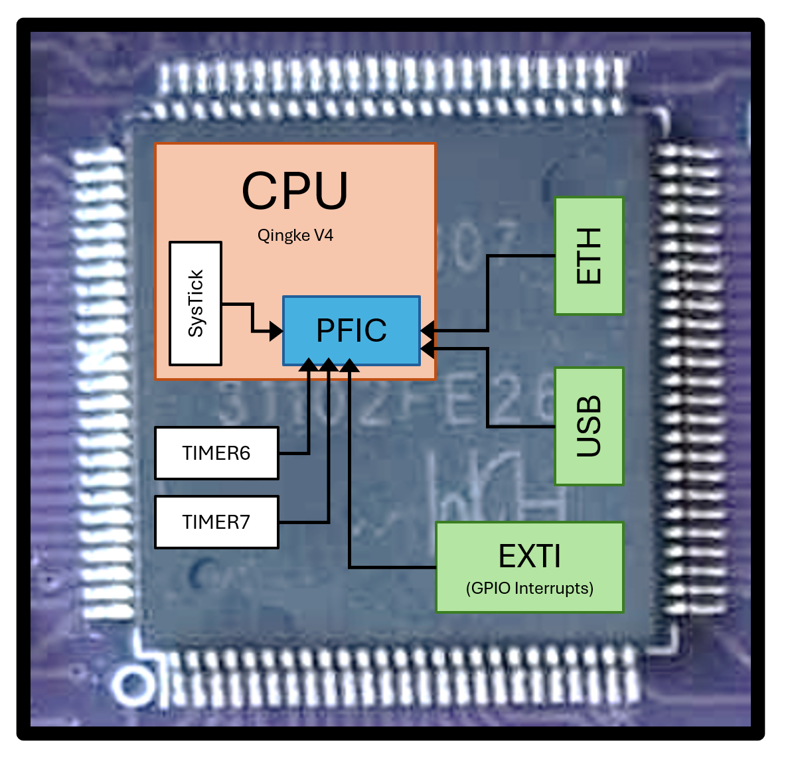
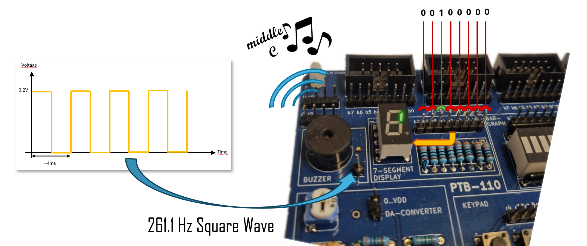

# Exceptions and Internal Interrupts 
In this lecture, we will start looking into *exceptions*, *faults*, *traps*, and *interrupts*. These are all names for situations where the currently running program is *interrupted* by some event, either from outside or inside the processor. 

A simple real-world analogy would be the ring signal on your phone. You probably do not look at your phone every few seconds to see if someone is calling you. Instead, you go about your life, and sometimes the phone rings and you drop everything for a short while to handle that phone call, and then go on with your life as if nothing had happened.

In the same way, a microcontroller in your fridge might run along happily regulating the temperature. When the fridge door opens, it has to turn on the lights. If the door stays open for too long it has to start an annoying beep that reminds you to close the door. 

We *could* try to check if the door is open, every few instructions, in our code, but that would be very difficult and lead to horribly complicated code. Instead, all modern microprocessors have an exception mechanism that allows the processor to: 

1. Store the current state of the machine (the register values) to memory.
2. Jump to an *exception handler* - another piece of code that handles the event that just occurred. 
3. Restore the machine state and resume your program as if nothing had happened. 

## Different types of exceptions
Exceptions are categorized in a number of different ways, and you will see that essentially the same functionality has different names depending on where and how it happens: 

* **RESET** - A very special type of exception occurs when someone presses the *reset* button (or the processor was told to reset by the debug module). The running program is then interrupted, and the processor starts a RESET sequence (the program is never resumed).
* **FAULT** - The running code might do something that is not allowed. For example, it might do an unaligned memory access (as we have discussed before), it might try to write to a protected part of the memory area, or it might simply try to divide a value by zero. All of these errors are likely to cause the machine to crash if not handled appropriately. Instead, the program can be immediately interrupted and some system code can run that handles the error in an appropriate way and then might allow the program to resume. 
* **INTERRUPT** - In this course we will divide interrupts into two different types: 
  - **External Interrupts** - This is when an interrupt originates from *outside* the microcontroller. The fridge door, for example, might be connected to one of the GPIO pins, and when the door opens the programmer wants the change in the GPIO pin's value to immediately interrupt the running program. 
  - **Internal Interrupts** - This is when the signal to interrupt originates from within the microcontroller. When the fridge door opens, the programmer might start a SysTick timer, and configure it to interrupt the running code after 30 seconds. 
* **TRAP** - Sometimes, the code itself might ask to be interrupted. This might sound strange, but in reality there are many cases where this is useful - for example when invoking system services or entering a debugger. We will return to this later.

> **Note:**
> This is the terminology we will use in this course, and what is used in many textbooks. Some textbooks and articles (and even the RISC-V specification) use slightly different, and sometimes contradictory, defenitions of these terms.

## A quick aside: Control and Status Registers

In the beginning of this course, we stated that a processor implementing RV32I only needs 33 registers
(`x0–x31` plus the `pc`). That is still true - but such a processor would not support interrupts.

Our microprocessor (CH32V307) implements RV32I together with the Privileged ISA and the `Zicsr` extension, which add support for interrupts and system control.
As a result, the processor contains a number of additional registers called *Control and Status Registers* (CSRs). We will encounter a few of these later in the lecture. For now, all you need to know is that: 

1. CSRs are real hardware registers like the GPRs, but they are not accessible with normal instructions.  
2. They can only be read or modified using a small set of special CSR instructions.

<div class="boxed">
<small>
**Enrichment:** The following is interesting and will help your understanding, but is not essential for the course. 
</small>

# Machine Privilege modes
A RISC-V processor (that implements the "Privileged Specification") can run in different *privilege modes*. At lower privilege levels, some instructions are not allowed. It is easy to see why this is necessary on a desktop computer: if any program could execute any instruction and freely access the memory of other programs, it could cause serious **security problems** (reading or modifying private data) or **stability problems** (crashing the entire system). For this reason, the operating system runs with full system access, while user applications run with very limited privileges.

We will not explore this topic in depth in this course, but even on the small microcontrollers we use, privilege modes can be very useful. Consider a smart fridge as an example. Some parts of the system are **safety-critical**, such as temperature regulation, and are developed very carefully to run reliably for many years without change. Other parts, such as the touchscreen user interface, are updated frequently as features and visual designs evolve. If a bug is introduced while adding a new font to the clock app, it is crucial that this mistake cannot affect the safety-critical code and spoil the food.

For this reason, the less critical code can run in a lower privilege mode, where it does not have the ability to interfere with or crash the core control software that keeps the fridge operating safely.

Even code that runs in a lower privilege mode (such as the user-interface tasks) will still need to interact with hardware. For example, the UI must update the display, read button presses, or query the current temperature. However, direct access to most peripherals and critical registers is restricted to privileged code.  

To handle this safely, user-mode programs do not access hardware directly. Instead, they **request services from privileged code**, which performs the sensitive operations on their behalf. This is done by temporarily transitioning from user mode to machine mode using a *trap* (often called a *system call*).

When the UI wants to update the screen or read a sensor, it triggers a special instruction that raises a trap. The processor immediately switches into machine mode and begins executing a trusted service routine. This routine checks the request, performs the necessary hardware access in a controlled way, and then returns the result to the user-mode program before switching back to user mode.

> Quiz: If all interrupt handlers run in privileged mode, why couldn't a malicious programmer simply write an interrupt handler that does the malicious stuff?
</div>

## The Programmable Fast Interrupt Controller (PFIC)
The module in the processor core on our microcontroller that collects all exceptions is called the *Programmable Fast Interrupt Controller* (PFIC). We will discuss this in more detail in the next lecture bit will quickly introduce it here. Anything that *can* interrupt the processor is connected to this module, and all the possible interrupt sources are ordered and listed in the [Vector Table](vector_table.html) in the QuickGuide. 

Whenever something wants to interrupt the processor, it will tell the PFIC and the PFIC will check if that interrupt is enabled, if there is another interrupt running at the moment and whether that interrupt should be interrupted or if the current interrupt should be queued. 

<center>

</center>

For this lecture, all we need to do to the PFIC is to *enable* interrupts from the SysTick timer, so let us look at a single set of registers: 

{{python quickguide-generator/main.py overview-table PFIC IENR* -no-grouping}}

These are the *Interupt Enable* registers and they contain one bit for each possible interrupt source (104 bits all together). The first register, `IENR1`, contains the bits corresponding to the first 32 interrupts in the [vector table](vector_table.html), the next register, `IENR2`, correspond to interrupts [32-63], and so on. 

Since we want to enable SyTick interrupts (interrupt number 12 in the vector table), we need to set the 12:th bit in `IENR1`.


# How to write a program with interrupts
We will explore why and how we program with interrupts using a simple example. Let's say we are employed by a Fridge company, and they want a prototype program from us. When the fridge door has been left open for too long they want a microcontroller to play a loud and annoying note, while at the same time displaying the current temperature on a 7-segment display. 

Luckily, our PTB-110 IO board has both a little speaker (called "buzzer" in the image below), and a 7 segment display, so all we have to do is plug in our MD307 and write the code. 



Let's start with playing a note. A sound signal sent to a speaker is usually an analog signal with varying voltage, and all we know (yet) is how to output 0 or 3.3V from our GPIO ports. For us humans to perceive a signal as a note, however, all we need is a signal with a frequency in the 20Hz-20kHz range. So in fact, just flipping a GPIO pin between 0 and 1 (0 and 3.3V) every ~2 ms and connecting that signal to a speaker will produce a 261Hz signal that sounds like a middle C on a piano (well, it has the same pitch, anyways).  

We have already practiced sending signals to GPIO pins *and* precise timing (with SysTick), so we can immediately write the code for this. 
```C
int main(void)
{
    *GPIOD_CFGLR = 0x00000002;  // Configure pin 0 as Output, Push-Pull, 2MHz
    *SYSTICK_CMPH = 0x0;        // Set systick compare value to 2ms 
    *SYSTICK_CMPL = 147000 * 2; //
    *SYSTICK_CTLR = 0b101101;   // Start systick timer, count down, enable restart
    while(1) 
    {
        while((*SYSTICK_SR & 0x1) == 0) {}  // Wait until systick has counted to zero (2ms)
        *SYSTICK_SR = 0;                    // Reset status flag
        *GPIOD_ODATA ^= 0x1;                // Flip pin 0
    }
}
```
If we connect GPIO pin `D0` to the buzzer, we will hear a tone playing. 

For the second task -- showing the temperature on the 7-segment display -- we will pretend that we are given two helper functions in a library: 

* `int GetTemperature()` - Blocks until a new temperature value is available (max 100 ms), then returns the temperature (always between 0 and 9 degrees)
* `uint8_t Get7SegCode(int x)` - Returns the bitmask (the lit segments) corresponding to the number `x`.

If we connect GPIO port E(7:0) to our 7-segment display, we could now run the following program: 

```C
int main(void)
{
    *GPIOE_CFGLR = 0x22222222;  // Configure all pins as Output, Push-Pull, 20MHz
    while(1) 
    {
        int t = GetTemperature(); 
        *GPIOE_ODATA = Get7SegCode(t);
    }
}
```

But how can we combine these two programs? Since the `GetTemperature` function can take anywhere between 0 and 100ms it seems impossible to keep flipping pin `D0` every 2ms. The answer (as you have probably guessed) is to let SysTick interrupt our code every time it has counted down to zero, flip `D0` in the interrupt handler, and return to the the main program. But before we can write that code, we need to know a bit more about interrupt handlers. 

## What happens when an interrupt occurs? 

In an early lecture, we gave a brief introduction to the *instruction cycle* - the state machine the processor goes through for each instruction. Let's revisit that, and add a few steps to take care of interrupts [^1]: 

1. *Fetch Instruction* - Fetch the next instruction from memory (at the address stored in `PC`)
2. *Decode Instruction* - Find which instruction it is, and prepare inputs to ALU, etc. 
3. *Execute Instruction* - Execute the instruction (usually an ALU operation)
4. *Store/Writeback* - Write results to memory or destination registers
5. **Check Exceptions** - Check if any exception has occurred and if it is enabled and, *if so*:
    1. Save current `PC` in CSR register `mepc`
    2. Save the cause of the exception in CSR register `mcause`
    3. Disable interrupts by writing a bit in CSR register `mstatus`
    4. `PC` <- Get address to interrupt handler from `mtvec` CSR.

[^1]: This description is still simplified, and interrupt handling is described as it works when the processor is configured for "vectored interrupts", which is all we cover in this course. 

In other words, if an interrupt occurs, the current instruction will continue until done. Then machine state will be saved away and `PC` will change to an address specific to this exception. We will discuss some of these steps in detail below. 

### Interrupt handler address
So how does the processor know where to jump (i.e., where in memory the interrupt handler is), when an interrupt occurs? There are actually several different ways that the CH32V307 can handle this, and they will be discussed in the next lecture. For this lecture, we will use the simplest possible way: Put the *address* of the interrupt handler function into the CSR `mtvec`.

Since the C language is platform independent, there is no special C code that can write to the CSR registers. Instead, we either have to implement this in an assembly file:
```s
.extern Interrupt_Handler  # Assuming there is a C function with this name
.global write_mtvec        # Make this function available to C code
write_mtvec:               # void write_mtvec()
la t0, Interrupt_Handler   # Load the address of that function to t0
csrw mtvec, t0             # And write it into mtvec
ret
```
, or we can use *inline assembly* in our C code to achieve the same thing: 
```C
// Set mtvec to address of Interrupt_Handler
__asm__ volatile ("csrw mtvec, %0" :: "r"(Interrupt_Handler));
```

Either way, when an interrupt is enabled and triggers, the processor will now expect a handler routine at the address stored in the `mtvec` register, and jump to that address. 


### Interrupt handlers
In most respects, an interrupt handler is just a "function" and we will implement it as a function in C, but there are two important caveats. 

* **Returning from an interrupt handler**
    When the interrupt handler is done, it cannot use the `ret` assembler instruction to return. If you recall, or look in the QuickGuide, the `ret` pseudo instruction is implemented as `jalr x0, 0(ra)`. That is, it will jump to whatever address is in the `ra` register but that will *not* be the address to the instruction that was interrupted!

    Instead, an interrupt handler must use the `mret` instruction. This is a special instruction, only used by interrupt handlers, that copies the previously stored CSR `mepc` to `pc`, restores privilege levels and enables interrupts again (if they were enabled when the exception occured). 

* **Register saving in an interrupt handler**
    In normal C functions, the compiler will follow the conventions, set up by the ABI, for which registers shall be saved on the stack. Importantly, that means that the *caller* is expected to save the `t` registers (if it has further use for them) before calling a function, so the *callee* does not have to do that. 

    Since an interrupt handler is not "called" in the conventional sense, the *caller* has no opportunity to save the `t` registers, and the interrupt handler has to assume that *all* registers it uses need to be saved on the stack. 

Luckily, in practice, we rarely have to think about this distinction when programming in C. We simply tell the compiler that this specific function is an interrupt handler and the compiler will produce the correct code. 

## Implementing our smart-fridge prototype
To complete our prototype that can play a tone on the buzzer and show the temperature on the display at the same time, we will rewrite the tone generation so that it is triggered by a systick interrupt instead. 

### Enabling interrupts from SysTick in the PFIC
Since SysTick is interrupt number 12, we enable SysTick interrupts by setting bit number 12 in the PFIC_IENR1 register: 

```C
#define PFIC_BASE       0xE000E000
#define PFIC_IENR1     ((volatile uint32_t *)(PFIC_BASE + 0x100))
int main(void)
{
    // Enable Systick Interrupt in PFIC
    *PFIC_IENR1 |= (1 << 12);
}
```

### Writing a SysTick interrupt handler
Next, we will write an interrupt handler that will be called every time the SysTick counter reaches 0. The actual handler code can look like this: 

```C
__attribute__((interrupt("machine")))
void SysTick_Handler(void)
{
    *SYSTICK_SR = 0;        // Reset the status, so we will get a new interrupt in 2ms
    *GPIOD_ODATA ^= 0x1;    // Flip GPIO D0 pin
}
```
The first line tells the compiler that this is an interrupt handler and code must be generated accordingly. Note that the systick module will not generate a new interrupt until the last one has been taken care of. You inform the module that this has been done by setting the status register back to 0. 

We also have to inform the processor that this is the function that we want to be called when an interrupt occurs. As discussed earlier, we do this by putting the address to it into the `mtvec` CSR register: 

```C
void main() {
    ...
    asm volatile ("csrw mtvec, %0" :: "r"(SysTick_Handler));
    ...
}
```

### Configuring SysTick to generate Interrupts
To make sure that this handler actually gets called, we can start by flipping a single bit in our previous systick-initialization code: 

```
    *SYSTICK_CMPH = 0x0;        // Set systick compare value to 2ms 
    *SYSTICK_CMPL = 147000 * 2; //
    *SYSTICK_CTLR = 0b101111;   // Start systick timer, count down, enable restart,
                                // and ENABLE INTERRUPTS
```

But now our code is in a dangerous state! After this line has been executed, systick will start counting and after 2ms, an interrupt will be triggered. The processor will then use the `mtvec` CSR to decide where to jump, but we have not put anything useful into that register.


And that is all there is to it! We can now write a single main C file, that plays a tone using an interrupt, and *in parallel* reads and updates the thermometer value.


