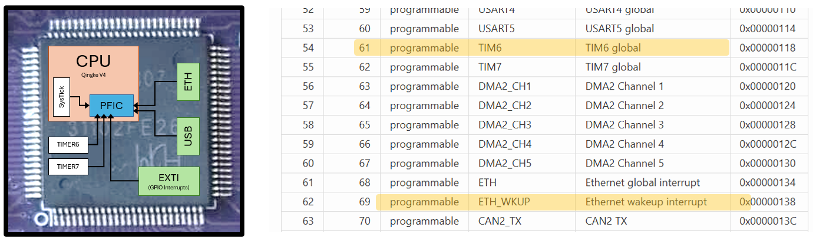
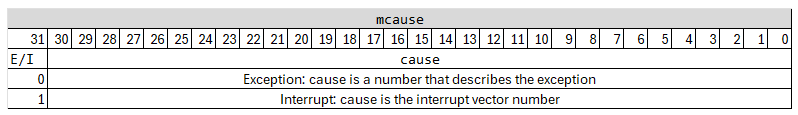
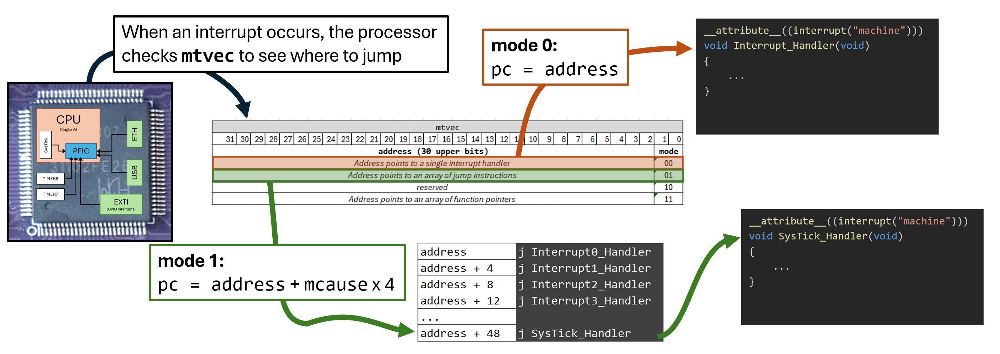

# External Interrupts
So far we have seen how to interrupt the program when a single, *internal*, interrupt occurs (SysTick counted to zero). In this lecture we will dive deeper into interrupt handling, and show how we can handle several simultaneous interrupts from modules outside the Qingke processor and finally from interrupts originating from the GPIO pins. 

## Configuring multiple interrupts
Recall from the previous lecture that every module that can cause an interrupt on the chip will have a hard-coded connection to the *Programmable Fast Interrupt Controller* (PFIC) module. When, for instance, the "Ethernet Wakeup" signal comes in from the ethernet cable, the ethernet module will signal the PFIC, and the PFIC will (if it has been configured to do so) interrupt the running code and make the processor run an interrupt handler. 

Every possible interrupt that can occur has an assigned *interrupt vector number* which you can find in the [QuickGuide](../quickguide/interrupt_vector_table.html).

<center>

</center>
> <b>TODO</b> Update quickguide snippet with corret numbers...

We will start with an example where we want three LEDs to blink at different frequencies, `f1`, `f2`, and `f3`.

Couldn't we just use SysTick for this? If the frequencies are `f1 = 1Hz`, `f2 = 2 * f1`, and `f3 = 4 * f1`, we could create a SysTick interrupt that triggered at frequency `f3` and do: 

```C
uint32_t ctr = 0; 
void Interrupt_Handler() // Runs at frequency f3
{
    toggle_LED3();   // Always toggle LED3 to get frequency f3
    if(ctr % 2 == 0) toggle_LED2(); // Toggle every 2:nd time to get frequency f2
    if(ctr % 4 == 0) toggle_LED1(); // Toggle every 4:th time to get frequency f1
}
```

This would work, but it is a special case. We want our leds to blink at *any* three frequencies. If the frequencies we wanted were `f1 = 1Hz`, `f2 = 3 * f1`, and `f3 = 5 * f1`, we would be in trouble because our interrupt would have to run at a frequency that is the *lowest common denominator*: `LCD(1,3,5) = 15Hz`. Therefore we would have to interrupt our processor very often, only to increase a counter. There are tricks for this, but it is much easier and more efficient to use one timer per LED. 

We can set up SysTick, TIMER6, and TIMER7 to generate interrupts at 1Hz, 3Hz, and 5Hz, respectively, like[^1] this:

[^1]: We covered the basic timers and prescalers in a previous lecture, so go there and do the exercises if this looks confusing to you.

```C
    // Set up systick for 1 second delay (1Hz)
    *systick = (SYSTICK_t){0}; // Clear everything to 0
    systick->CMP = 144000000; // Set up to count to one second (assuming 144 MHz clock)
    systick->ctrl.clksrc = 1; // Use HCLK
    systick->ctrl.reload = 1; // Enable reload
    systick->ctrl.intenable = 1; // Enable interrupt
    systick->ctrl.enable = 1; // Start counting

    // Set up timer 6 at 3Hz
    *timer6 = (TIMER_t){0}; // Clear everything to 0
    timer6->PSC = 9600;    // Timer increases every 9600th clock -> 144Mhz / 9600 = 15kHz
    timer6->ATRLR = 5000;  // Generate interrupt every 5000 ticks -> 15kHz / 5000 = 3Hz
    timer6->ctrl1.enable = 1; // Enable timer
    timer6->DMAINTENR = 1; // Enable update interrupt

    // Set up timer 7 at 5Hz
    *timer7 = (TIMER_t){0}; // Clear everything to 0
    timer7->PSC = 9600;     // Timer increases every 9600th clock -> 144Mhz / 9600 = 15kHz
    timer7->ATRLR = 3000;   // Generate interrupt every 3000 ticks -> 15kHz / 3000 = 5Hz
    timer7->ctrl1.enable = 1; // Enable timer
    timer7->DMAINTENR = 1; // Enable update interrupt
```

Next, we have to tell the PFIC to allow interrupts for all three timers. So, we have to use the interrupt vector number (which we find in the QuickGuide) to calculate which of the PFIC_IENRx registers it resides in, and then set the correct bit in that register. We can do this quite elegantly as: 

```C
#define PFIC_IENR     ((volatile uint32_t *)(0xE000E000 + 0x100))
...
    PFIC_IENR[SYSTICK_IRQ_NUM / 32] |= (1 << (SYSTICK_IRQ_NUM % 32));
    PFIC_IENR[TIMER6_IRQ_NUM / 32] |= (1 << (TIMER6_IRQ_NUM % 32));
    PFIC_IENR[TIMER7_IRQ_NUM / 32] |= (1 << (TIMER7_IRQ_NUM % 32));
```

Finally, we need to write an interrupt handler, and point `mtvec` to that interrupt handler (just as in the previous lecture): 

```C

__attribute__((interrupt("machine")))
void Interrupt_Handler(void)
{
    ...
}

int main(void)
{
    // Set mtvec to address of Interrupt_Handler
    __asm volatile ("csrw mtvec, %0" :: "r"(Interrupt_Handler));
    ...
```

But now what? With this code, all three timers will generate interrupts, and out interrupt handler will run whenever one of them fires, but how do we know *which* timer triggered the interrupt? 

When the processor interrupts the code to run an interrupt handler, it places the *source* of the interrupt (the interrupt vector number from the quickguide) in the CSR register `mcause`: 

<center>

</center>
> <b>TODO</b> Put CSRs in QuickGuide and include here

To handle the correct timer, we have to first make sure that it really was an interrupt that occurred (and not another exception, like an unaligned memory access), and then do the proper thing depending on which interrupt it was: 

```C
__attribute__((interrupt("machine")))
void Interrupt_Handler(void)
{
    uint32_t cause;
    // The `mcause` register is not directly available to C, 
    // so we read it with inline assembly. 
    __asm volatile ("csrr %0, mcause" : "=r"(cause) :: "memory");
    if(cause & 0x80000000){ // Check bit 31
        // This is an interrupt
        cause = cause & 0x7FFFFFFF; // Mask out the MSB
        if(cause == SYSTICK_IRQ_NUM){
            *GPIOD_OUTDR ^= 0x1;    // Toggle LED1
            systick->SR = 0;        // Acknowledge the interrupt
        }
        else if(cause == TIMER6_IRQ_NUM){
            *GPIOD_OUTDR ^= 0x2;    // Toggle LED2
            timer6->INTFR = 0;      // Acknowledge the interrupt
        }
        else if(cause == TIMER7_IRQ_NUM){
            *GPIOD_OUTDR ^= 0x4;    // Toggle LED3
            timer7->INTFR = 0;      // Acknowledge the interrupt
            return;
        }
    }
    else {
        // Exception. Freak out. 
        while(1);
    }
}
```

Note that you **must** acknowledge the basic timer interrupts (just as you must acknowledge a SysTick interrupt) when you have handled it. Otherwise the processor will just run the interrupt handler again, as soon as it is finished. 

Another important thing to note here is that even this quite simple interrupt handler becomes quite a large number of instructions (35 machine code instructions when I compiled it). 
Meanwhile, all we really need to do when we get, e.g., a SysTick interrupt is to flip one bit, acknowledge, and return (5 instructions). This can quickly become a bottleneck when we have to handle many interrupts and the interrupts need to be handled quickly.

It would be much better if the CPU could immediately call a specific interrupt handler, based on the cause of the interrupt, and that is what we will cover next. 

## Vectored Interrupt Handling
So far, we have simply put the address to the interrupt handler into the `mtvec` CSR and when an interrupt occurs the processor has jumped to that address. This is only one of three *modes* that the CH32V307 can operate in, however. We choose the mode using the two least significant bits of the `mtvec` register (see image below). Since all instructions (and therefore, all functions) on our system must begin at a four-byte aligned address, any valid interrupt-handler address will have zeroes as its two least significant bits, so, without thinking about it, we have always chosen **mode 0** so far. 

The possible configurations of the two least significant bits are: 

* **00 - mode 0** - When an interrupt occurs, the processor jumps directly to the address stored in `mtvec`, i.e: `pc = mtvec`.
* **01 - mode 1** - When an interrupt occurs, the processor will fetch the address from `mtvec` but will then *add 4 x* `cause` to the address (where cause is the value of the `mcause` CSR, with the MSB masked out). In other words: `pc = mtvec + 4 * (mcause & 0x7FFFFFFF)`. This is called a *vectored* mode, and we would normally have a jump instruction at that address (see image below). 
* **10 - reserved**
* **11 - mode 3** - In this mode, the processor will fetch the new address from a list of *function pointers* starting at `mtvec` with an offset taken from `mcause`. `pc = M[mtvec + 4 * (mcause & 0x7FFFFFFF)]`. This last mode is discussed further in your workbook, but as it is not a standard RISC-V mode, we will not explore it further in this course. [^mode_3_footnote]

[^mode_3_footnote]: This is how vectored interrupts are handled on ARM processors, and it is implemented in this microcontroller by WCH to ease the transition for ARM developers. 

<div class="boxed"> 
> **Quiz** (advanced, answer in footnote[^quiz_answer]) - Why was mode 1 chosen instead of mode 3 as the standard way for RISC-V to handle interrupts? Can you think of any case where it can be faster? 
</div>

We will use *mode 1* to make our processor jump directly to the interrupt handler for the specific timer, by placing a list containing jump instructions somewhere in memory.

[^quiz_answer]: If you need an interrupt to be handled extremely quickly, you can place its instructions *directly* into the vector table. This only works if the instructions do not overwrite another entry that you need. Useful for very fast (MHz range) signals. 

<center>

</center>

The remaining question is how to create that list of jump instructions, at some place in memory? The easiest, and most common, way to achieve this is to write the list in an assembly file, and compile it with the program: 

```
.section .text
# Make the (C code) interrupt handlers addresses available to our assembly code
.extern SysTick_Handler  
.extern Timer6_Handler 
.extern Timer7_Handler 

.align 2        # Create a label that is the start of our list in memory
vector_table:   # and make sure it is at a 4-byte aligned address
.org vector_table + 12 * 4   # "Move" to the place in memory where we want out SysTick handler
j SysTick_Handler            #  And place a jump instruction there
.org vector_table + 70 * 4   # "Move" to the place in memory where we want out Timer6 handler
j Timer6_Handler             #  And place a jump instruction there
.org vector_table + 71 * 4   #  etc... 
j Timer7_Handler             #  etc... 
```

We do not really care where in memory our vector table is, so we just let the compiler decide on a place (the label `vector_table`), as we do for any variable. Since SysTick is interrupt number 12, we want the jump instruction that jumps to the SysTick handler top be at address `vector_table + 4 * 12` (because that is where the CPU will jump, when a SysTick interrupt is triggered). We could achieve this by just leaving `.space 4*12` after the `vector_table` label and before the `j SysTick_Handler` instruction, but it is easier to use the `.org <address>` directive. You can think of this as telling the assembler to "move the cursor" to somewhere in memory, and that is where the next instruction will be placed. 

Finally, we need to put the address of our vector table into `mtvec` and set the least significant bit so the processor knows that it should use mode 1. Since we already have an assembly file, this is easiest to do with a little assembly function: 

```
init_interrupts: 
    la t0, vector_table     # Address of vector table to t0
    ori t0, t0, 1           # Choose `mode 1` by setting the LSB
    csrw mtvec, t0          # Write t0 into `mtvec`
    ret
```

We can now rewrite our c program so that it has three separate interrupt handlers: 

```C
__attribute__((interrupt("machine")))
void SysTick_Handler(void) { ... }

__attribute__((interrupt("machine")))
void Timer6_Handler(void) { ... }

__attribute__((interrupt("machine")))
void Timer7_Handler(void) { ... }

int main()
{
    // Configure timers (as before)
    ...
    // Enable interrupts in PFIC (as before)
    ...
    // Set up processor to use vector table: 
    init_interrupts(); 
    // LEDs will blink frome here on
}
```

### Nested Interupts
It would be reasonable at this point to ask ourselves: "What happens if an interrupt occurs while an interrupt hadler is running?". The answer is that "it depends" on a lot of things. A RISC-V processor has the capability for *nested* exceptions, i.e., one exception interrupts another exception handler. 

**Can an interrupt from one source (e.g. SysTick) interrupt itself?** - No. When the processor starts handling a specific interrupt, it sets the corresponding *active* bit in the *Interrupt Active* register (`PFIC_IACTR`) register. If the same interrupt should fire again, the processor will detect that it is active and will not start the handler again immediately. Instead, it will set the corresponding bit in the *Interrupt Pending* register (`PFIC_IPR`). 

When the interrupt handler returns, the active bit will be cleared. If the processor finds that a new interrupt is pending, it will handle that interrupt before returning to the program code. 

Thus, there is no risk of an interrupt interrupting itself: The interrupt handler will always complete before another interrupt of the same type is handled. What *can* happen, if you, e.g., set the SysTick frequency too fast, is that the systick interrupt handler is always pending, and the processor never returns to the program code. We say that the program is *starved*.

**Can a fault (e.g. unaligned memory access) interrupt a running interrupt handler?** - Yes. An exception caused by the currently running instruction (called a *synchronous* exception) *will* interrupt the interrupt handler. This gives the processor a chance to transfer control to an exception handler, if an interrupt handler behaves badly.

**Can another interrupt (e.g. Timer6) interrupt a running interrupt handler (e.g. SysTick)?** - The RISC-V ISA does *not* require this to be possible, so on many architectures the new interrupt will be "pending" and its handler will run directly after the current handler returns. 

On the CH32V307, different interrupt sources can have different *priorities* (set in the `IPRIO` registers). If an interrupt with a higher priority occurs while a lower-priority interrupt handler is running, the new interrupt handler will run immediately, pre-empting the current one. The pre-empted handler will then continue and complete once the higher-priority handler returns.

**What if a fault occurs while a fault-handler is running?** - Infinite exception loop. Crash and Burn. Don't do this. 

We will not delve much deeper into nested interrupts in this course, but it is worthwhile understanding that nested interrupts and priorities can be quite important. Let's say we have a program where SysTick is used to output signal (perhaps a clock signal, or a note to a speaker) with a specific frequency. Meanwhile, Timer6 is used to turn on the night-light every evening. If the interrupt handler for Timer6 run a few milliseconds little later than intended, that is usually acceptable. But if the SysTick interrupt handler is delayed by even a few nanoseconds, that might mean that the clock signal falls out-of-sync with other parts of the system or, even worse, the played note becomes slightly flat!

The mechanism for nested interrupts does not have to be very complicated at all, on RISC-V. Since an interrupt handler is already handled differently than normal functions, and always saves all registers it might modify on the stack, interrupts can in principle interrupt each other arbitrarily, as long as there is sufficient stack space available.

On the CH32V307, there is a special *hardware stack*, that allows up to three nested interrupt handlers without  using the in-memory stack at all. This significantly reduces interrupt latency and enables extremely fast interrupt response times.


## Interrupts from GPIO pins

We can use as an example that we want to be able to flip a fourth LED with a dipswitch. 
