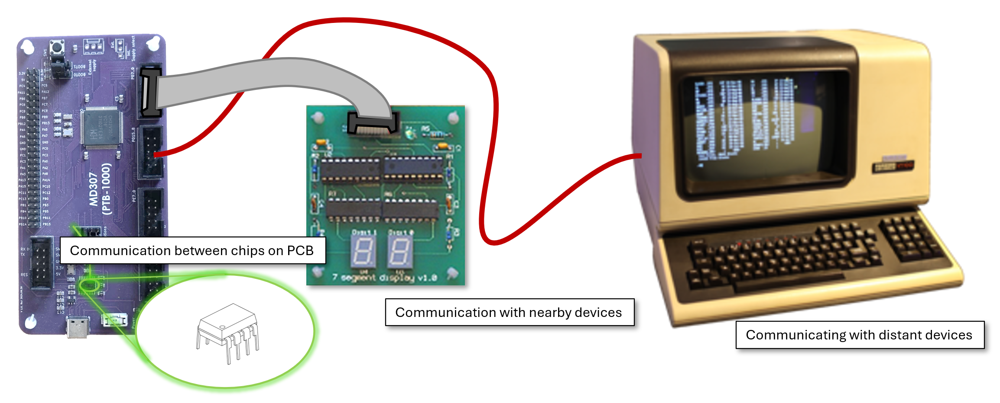
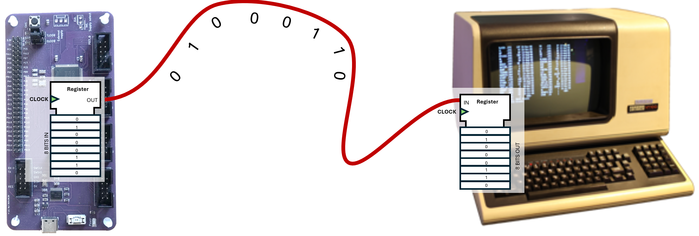
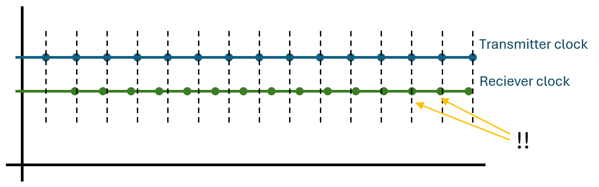
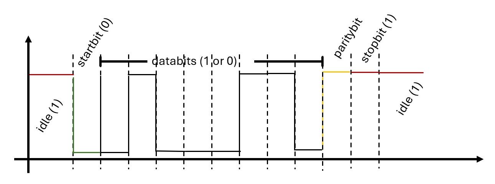

# Serial Communication

This lecture is about transfer of data between components. Such communication occurs across a wide range of scales in machine-oriented programming. A microprocessor may transmit a byte to a digital-to-analogue converter (DAC) located on the same printed circuit board (PCB) via copper traces on the board. A byte may be conveyed through general-purpose input/output (GPIO) pins to a bargraph or hexadecimal display. A longer cable may connect a GPIO port to a terminal situated in another room. At a broader scale, the microcontroller (MCU) may be connected to the Internet.

The protocols and transmission media employed in these scenarios can differ substantially: ranging from a single conductor connecting a GPIO pin to a light-emitting diode (LED), to multiple parallel conductors with a simple protocol for communicating with an ASCII display, to retrieving a web page, which requires several layers of protocols and heterogeneous transmission media. 

At the lowest level of abstraction, however, the fundamental problem remains the same: a sequence of bytes must be transferred over a physical medium from one device to another.

## Parallel Communication
So far in this course, only examples of *parallel* communication have been considered. When transmitting data to the bargraph or the ASCII display, the entire byte is presented simultaneously, with one signal line per bit. This is arguably the simplest conceptual approach; however, it entails several practical limitations:

* Adjacent parallel lines may interfere with one another, producing signal degradation through *crosstalk*.
* Over longer distances, providing a large number of parallel conductors becomes costly.
* On a printed circuit board (PCB) or within a cable assembly, additional conductors require more routing space or result in thicker, bulkier cables.
* The microprocessor has a finite number of general-purpose input/output (GPIO) pins.

During the 1980s and 1990s, consumer electronics frequently employed parallel interfaces[^footnote_printer_cable]. For the reasons outlined above, however, and for additional considerations related to scalability and signal integrity, most communication at nearly all scales is now implemented using *serial* protocols. In serial communication, data are transmitted sequentially over a single channel, one bit at a time. Although this approach demands more sophisticated timing control and higher signalling rates at both ends of the link, it is generally more economical, more scalable, and more robust in practice.

Parallel interfaces remain relevant in applications requiring extremely high data throughput over very short distances, such as modern synchronous dynamic random-access memory (e.g. DDR5).

[^footnote_printer_cable]: Legacy parallel printer cables typically contained on the order of 25–36 conductors, depending on implementation. By contrast, a standard USB 2.0 cable requires only four signal conductors.

# Sending a byte of data
Let us use the gorgeous old text terminal in the image above as an example. These devices were common in earlier computing systems. Their only job was to receive bytes encoding ASCII characters for display on the screen, and to capture the keys pressed by the user, transmitting the corresponding ASCII codes back to the host computer.

Because terminals could be located in separate rooms or even in different buildings, using a parallel interface like the one we connect the ASCII display with was not a realistic option. Instead, communication was implemented using serial transmission. Data in each direction were conveyed over a single signal conductor, so the cable required two signal lines: one for transmission and one for reception[^footnote_common_ground].
This configuration is called *full duplex* communication, since both ends can transmit simultaneously on separate lines. 

If one wanted really cheap cables, one could instead use *half-duplex* communication, where the two devices take turns transmitting and share the same signal line. In that case, only one side may drive the line at any given time.

[^footnote_common_ground]: In practice, a third conductor was typically included to provide a common ground reference between the devices.

To transmit data, the transmitter places the bits on the wire sequentially at an agreed signalling rate. The receiver samples the wire at the same rate. In practice, this is often implemented using a *shift register*. On the transmitter side, the register is loaded with a byte and, at each clock pulse, the register shifts the next bit onto the line. At the receiving end, a corresponding register shifts the incoming bits into storage. If both devices share the same clock signal, this arrangement functions correctly.

Herein lies a difficulty, however. It is not realistic to assume that two independent devices will have exactly identical clock frequency and phase. Even if both are configured to operate at 1 MHz, small tolerances ensure that one clock will be slightly faster or slower than the other. Over time, this frequency mismatch accumulates as phase error, and the shift registers will gradually drift out of synchronisation.

A straightforward solution is to transmit the clock signal over an additional wire. This is known as *synchronous* transmission and is widely used. SPI and I2C are examples of synchronous protocols that will be discussed later in the lecture. However, adding a clock line does not eliminate the earlier concerns regarding cost and interference. Furthermore, at very high signalling rates, *skew* becomes significant. At GHz frequencies, even if clock and data are launched simultaneously from the CPU, differences in propagation delay can prevent them from arriving in perfect alignment at the receiver.

## Asynchronous transmission

We would like to transmit data over a single wire without a shared clock signal. However, if two devices run on independent clocks, they will inevitably drift out of synchronisation.

Consider the diagram below. The blue and green traces represent two clocks that are *almost* the same frequency, but the green clock runs slightly faster. The transmitting device places a new bit on the wire at each clock pulse. Initially, the receiving device samples the line just before the next bit transition, and everything works correctly. After some time (see the arrows), the accumulated drift causes the sampling instant to move into the neighbouring bit period — and the receiver misinterprets a bit.

If we knew the *exact* clock frequencies of the two devices (we never do, but let us pretend), we could calculate how many bits can be transmitted before an error occurs. For example, if one device runs at exactly 1 MHz and the other at exactly 1.001 MHz (a 0.1% mismatch), sampling will drift by half a bit period after approximately 500 bits. Thus, with a 0.1% frequency difference and perfect initial alignment, roughly 500 bits can be transmitted before failure.

To ensure correct initial alignment, the transmitter sends a *start bit*. The receiver detects the high-to-low transition (idle is logic 1) and uses that edge to align its internal timing, for example by resetting a counter or starting a timer interrupt (which you already know how to implement). From that point, it samples subsequent bits at regular intervals. After a fixed number of bits, it waits for the next start bit and re-synchronises.

This is the fundamental principle behind the *Universal Asynchronous Receiver/Transmitter* (UART). A UART is a standard hardware block found in most microcontrollers that implements this start–stop asynchronous protocol.

The UART transmits data bytes encapsulated in a *frame*, as shown above. A frame begins with a start bit (logic 0). The receiver detects this transition and begins sampling the incoming bits. It then receives eight data bits — the byte to be transmitted.

Optionally, a *parity bit* may follow. For even parity, the transmitter computes the XOR of all data bits (`bit0 XOR bit1 XOR ... XOR bit7`) and transmits the result. The receiver performs the same calculation and compares it with the received parity bit. If the values differ, a transmission error is detected. Parity cannot guarantee correctness, but it reliably detects any single-bit error.

Finally, the transmitter sends one stop bit (logic 1), returning the line to its idle state. The receiver then waits for the next start bit. (Some configurations use two stop bits, but 8N1 uses one.)

Thus, to transmit 8 data bits with parity and one stop bit, the UART places 11 symbols on the line. The number of symbols per second is the *baud rate*. In a UART, one symbol corresponds to one bit on the wire, so the baud rate equals the raw line bit rate. The useful payload rate is lower because of start, parity, and stop bits.

A common UART setting is 115200 baud. With 8 data bits, even parity, and one stop bit (8E1), the effective data rate is:

115200 × 8 / 11 ≈ 83,782 bit/s.

You might wonder why frames are typically only 8 bits long. Longer frames would reduce overhead from start, parity, and stop bits. However, the longer the frame, the more clock drift accumulates before re-synchronisation. An 8-bit frame gives a combined clock mismatch tolerance of roughly 5–6% (about ±2–3% per device), which aligns well with what inexpensive oscillators in typical UART systems can achieve.

Although UART-style asynchronous serial communication is one of the earliest techniques for transmitting data without a separate clock line, it remains entirely appropriate when very high data rates are not required. Its simplicity and modest hardware demands make it well suited to embedded systems, and it is still widely used in GPS receivers, debug consoles, Bluetooth modules, and (most importantly to some of us) in the MIDI interface between keyboards and synthesisers.

## Embedded clock signal
In contrast, USB (and other modern high-speed serial links) uses *embedded* clocking: the receiver continuously adjusts its sampling phase by observing transitions in the data stream. Instead of sampling at fixed time intervals after a single initial synchronisation event (as in UART), it continually corrects its timing so that each bit is sampled near its centre, keeping its clock aligned with the transmitter throughout the transmission.

The advantage of embedded clocking is that it allows far higher data rates because the receiver continually corrects its timing instead of relying on a fixed sampling schedule. The trade-off is increased circuit complexity, since the receiver must include a clock-recovery loop rather than a simple baud-rate timer.

We will not dive deeper into embedded clock signals in this course. 

# Programming the UART

Now that you understand asynchronous transmission and framing, you might be tempted to implement this manually using GPIO, interrupts, and SysTick timing. That is entirely possible with your current knowledge — but fortunately unnecessary. Since the 1970s, microcontrollers have included dedicated UART peripherals that handle framing, timing, and buffering in hardware, allowing the processor to perform other tasks.

The CH32V307 contains three USART controllers, each capable of transmitting asynchronous data in several different modes. The register block for each USART appears as follows in the quick guide:

{{python quickguide-generator/main.py overview-table USART1 -no-grouping}}

The USART supports multiple operating modes, and not all registers are relevant for our purposes.

## Sending a byte of data

Before transmitting, the USART must be configured with the desired frame format and baud rate.

We begin by setting the `UE`, `PCE`, `M`, and `TE` bits in the `CTLR1` register. `UE` enables the USART, `PCE` enables parity control, `M` selects the word length (8 or 9 bits), `TE` enables the transmitter part of the USART.

{{python quickguide-generator/main.py register-details USART1 CTLR1 -no-folding}}

Next, we configure the baud rate. The USART divides the peripheral clock frequency (`f_PCLK`) to generate the desired symbol rate. The required divisor is:

USARTDIV = fPCLK / (16 × baudrate)

For example, with a baud rate of 115200 bit/s and a peripheral clock of 144 MHz:

USARTDIV = 144,000,000 / (16 × 115200) = 78.125

This value is written into the Baud Rate Register (`BRR`), which contains separate fields for the mantissa and fractional part:

{{python quickguide-generator/main.py register-details USART1 BRR -no-folding}}

To transmit a byte, we simply write it to the Data Register (`DATAR`). The USART immediately begins shifting the bits out sequentially on pin PA9 (the default USART1 TX pin).

The program should then wait until the `TXE` bit in the Status Register (`STATR`) is set. `TXE` indicates that the data register is empty and ready to accept a new byte. (If one needs to know when transmission has fully completed on the wire, the `TC` flag must be checked instead.)

{{python quickguide-generator/main.py register-details USART1 STATR -no-folding}}

## Receiving a byte of data

On the receiving side, configuration is similar, except that the receiver is enabled instead of (or in addition to) the transmitter by setting the `RE` bit in `CTLR1`.

When a byte arrives on PA10 (USART1 RX), the USART hardware automatically shifts the bits into the data register. When a full frame has been received, the `RXNE` (Receive Not Empty) flag is set. The program can then read the `DATAR` register to obtain the received byte.

To send multiple bytes from one CH32V307 to another, the transmitting device could remain in a loop, writing a new byte each time `TXE` is set. Similarly, the receiving device could poll the `RXNE` flag and read incoming bytes as they arrive.

However, constant polling would occupy the processor entirely. In practice, transmission and reception are usually interrupt-driven. By enabling the transmit interrupt (`TXEIE`) in `CTLR1`, the USART generates an interrupt whenever it is ready to accept another byte. The transmitter interrupt handler then feeds the next byte from a software buffer.

Likewise, by enabling the receive interrupt (`RXNEIE`), the processor is interrupted whenever a new byte arrives. The interrupt handler reads the data register and stores the byte in a buffer, allowing the main program to continue executing independently of the serial communication. 

# Other transmission protocols on the MD307
In addition to the USART peripherals, the MD307 also supports several other widely used communication protocols.

**SPI (Serial Peripheral Interface)** is a synchronous, full-duplex protocol typically used for short-distance communication between a microcontroller and peripheral devices such as displays, ADCs, DACs, and external memory. It uses separate lines for clock (SCK), master-out–slave-in (MOSI), master-in–slave-out (MISO), and a chip-select (CS) signal for each slave device. Because data are shifted in and out simultaneously under control of a shared clock, SPI can achieve very high data rates over short distances. The protocol itself is simple and has minimal overhead, but it does not provide built-in addressing or error detection; these must be implemented at a higher level if required.

The TFT screen that you will use in Lab 4 (if you choose to do that) is controlled via SPI. The SPI communication is handled by another hardware block, similar to the USART, but you will not need to program that directly for the lab.  

**I2C (Inter-Integrated Circuit)** is a synchronous, half-duplex bus designed for communication between integrated circuits on the same board. It uses only two wires: a serial clock (SCL) and a bidirectional data line (SDA), both operating with open-drain signalling and pull-up resistors. Devices share the same bus and are selected through unique addresses, allowing many peripherals to coexist on just two lines. I2C is slower than SPI but reduces pin usage and wiring complexity. It includes acknowledgement bits and defined bus arbitration mechanisms, which improve reliability in multi-device systems.

**I2S (Inter-IC Sound)** is a synchronous serial protocol designed specifically for digital audio transmission between integrated circuits. Unlike SPI or UART, which are general-purpose data links, I2S is optimised for continuous streaming of audio samples.

An I2S connection typically uses three signals: a serial clock (SCK), a word-select or left/right clock (WS or LRCK), and a serial data line (SD). The clock defines the bit rate, while the word-select signal indicates whether the transmitted sample belongs to the left or right audio channel. Data are shifted synchronously with the clock, most significant bit first. Because audio data must be delivered at a constant rate, I2S operates as a continuous stream rather than as discrete frames with start and stop bits.

On the MD307, I2S functionality is implemented as a special operating mode of certain SPI peripherals. It is commonly used to interface with audio DACs, ADCs, codecs, and digital microphones in applications requiring high-quality digital sound reproduction.

**CAN (Controller Area Network)** is a robust, message-based protocol originally developed for automotive systems. It uses differential signalling over a two-wire bus and is designed for high noise immunity and fault tolerance. Unlike UART, SPI, or I2C, CAN is multi-master and uses identifier-based arbitration to determine message priority. It includes strong error detection, automatic retransmission, and fault confinement mechanisms. Although more complex than the other protocols discussed, CAN is well suited for distributed embedded systems where reliability and resilience are critical.

