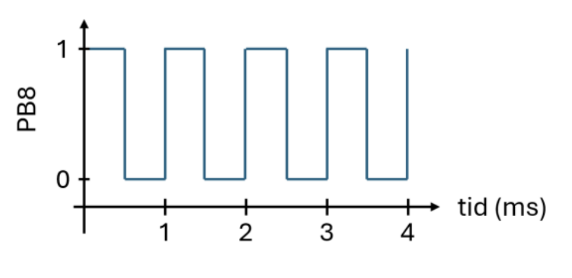
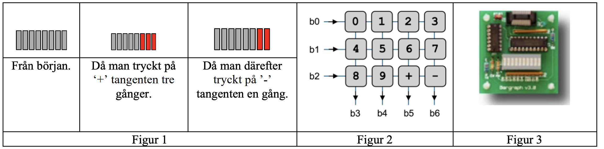
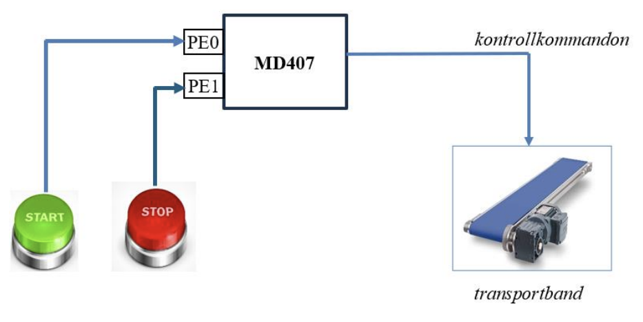

<style>
body {
    max-width: none !important;
}
h1 {
    background-color: #2c2c2c;
    color: #ffffff;
    padding: 0.4em 0.7em;
    border-radius: 4px;
}
td pre {
    padding: 0;
    margin: 0;
}
td pre code {
    padding: 0.3em 0.5em;
    white-space: pre;
}
td:has(pre) {
    padding: 0.2rem 0.3rem;
}
</style>

# Uppgift 1a (−2…6 p)

Följande deklarationer är givna på "toppnivå".

```c
static unsigned short a, b;
static int index;
static int vi[100];
```

Vi har nu tilldelningen:

```c
vi[ a++ ] = index;
```

Vilken av följande implementeringar i RISC-V-kod är korrekt?


## Svarsalternativ

<table>
<tr>
<td>A</td><td>B</td><td>C</td><td>D</td>
</tr>
<tr>
<td>

```
  la    t0, index
  lw    t0, 0(t0)
  la    t1, a
  lw    t2, 0(t1)
  addi  t3, t2, 1
  sh    t3, 0(t1)
  slli  t2, t2, 4
  la    t3, vi
  add   t3, t3, t2
  sw    t0, 0(t3)
```
</td><td>

```
  la    t0, index
  lw    t0, 0(t0)
  la    t1, a
  lw    t2, 0(t1)
  addi  t3, t2, 1
  sw    t3, 0(t1)
  slli  t2, t2, 2
  la    t3, vi
  add   t3, t3, t2
  sw    t0, 0(t3)
```
</td><td>

```
  la    t0, index
  lw    t0, 0(t0)
  la    t1, a
  lhu   t2, 0(t1)
  addi  t3, t2, 1
  sh    t3, 0(t1)
  slli  t2, t2, 2
  la    t3, vi
  add   t3, t3, t2
  sw    t0, 0(t3)
```
</td><td>

```
  la    t0, index
  lw    t0, 0(t0)
  la    t1, a
  lhu   t2, 0(t1)
  addi  t3, t2, 1
  sh    t3, 0(t1)
  slli  t2, t2, 4
  la    t3, vi
  add   t3, t3, t2
  sw    t0, 0(t3)
```
</td>
</tr>
<tr>
<td>E</td><td>F</td>
</tr>
<tr>
<td>

```
  la    t0, index
  lw    t0, 0(t0)
  la    t1, a
  lhu   t2, 0(t1)
  addi  t3, t2, 1
  sh    t3, 0(t1)
  slli  t2, t2, 4
  la    t3, vi
  sw    t0, t2(t3)
```
</td><td>

```
  la    t0, index
  lw    t0, 0(t0)
  la    t1, a
  lw    t2, 0(t1)
  addi  t3, t2, 1
  sh    t3, 0(t1)
  slli  t2, t2, 4
  la    t3, vi
  sw    t0, t2(t3)
```
</td>
</tr>
</table>

<details><summary>Svar</summary>

Svarsalternativ **C**

```
  la    t0, index
  lw    t0, 0(t0)
  la    t1, a
  lhu   t2, 0(t1)
  addi  t3, t2, 1
  sh    t3, 0(t1)
  slli  t2, t2, 2
  la    t3, vi
  add   t3, t3, t2
  sw    t0, 0(t3)
```

</details>

---

# Uppgift 1b (−2…2 p)

Följande deklarationer är givna på "toppnivå".

```c
static short a, b, c;
static int index;
static int vi[100];
```

Vilken av följande implementeringar i RISC-V-kod är korrekt?


## Svarsalternativ

<table>
<tr>
<td>A</td><td>B</td><td>C</td><td>D</td>
</tr>
<tr>
<td>

```
.align 2
a:  .byte 2
.align 2
b:  .byte 2
.align 2
c:  .byte 2
.align 4
index:  .byte 4
.align 100
vi:  .byte 100
```
</td><td>

```
.align 2
a:  .short 1
.align 2
b:  .short 1
.align 2
c:  .space 2
.align 4
index:  .word 1
.align 100
vi:  .word 100
```
</td><td>

```
.align 2
a:  .word 2
.align 1
b:  .word 2
.align 1
c:  .word 2
.align 2
index:  .space 4
vi:  .space 400
```
</td><td>

```
.align 1
a:  .space 2
b:  .space 2
c:  .space 2
.align 2
index:  .space 4
vi:  .byte 400
```
</td>
</tr>
<tr>
<td>E</td><td>F</td>
</tr>
<tr>
<td>

```
.align 1
a:  .space 2
b:  .space 2
c:  .space 2
.align 2
index:  .space 4
vi:  .space 400
```
</td><td>

```
.align 1
a:  .space 2
b:  .space 2
c:  .space 2
.align 2
index:  .space 4
vi:  .space 100
```
</td>
</tr>
</table>

<details><summary>Svar</summary>

Svarsalternativ **E**

```
.align 1
a:  .space 2
b:  .space 2
c:  .space 2
.align 2
index:  .space 4
vi:  .space 400
```

</details>

---

# Uppgift 2 (−2…6 p)

Följande C-funktion `pack` packar födelsedata (år, månad dag) i en unsigned int, enligt:

```c
int pack(unsigned short year, unsigned short month, unsigned short day)
{
  unsigned int rval = year << 9;
  rval |= month << 5;
  rval |= day;
  return rval;
}
```

<table style="text-align: center; border-collapse: collapse; font-size: 0.85em; width: 100%;" border="1">
  <tr>
    <th style="padding: 1px 2px;">31</th><th style="padding: 1px 2px;">30</th><th style="padding: 1px 2px;">29</th><th style="padding: 1px 2px;">28</th><th style="padding: 1px 2px;">27</th><th style="padding: 1px 2px;">26</th><th style="padding: 1px 2px;">25</th><th style="padding: 1px 2px;">24</th>
    <th style="padding: 1px 2px;">23</th><th style="padding: 1px 2px;">22</th><th style="padding: 1px 2px;">21</th><th style="padding: 1px 2px;">20</th><th style="padding: 1px 2px;">19</th><th style="padding: 1px 2px;">18</th><th style="padding: 1px 2px;">17</th><th style="padding: 1px 2px;">16</th>
    <th style="padding: 1px 2px;">15</th><th style="padding: 1px 2px;">14</th><th style="padding: 1px 2px;">13</th><th style="padding: 1px 2px;">12</th><th style="padding: 1px 2px;">11</th><th style="padding: 1px 2px;">10</th><th style="padding: 1px 2px;">9</th>
    <th style="padding: 1px 2px;">8</th><th style="padding: 1px 2px;">7</th><th style="padding: 1px 2px;">6</th><th style="padding: 1px 2px;">5</th>
    <th style="padding: 1px 2px;">4</th><th style="padding: 1px 2px;">3</th><th style="padding: 1px 2px;">2</th><th style="padding: 1px 2px;">1</th><th style="padding: 1px 2px;">0</th>
  </tr>
  <tr>
    <td style="padding: 1px 2px;">0</td><td style="padding: 1px 2px;">0</td><td style="padding: 1px 2px;">0</td><td style="padding: 1px 2px;">0</td><td style="padding: 1px 2px;">0</td><td style="padding: 1px 2px;">0</td><td style="padding: 1px 2px;">0</td><td style="padding: 1px 2px;">0</td>
    <td style="padding: 1px 2px;">0</td><td style="padding: 1px 2px;">0</td>
    <td colspan="13" style="padding: 1px 2px;">year</td>
    <td colspan="4" style="padding: 1px 2px;">month</td>
    <td colspan="5" style="padding: 1px 2px;">day</td>
  </tr>
</table>

Ange det alternativ (A–G) som visar en korrekt implementering (hur funktionen kodas) i RISC-V assemblerspråk.


## Svarsalternativ

<table>
<tr>
<td>A</td><td>B</td><td>C</td><td>D</td>
</tr>
<tr>
<td>

```
pack:
  shl   a0, a0, 9
  shl   a1, a1, 5
  or    a0, a0, a2
  or    a0, a0, a1
  ret
```
</td><td>

```
pack:
  slli  a0, a0, 9
  slli  a1, a1, 5
  or    a0, a0, a1
  or    a0, a0, a2
  ret
```
</td><td>

```
pack:
  srli  a0, a0, 9
  srli  a1, a1, 5
  or    a0, a0, a1
  or    a0, a0, a2
  ret
```
</td><td>

```
pack:
  slli  a0, a0, 9
  slli  a1, a1, 5
  ori   a0, a0, a1
  ori   a0, a0, a2
  ret
```
</td>
</tr>
<tr>
<td>E</td><td>F</td><td>G</td>
</tr>
<tr>
<td>

```
pack:
  shl   a2, a2, 9
  shl   a1, a1, 5
  or    a2, a2, a1
  or    a0, a0, a2
  ret
```
</td><td>

```
pack:
  slli  a2, a2, 9
  slli  a1, a1, 5
  or    a2, a2, a1
  or    a0, a0, a2
  ret
```
</td><td>

```
pack:
  srli  a2, a2, 9
  srli  a1, a1, 5
  or    a2, a2, a1
  or    a0, a0, a2
  ret
```
</td>
</tr>
</table>

<details><summary>Svar</summary>

Svarsalternativ **B**

```
pack:
  slli  a0, a0, 9
  slli  a1, a1, 5
  or    a0, a0, a1
  or    a0, a0, a2
  ret
```

</details>


---

# Uppgift 3 (−2…6 p)

En lista av objekt med typen unsigned int skall
konverteras till unsigned short. Om talet är för
stort för att få plats i en unsigned short skall det
inte vara med i den nya listan. Funktionen
`ConvertList` skall returnera pekaren till det första
elementet i den nya listan, och parametern `num_elems`
skall uppdateras med den nya storleken.
Huvudprogrammet nedan skall exempelvis ge
utskriften: `345 2333 123`.

```c
void main() {
  unsigned short *a;
  unsigned int
  v[] = {65536, 345, 2333, 0xFFFFFFFE, 123};
  int num_elems = sizeof(v) / sizeof(v[0]);

  a = ConvertList(v, &num_elems);
  for (int i = 0; i < num_elems; i++) {
    printf("%i ", a[i]);
  }
}
```

Sex olika programmerare får i uppgift att implementera funktionen `ConvertList(unsigned int *, int *)`, resultaten blir likartade men bara en programmerare presterar ett helt korrekt resultat. De olika alternativen finns nedan, ange alternativet med den korrekta lösningen.


## Svarsalternativ

<table>
<tr>
<td>A</td><td>B</td><td>C</td><td>D</td>
</tr>
<tr>
<td>

```c
unsigned short*
ConvertList(unsigned int* a, int* num_elems)
{
  unsigned short* b = (unsigned short*)&a[0];
  int c = 0;
  for (int i = 0; i < (*num_elems); i++) {
    if (a[i] >= 0xFFFF) { c++; }
    else {
      b = a[i];
      *b += 1;
    }
  }
  *num_elems -= c;
  return b;
}
```
</td><td>

```c
unsigned short*
ConvertList(unsigned int* a, int* num_elems)
{
  unsigned short* b = (unsigned short*)a;
  int c = 0;
  for (int i = 0; i < (*num_elems); i++) {
    if (a[i] >= (1 << 16)) { c++; }
    else {
      *b = a[i];
      b += 2;
    }
  }
  *num_elems -= c;
  return (unsigned short*)a;
}
```
</td><td>

```c
unsigned short*
ConvertList(unsigned int* a, int* num_elems)
{
  unsigned short* b = (unsigned short*)&a[0];
  for (int i = 0; i < (*num_elems); i++) {
    if (a[i] >= (1 << 16)) {
      *num_elems -= 1;
    }
    else {
      *b = a[i];
      b += 1;
    }
  }
  return (unsigned short*)a;
}
```
</td><td>

```c
unsigned short*
ConvertList(unsigned int* a, int* num_elems)
{
  unsigned short* b = (unsigned short*)&a[0];
  int c = 0;
  for (int i = 0; i < (*num_elems); i++) {
    if (a[i] >= (1 << 16)) { c++; }
    else {
      *b = a[i];
      b += 1;
    }
  }
  *num_elems -= c;
  return (unsigned short*)a;
}
```
</td>
</tr>
<tr>
<td>E</td><td>F</td>
</tr>
<tr>
<td>

```c
unsigned short*
ConvertList(unsigned int* a, int* num_elems)
{
  unsigned short* b = (unsigned short*)a;
  int c = 0;
  for (int i = 0; i < num_elems; i++) {
    if (a[i] >= (1 << 16)) { c++; }
    else {
      *b = a[i];
      b += 1;
    }
  }
  num_elems -= c;
  return (unsigned short*)a;
}
```
</td><td>

```c
unsigned short*
ConvertList(unsigned int* a, int* num_elems)
{
  unsigned short* b = (unsigned short*)&a[0];
  int c = 0;
  for (int i = 0; i < (*num_elems); i++) {
    if (a[i] >= 0xFFFF) { c++; }
    else { *b++ = *a++; }
  }
  *num_elems -= c;
  return (unsigned short*)a;
}
```
</td>
</tr>
</table>

<details><summary>Svar</summary>

Svarsalternativ **D**

```c
unsigned short*
ConvertList(unsigned int* a, int* num_elems)
{
  unsigned short* b = (unsigned short*)&a[0];
  int c = 0;
  for (int i = 0; i < (*num_elems); i++) {
    if (a[i] >= (1 << 16)) { c++; }
    else {
      *b = a[i];
      b += 1;
    }
  }
  *num_elems -= c;
  return (unsigned short*)a;
}
```

</details>


---

# Uppgift 4 (10 p)

En fyrkantsvåg med frekvensen 1kHz skall läggas ut på GPIO port B, pinne 8.



a) Visa de makrodefinitioner som behövs för att beskriva SysTick porten. Visa även makrodefinitionen för registret OUTDR_B_HIGH som motsvarar b8–b15 i GPIO port B. (2p)

b1) Nedanstående assemblyfil är given. Visa hur avbrottsvektorn för `systick_handler()` initieras i vektortabellen, och hur mtvec ställs in, under antagandet att systemet använder vektorat läge (mode 01). (1p)

```s
.extern at_irq

.section .data
vector_table:
    # fyll i här

.section .text
init_interrupts:
    # fyll i här
    ret
```

b2) Skriv funktionen `void start_wave()` som initierar SysTick och startar fyrkantsvågen genom att, med avbrott, utföra avbrottshanteraren `void systick_handler()` var 500:de millisekund. Skriv även koden för avbrottshanteraren. (3p)

c) Ändra avbrottshanteraren så att den även lägger ut en fyrkantsvåg med frekvensen 500Hz på port B, pinne 9. (2p)

d) Två CH32V307-kort, A och B, är ihopkopplade för att överföra data från A till B. Varje gång en bit skall skickas lägger A ut en etta eller nolla på Port D, pinne 0. Sedan flippar den Port D, pinne 1. När B märker att pinne 1 byter värde startas en avbrottshanterare som omedelbart läser av värdet som ligger på pinne 0.

För att spara pengar har man bestämt att överföringen skall ske med bara en sladd från pinne 0 på A till pinne 0 på B. Båda maskinernas systemklocka är ungefär, men inte exakt, 144MHz. Beskriv (i text, ingen kod) hur man tillförlitligt kan överföra datan med bara en sladd. (2p)

<details><summary>Svar</summary>

#### a)

```c
#define STK_CTLR          ((volatile unsigned int *)0xE000F000)
#define STK_SR            ((volatile unsigned int *)0xE000F004)
#define STK_CNTL          ((volatile unsigned int *)0xE000F008)
#define STK_CMPLR         ((volatile unsigned int *)0xE000F010)
#define GPIO_B_OUTDR_HIGH ((volatile unsigned char *)0x40010C0D)
```

#### b1)

I vektorat läge (mode 01) hoppar processorn till mtvec_BASE + 4 × cause vid ett avbrott. SysTick har IRQ-nummer 12, så hopp-instruktionen placeras på offset 12 × 4 = 0x30 från vector_table.

mtvec ställs in på adressen till vector_table med de två lägsta bitarna satta till 01.

```s
.extern systick_handler

.section .data
vector_table:
    .org vector_table + 12 * 4   /* IRQ 12 = SysTick, offset 0x30 */
    j    systick_handler

.section .text
init_interrupts:
    la   t0, vector_table
    ori  t0, t0, 1               /* Sätt mode = 01 (vektorat läge) */
    csrw mtvec, t0
    ret
```


#### b2)

```c
void systick_handler(void)
{
  *GPIO_B_OUTDR_HIGH ^= 0x1;    /* Toggla PB8 → 1 kHz fyrkantsvåg */
  *STK_SR = 0;                  /* Kvittera avbrottet */
}

void start_wave(void)
{
  *STK_CTLR = 0;                            /* Stäng av SysTick under konfiguration */
  *STK_CMPLR = 144000000 / (2 * 1000) - 1; /* 500 µs @ 144 MHz = 71999 */
  *PFIC_IENR1 |= (1 << 12);                 /* Aktivera SysTick-avbrott i PFIC (IRQ 12) */
  *STK_CTLR = 0xF;                          /* STE|STIE|STCLK|STRE – starta SysTick */
}
```

#### c)

```c
void systick_handler(void)
{
  *GPIO_B_OUTDR_HIGH ^= 0x1;         /* Toggla PB8 → 1 kHz */
  if (*GPIO_B_OUTDR_HIGH & 0x1)      /* Var annanhanstig (500 Hz) */
  {
    *GPIO_B_OUTDR_HIGH ^= 0x2;       /* Toggla PB9 → 500 Hz */
  }
  *STK_SR = 0;                       /* Kvittera avbrottet (alltid) */
}
```

#### d)

(kort beskrivning av Manchester Kodning, eller ett ram-protokoll som RS232, se lärobok) 1–2p

</details>


---

# Uppgift 5 (10 p)

I den här uppgiften ska du implementera en enkel display för att visa ljudvolym. Vi kommer att använda ett numeriskt tangentbord med '+' och '-' tangenter (se Figur 2) och en 8-segment bargraph (Figur 3) kopplade till CH32V307-systemet.



Se Figur 1 som exempel, genom att trycka på '+'-tangenten ökar vi volymen och då skall fler segment lysa. Genom att trycka på '-'-tangenten minskar vi volymen och då skall färre segment lysa på bargraphen.

Tangentbordet är anordnat i tre rader och 4 kolumner, som visas i Figur 2, och ansluts till systemet via GPIO-port C. Signaler i stiften som motsvarar bitarna b0–b2 används för att aktivera raderna medan signalen i stiften som motsvarar bitarna b3–b6 används för att identifiera vilken tangent som tryckts ned. Bit b7 används inte. Endast nedtryckning av tangenterna '+' och '-' ska resultera i någon åtgärd i programmet medan nedtryckning av övriga tangenter ignoreras av programmet.

Bargraphen, som ses i Figur 3, ansluts till systemet via GPIO-port D bitar b0–b7. Alla ingångsstift ska konfigureras som pull-up och alla utgångsstift ska konfigureras som open-drain.

Implementera ditt program i C och följ stegen nedan:

a) Definera en struct som representerar en GPIO port. Visa sedan hur man refererar CFGLR-registret i Port D med användning av denna struct. (2p)

Om du väljer att inte göra uppgift a) måste du visa korrekta macrodefinitioner för de register du använder i följande uppgifter.

b) Skriv en funktion `void ports_init(void)` där du gör de initieringar som behövs för att port C och D skall fungera enligt beskrivningen ovan. (2p)

c) Skriv en funktion `int read_key(void)` där du läser av tangentbordet och returnerar ett värde som motsvarar tangenten som har tryckts in. Returvärdena ska vara 0 till 9 som representerar motsvarande numeriska tangenter, 10 för tangenten '+', och 11 för tangenten '-'. (3p)

d) Skriv en funktion `int update_volume(int incdec, int vol)` som tar som inparameter det föregående värdet för volymen (`int vol`) och en flagga som har värdet 1 eller -1 (`int incdec`) beroende på om volymen skall ökas eller minskas med en enhet, och returnerar de nya värdena för volym. Volymvärdena kan vara 0 t.o.m 8. Försök att öka volymen över 8, eller att minska volymen under 0 ska ignoreras. (1p)

e) Gör en huvudfunktion som anropar alla funktionerna ovan för att först initiera portarna och sedan i en oändlig slinga läsa av tangentbordet. Om '+' eller '-' trycks ned uppdateras volymen och motsvarande antal segment skall lysa på bargraphen. (2p)

<details><summary>Svar</summary>

#### (a) (2p)

**Alternativ 1:**

```c
typedef volatile struct {
   unsigned int cfglr;    // +0x0
   unsigned int cfghr;    // +0x4
   unsigned int indr;     // +0x8
   unsigned int outdr;    // +0xC
   unsigned int bshr;     // +0x10
   unsigned int bcr;      // +0x14
   unsigned int lckr;     // +0x18
} GPIO, *PGPIO;
```

Anm: Fler alternativ är möjliga här

Alt a:
```c
#define GPIO_C (*((volatile PGPIO) 0x40011000))
#define GPIO_D (*((volatile PGPIO) 0x40011400))
GPIO_D.cfglr
```

Alt b:
```c
#define GPIO_C ((volatile PGPIO) 0x40011000)
#define GPIO_D ((volatile PGPIO) 0x40011400)
GPIO_D->cfglr
```

**Alternativ 2:**

```c
typedef volatile struct {
   unsigned int cfglr;       // +0x0
   unsigned int cfghr;       // +0x4
   unsigned short indr;      // +0x8
   unsigned short unused_0;
   unsigned short outdr;     // +0xC
   unsigned short unused_1;
   unsigned int bshr;        // +0x10
   unsigned short bcr;       // +0x14
   unsigned short unused_2;
   unsigned int lckr;        // +0x18
} GPIO;
```

Anm: Fler alternativ är möjliga här

Alt a:
```c
#define GPIO_C (*((volatile GPIO *) 0x40011000))
#define GPIO_D (*((volatile GPIO *) 0x40011400))
GPIO_D.cfglr  // Referens
```

Alt b:
```c
#define GPIO_C ((volatile GPIO *) 0x40011000)
#define GPIO_D ((volatile GPIO *) 0x40011400)
GPIO_D->cfglr  // Referens
```

#### (b) (2p)

```c
void ports_init(void) {
   /* Port C: b0-b2 open-drain output (CNF=01,MODE=01 = 0x5), b3-b6 input pull-up (CNF=10,MODE=00 = 0x8) */
   GPIO_C.cfglr = 0x08888555;
   GPIO_C.outdr |= 0x78;       /* b3-b6 pull-up (set ODR bits) */
   /* Port D: b0-b7 open-drain output (CNF=01,MODE=01 = 0x5) */
   GPIO_D.cfglr = 0x55555555;
}
```

#### (c) (3p)

```c
int read_key(void) {
   int row, value;

   /* blocking read */
   while (1) {
      /* activate rows */
      for (row = 0; row < 3; row++) {
         GPIO_C.outdr |= 0b111; /* deactivate all rows */
         GPIO_C.outdr &= ~(1 << row);  /* activate one row at a time b0, b1, b2 */
         for(volatile int i = 0; i < 100; i++);  /* delay to update pin values */
         value = GPIO_C.indr >> 3; /* read b3-b6 and shift to 0 position */
         value = ~value; /* as input is pins are in pull-up mode, revert the logic so that 1 == pressed key */ 
         value &= 0b1111; /* clear all but first 4 bits (input pins) */
         int col = 0;
         while (value) {
            if (value & 0x1)
               return (row * 4 + col); /* convert read value into key value */
            col++;
            value = value >> 1;
         }
      }
   }
}
```

#### (d) (1p)

```c
int update_volume(int incdec, int vol) {
   if ((incdec == 1) && (vol < 8))
      vol++;
   else if ((incdec == -1) && (vol > 0))
      vol--;
   return vol;
}
```

#### (e) (2p)

```c
int main(void) {
   int key;
   int volume = 0;
   int bars;

   ports_init();
   while (1) {
      key = read_key();
      if (key == 10)        /* key '+' */
         volume = update_volume(1, volume);
      else if (key == 11)   /* key '-' */
         volume = update_volume(-1, volume);
      bars = 0;
      for(int i = 0; i < volume; i++){
        bars |= (1 << i);
      }
      GPIO_D.outdr = bars;
   }
}
```

</details>


# Uppgift 6 (10 p)

Betrakta nedanstående koppling, där ett CH32V307-kort har kopplats till ett transportband. Transportbandet kan startas och stoppas från programvara som körs på CH32V307-kortet med hjälp av funktionerna `start_machine()` och `stop_machine()`. Du kan anta att dessa funktioner är implementerade.



Två återfjädrande knappar START och STOP är kopplade till pin PE0 respektive PE1 på CH32V307-kortet. När respektive knapp trycks ned sätts den tillkopplade pinnen till '1'. När respektive knapp inte är nedtryckt sätts pinnen till '0'.

Målet med denna uppgift är att konfigurera avbrott för pinnarna PE0 respektive PE1, så att avbrott genereras när knapparna trycks ner. Avbrottshanteraren ska anropa funktionen `start_machine()` eller `stop_machine()` beroende på vilken knapp som trycks ned.

Observera, i denna uppgift kan du förutsätta att korrekt typkonverterade macrodefinitioner för pekare till alla register redan finns.

a) Pinnarna PE0 och PE1 ska ställas in som ingångar med pull-down-motstånd. Visa hur detta kan åstadkommas utan att inställningarna för övriga pinnar påverkas. (1p)

b) Visa hur AFIO konfigureras så att PE0 och PE1 kopplas till EXTI-modulen i CH32V307. Tänk på att bara PE0 och PE1 ska konfigureras och att övriga EXTI-linor inte får påverkas. (2p)

c) Visa hur EXTI och PFIC konfigureras så att avbrott genereras på positiv flank för de två pinnarna. (3p)

d1) Visa en avbrottshanterare `void at_irq(void)` som startar transportbandet genom att anropa `start_machine()` vid positiv flank på PE0 och som stoppar transportbandet genom att anropa `stop_machine()` vid positiv flank på PE1.

d2) Nedan visas assemblerkod för systemets vektortabell. Komplettera koden så att hopp till funktionen `at_irq` sker vid avbrott på både EXTI line 0 och EXTI line 1. Du får anta att registret `mtvec` är korrekt konfigurerat. (4p)

```s
.extern at_irq

.section .data
vector_table:
    # Fyll i här

```

<details><summary>Svar</summary>

#### (a) (1p)

```c
/* Pin 0, pin 1: input with pull-up/pull-down (CNF=10, MODE=00) = 0x8 per pin */
*GPIO_E_CFGLR &= 0xFFFFFF00;         /* clear config for pin0 and pin1 */
*GPIO_E_CFGLR |= 0x00000088;         /* input with pull-up/pull-down */
*GPIO_E_OUTDR &= ~0x03;              /* pin0 and pin1 pull-down (ODR=0) */
```

#### (b) (2p)

```c
// Port E's identifier is 0x4 and we need to write this identifier
// in AFIO_EXTICR1 register's first 4 bits for pin 0 and next 4 bits
// for pin 1

void InitAFIO() {
  *AFIO_EXTICR1 &= 0xFFFFFF00;
  *AFIO_EXTICR1 |= 0x00000044;
}
```

#### (c) (3p)

```c
void InitEXTI() {

  // Enable line 0 and line 1 in the EXTI module's interrupt enable register.
  // Rising edge will generate interrupts from pins PE0 and PE1.
  // Falling edge will NOT generate interrupts from pins PE0 and PE1.

  *EXTI_INTENR |= 0x0003;
  *EXTI_RTENR |= 0x0003;
  *EXTI_FTENR &= 0xFFFC;

  // Enable interrupt sources in PFIC
  // EXTI0 = IRQ 22, EXTI1 = IRQ 23
  *PFIC_IENR1 |= ((1 << 22) | (1 << 23));
}
```

#### (d1) (3p)

```c
void at_irq(void)
{
  // If an interrupt is generated at the rising edge of PE0, i.e., the
  // first bit of port E's INDR register becomes 1, then START the machine

  if (*GPIO_E_INDR & 0x1) {
    start_machine();
  }

  // If an interrupt is generated at the rising edge of PE1, i.e., the second
  // bit of port E's INDR register becomes 1, then STOP the machine

  if (*GPIO_E_INDR & 0x2) {
    stop_machine();
  }

  *EXTI_INTFR |= 0x3;               /* Acknowledge both interrupts */
}

```

#### (d2) (1p)


```s
.extern at_irq

.section .data
vector_table:
    .org vector_table + 22 * 4
    j at_irq
    j at_irq

```

</details>

---


