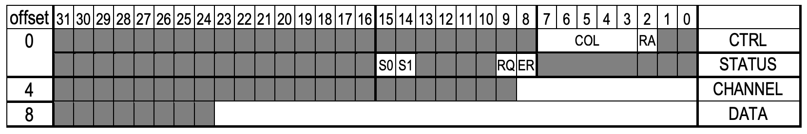
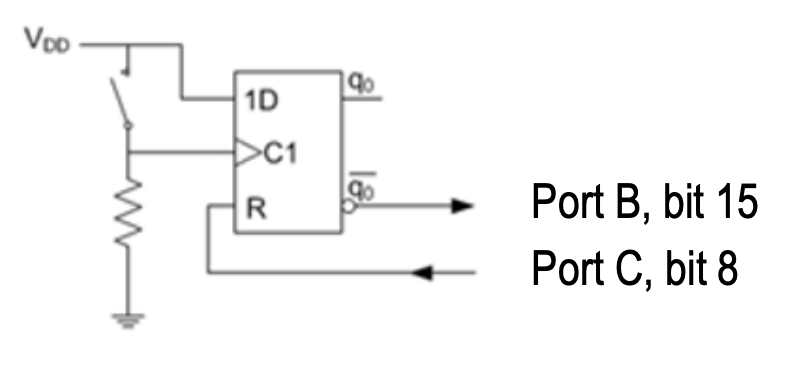
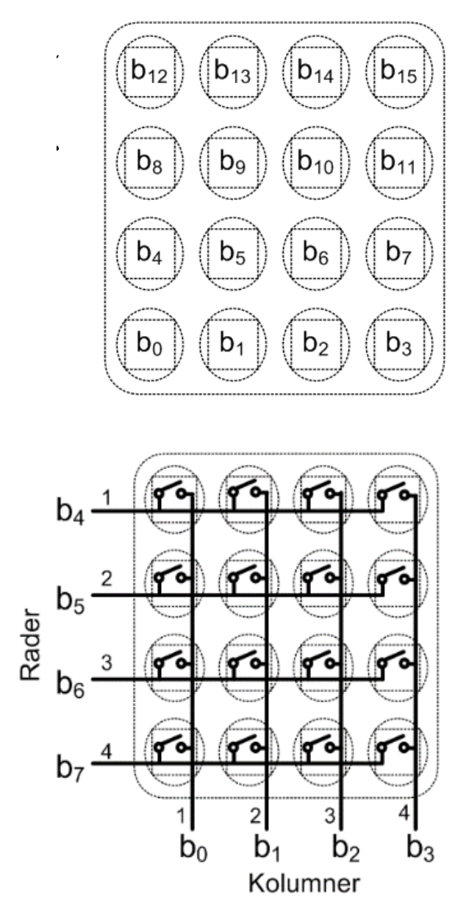
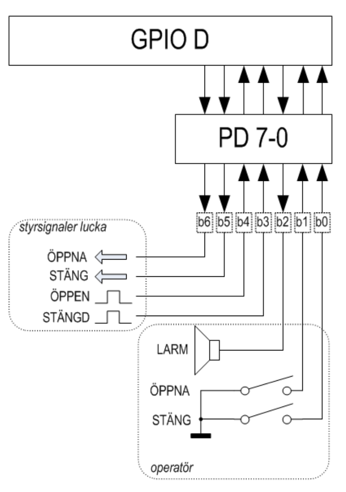

<style>
body {
    max-width: none !important;
}
h1 {
    background-color: #2c2c2c;
    color: #ffffff;
    padding: 0.4em 0.7em;
    border-radius: 4px;
}
td pre {
    padding: 0;
    margin: 0;
}
td pre code {
    padding: 0.3em 0.5em;
    white-space: pre;
}
td:has(pre) {
    padding: 0.2rem 0.3rem;
}
</style>

**Kurs:** Maskinorienterad programmering — Tentamen 31 maj 2024  
**Målplattform:** **CH32V307** (RISC‑V, QingKe V4F)

# Uppgift 1 (–1 … 6 p)

En C-funktion `convert` är definierad enligt listning nedan.

Ange det alternativ (A–H) som visar en korrekt implementering (dvs. fungerande kod) i **RISC‑V RV32** assemblerspråk.

```c
int convert( signed char *cp )
{
  int converted = 0;
  while( *cp ) 
  {
    if( *cp<0 )
    {
      *cp = -(*cp);
      converted++;
    }
    cp++;
  }
  return converted;
}
```

---

## Svarsalternativ

<table>
<tr>
<td>A</td><td>B</td><td>C</td><td>D</td>
</tr>
<tr>
<td>

```
convert:
    li      t0, 0
loop:
    lb      t1, 0(a0)
    beq     t1, x0, done
    bge     t1, x0, L1
    addi    a0, a0, 1
    j       loop
L1:
    neg     t1, t1
    sb      t1, 0(a0)
    addi    t0, t0, 1
    addi    a0, a0, 1
    j       loop
done:
    mv      a0, t0
    ret
```

</td>
<td>

```
convert:
    li      t0, 0
loop:
    lw      t1, 0(a0)
    beq     t1, x0, done
    blt     t1, x0, L1
    addi    a0, a0, 1
    j       loop
L1:
    neg     t1, t1
    sw      t1, 0(a0)
    addi    t0, t0, 1
    addi    a0, a0, 1
    j       loop
done:
    mv      a0, t0
    ret
```

</td>
<td>

```
convert:
    li      t0, 0
loop:
    lb      t1, 0(a0)
    beq     t1, x0, done
    blt     t1, x0, L1
    neg     t1, t1
    sb      t1, 0(a0)
    addi    t0, t0, 1
L1:
    addi    a0, a0, 1
    j       loop
done:
    mv      a0, t0
    ret
```

</td>
<td>

```
convert:
    li      t0, 0
loop:
    lw      t1, 0(a0)
    beq     t1, x0, done
    bge     t1, x0, L1
    addi    a0, a0, 1
    j       loop
L1:
    neg     t1, t1
    sw      t1, 0(a0)
    addi    t0, t0, 1
    addi    a0, a0, 1
    j       loop
done:
    mv      a0, t0
    ret
```

</td>
</tr>

<tr>
<td>E</td><td>F</td><td>G</td><td>H</td>
</tr>
<tr>

<td>

```
convert:
    li      t0, 0
loop:
    lb      t1, 0(a0)
    beq     t1, x0, done
    bge     t1, x0, L1
    neg     t1, t1
    sb      t1, 0(a0)
    addi    t0, t0, 1
L1:
    addi    a0, a0, 1
    call    loop
done:
    mv      a0, t0
    ret
```

</td>
<td>

```
convert:
    li      t0, 0
loop:
    lb      t1, 0(a0)
    beq     t1, x0, done
    blt     t1, x0, L1
    addi    a0, a0, 1
    j       loop
L1:
    neg     t1, t1
    sb      t1, 0(a0)
    addi    t0, t0, 1
    addi    a0, a0, 1
    j       loop
done:
    mv      a0, t0
    ret
```

</td>
<td>

```
    .text
    .globl convert
convert:
    li      t0, 0
loop:
    lw      t1, 0(a0)
    beq     t1, x0, done
    blt     t1, x0, L1
    neg     t1, t1
    sw      t1, 0(a0)
    addi    t0, t0, 1
L1:
    addi    a0, a0, 1
    call    loop
done:
    mv      a0, t0
    ret
```

</td>
<td>

```
convert:
    li      t0, 0
loop:
    lw      t1, 0(a0)
    beq     t1, x0, done
    bge     t1, x0, L1
    neg     t1, t1
    sw      t1, 0(a0)
    addi    t0, t0, 1
L1:
    addi    a0, a0, 1
    j       loop
done:
    mv      a0, t0
    ret
```

</td>
</tr>
</table>

<details><summary>Svar</summary>

**Svar: F**

```asm
@ a0: cp
@ t0: converted
convert:
    li      t0, 0              @ converted = 0
L1:
    lb      t1, 0(a0)          @ t1 = *cp
    beq     t1, zero, L3       @ *cp == 0 → klar
    bge     t1, zero, L2       @ *cp >= 0 → skippa negering
    neg     t1, t1             @ t1 = -(*cp)
    sb      t1, 0(a0)          @ *cp = -(*cp)
    addi    t0, t0, 1          @ converted++
L2:
    addi    a0, a0, 1          @ cp++
    j       L1
L3:
    mv      a0, t0             @ returvärde
    ret
```

- Alternativ A: `bge t1, x0, L1` hoppar förbi negering korrekt, men `addi a0, a0, 1` exekveras innan `L1` — cp inkrementeras utan att negera → fel hopplogik.
- Alternativ B: använder `lw`/`sw` på en `signed char *` → laddar/sparar 4 byte istället för 1.
- Alternativ C: `blt t1, x0, L1` hoppar till `L1` (utan negering) när `*cp < 0` → nekar negering för negativa värden.
- Alternativ D: `lw`/`sw` och fel grenriktning.
- Alternativ E: `call loop` istället för `j loop` → förstör `ra` i loopen.
- **F: korrekt** — `blt t1, x0, L1` inleder negerings-blocket när `*cp < 0`, `j loop` är ovillkorligt hopp tillbaka.
- Alternativ G: `lw`/`sw` och `call loop`.
- Alternativ H: `lw`/`sw`.

</details>

---

# Uppgift 2 (–2 … 6 p)

C-funktionen `bitcheck` undersöker en parameter med avseende på antalet 1-ställda bitar.

Funktionen deklareras:

`int bitcheck( unsigned int *pp, int * num );`

- `pp` är en pekare till det värde som ska undersökas
- `num` är en pekare till en plats för returvärde, dvs. antalet 1-ställda bitar hos parametern

Funktionen returnerar 1 om antalet ettor hos parametern är udda, annars ska funktionsvärdet vara 0.

Sex olika programmerare får i uppgift att implementera funktionen. Resultaten blir likartade men bara en programmerare presterar ett helt korrekt resultat. Ange alternativet med den korrekta lösningen.

---

## Svarsalternativ

<table>
<tr>
<td>A</td><td>B</td><td>C</td>
</tr>
<tr>
<td>

```c
int bitcheck( unsigned int *pp, int *num)
{
  int retval = 0;
  while(pp)
  {
    if( pp & 1 ) 
      retval++;
    pp >>= 1;
  }
  num = retval;
  return retval & 1;
}
```

</td>
<td>

```c
int bitcheck( unsigned int *pp, int *num)
{
  int retval = 0;
  while(*pp)
  {
    if( *pp & 1 ) 
      retval++;
    *pp >>= 1;
  }
  num = retval;
  return retval & 1;
}
```

</td>
<td>

```c
int bitcheck( unsigned int *pp, int *num)
{
  int retval = 0;
  while(*pp)
  {
    if( *pp & 1 ) 
      retval++;
    *pp >>= 1;
  }
  *num = retval;
  return retval & 1;
}
```

</td>
</tr>

<tr>
<td>D</td><td>E</td><td>F</td>
</tr>
<tr>

<td>

```c
int bitcheck( unsigned int *pp, int *num)
{
  int retval = 0;
  while(pp)
  {
    if( pp & 1 ) 
      retval++;
    pp >>= 1;
  }
  *num = retval;
  return retval & 1;
}
```

</td>
<td>

```c
int bitcheck( unsigned int *pp, int *num)
{
  int retval = 0;
  while(pp)
  {
    if( pp & 1 ) 
      retval = retval+sizeof(int);
    pp >>= 1;
  }
  num = retval;
  return retval & 1;
}
```

</td>
<td>

```c
int bitcheck( unsigned int *pp, int *num)
{
  int retval = 0;
  while(*pp)
  {
    if( *pp & 1 ) 
      retval = retval+sizeof(int);
    *pp >>= 1;
  }
  *num = retval;
  return retval & 1;
}
```

</td>
</tr>
</table>

<details><summary>Svar</summary>

**Svar: C**

- `while(*pp)` derefererar pekaren och loopar över bitarna i det faktiska värdet ✓
- `if(*pp & 1)` testar lägsta biten i värdet ✓
- `*pp >>= 1` skiftar värdet via pekare ✓
- `*num = retval` skriver antalet ettor till den adress `num` pekar på ✓
- `return retval & 1` returnerar 1 om antalet ettor är udda ✓

Alternativ A/D/E: opererar på pekarvärdet `pp` direkt (adressaritmetik) istället för `*pp`.  
Alternativ B: `num = retval` tilldelar lokal kopia av pekaren — skriver aldrig till destinationen.  
Alternativ F: använder `sizeof(int)` (= 4) som increment istället för 1 → räknar bitar med fel vikt.

</details>

---

# Uppgift 3 (–1 … 4 p)

Följande deklarationer är givna på "toppnivå".

```c
static unsigned char f,c;
int foo2(unsigned char);
short foo1(unsigned char,int);
```

Följande funktion skall implementeras:

```c
short func() {
    unsigned short x = foo2(f);
    short a = foo1(c, x) + x;
    return a;
}
```

Vilken av följande implementeringar i **RISC‑V-assembly**-kod är korrekt?

---

## Svarsalternativ

<table>
<tr>
<td>A</td><td>B</td><td>C</td>
</tr>
<tr>
<td>

```
func:
    la      t0, f
    lbu     a0, 0(t0)
    call    foo2
    mv      t0, a0
    mv      a1, t0
    la      t1, c
    lbu     a0, 0(t1)
    call    foo1
    add     a0, a0, t0
    ret
```

</td>
<td>

```
func:
    addi    sp, sp, -8
    sw      ra, 0(sp)
    la      t0, f
    lbu     a0, 0(t0)
    call    foo2
    mv      a1, a0
    la      t0, c
    lbu     a0, 0(t0)
    call    foo1
    add     a0, a0, a1
    lw      ra, 0(sp)
    addi    sp, sp, 8
    ret
```

</td>
<td>

```
func:
    addi    sp, sp, -4
    sw      ra, 0(sp)
    la      t0, f
    lbu     a0, 0(t0)
    call    foo2
    mv      s0, a0
    mv      a1, s0
    la      t0, c
    lbu     a0, 0(t0)
    call    foo1
    add     a0, a0, s0
    lw      ra, 0(sp)
    addi    sp, sp, 4
    ret
```

</td>
</tr>

<tr>
<td>D</td><td>E</td><td>F</td>
</tr>
<tr>

<td>

```
func:
    addi    sp, sp, -4
    sw      ra, 4(sp)
    la      t0, f
    lbu     a0, 0(t0)
    call    foo2
    sw      a0, 0(sp)
    mv      a1, a0
    la      t0, c
    lbu     a0, 0(t0)
    call    foo1
    lw      t0, 0(sp)
    add     a0, a0, t0
    lw      ra, 4(sp)
    addi    sp, sp, 4
    ret
```

</td>
<td>

```
func:
    addi    sp, sp, -8
    sw      ra, 4(sp)
    sw      s0, 0(sp)
    la      t0, f
    lbu     a0, 0(t0)
    call    foo2
    mv      s0, a0
    mv      a1, s0
    la      t0, c
    lbu     a0, 0(t0)
    call    foo1
    add     a0, a0, s0
    lw      s0, 0(sp)
    lw      ra, 4(sp)
    addi    sp, sp, 8
    ret
```

</td>
<td>

```
func:
    addi    sp, sp, -4
    sw      ra, 4(sp)
    la      t0, f
    lbu     a0, 0(t0)
    call    foo2
    mv      t0, a0
    mv      a1, a0
    la      t1, c
    lbu     a0, 0(t1)
    call    foo1
    add     a0, a0, t0
    lw      ra, 4(sp)
    addi    sp, sp, 4
    ret
```

</td>
</tr>
</table>

<details><summary>Svar</summary>

**Svar: E**

`func` anropar `foo2` och `foo1`, så `ra` måste sparas. Returvärdet från `foo2` (= `x`) behöver överleva anropet till `foo1` — det kräver ett **callee-saved register** (s-register).

- **A**: sparar inte `ra` → `ret` hoppar fel efter `call foo1`.
- **B**: sparar `ra` men sparar `foo2`-resultatet i `a1` — `a1` är caller-saved och skrivs över av `call foo1` → fel.
- **C**: använder `s0` för `foo2`-resultatet men sparar inte `s0` på stacken → förstör anroparens `s0`.
- **D**: `addi sp, sp, -4` allokerar 4 byte men `sw ra, 4(sp)` skriver 4 byte utanför det allokerade utrymmet → stackkorruption.
- **E**: sparar `ra` och `s0` på stacken, håller `foo2`-resultatet i `s0` över `call foo1`, återställer korrekt → **korrekt**.
- **F**: sparar `foo2`-resultatet i `t0` — `t0` är caller-saved och skrivs över av `call foo1` → fel.

</details>

---

# Uppgift 4 (10 p)

Följande port som utgör ett gränssnitt mot en yttre periferienhet är placerad på adress `0xFF600000`.

<p align="center">
  
</p>

---

**a)** Visa lämpliga makrodefinitioner för referens (åtkomst) av portens olika register. (2 p)

<details><summary>Svar</summary>

```c
#define CTRL     ((volatile unsigned char *)0xFF600000)
#define STATUS   ((volatile unsigned char *)0xFF600001)
#define CHANNEL  ((volatile unsigned int  *)0xFF600004)
#define DATA     ((volatile unsigned int  *)0xFF600008)
```

</details>

---

**b)** Visa med en typdefinition `PORT`, hur porten kan avbildas med en `struct`-definition. (2 p)  
Visa speciellt hur delen `DATA` då refereras med hjälp av din typdefinition. (2 p)

<details><summary>Svar</summary>

```c
typedef struct {
  unsigned char  CTRL;
  unsigned char  STATUS;
  short          unused0;
  unsigned int CHANNEL;
  unsigned short unused1;
  unsigned int  DATA;
} PORT;

/* Referens till DATA */
((PORT*)0xFF600000)->DATA;
```

</details>

---

**c)** Visa hur portens första register (offset=0) kan avbildas med en bitfältsdeklaration där de olika bitarna kan refereras var för sig. (4 p)

<details><summary>Svar</summary>

CTRL är 1 byte (offset 0, width 1). Från registerfiguren, bits 7–0:

| Bitar | Namn | Bredd |
|-------|------|-------|
| 7–3   | COL  | 5     |
| 2     | RA   | 1     |
| 1–0   | —    | 2     |

```c
typedef struct {
    unsigned char      :2;  /* bits 3:0 reserverade */
    unsigned char RA   :1;  /* bit 4                */
    unsigned char COL  :5;  /* bits 7:5             */
} REG0;
```

`unsigned char` används eftersom registret är 8 bitar brett — `unsigned int` skulle ge 4-byte-åtkomst och täcka även STATUS, CHANNEL-padding etc.

</details>

---

# Uppgift 5 (5 p)

Man vill implementera en klocka med hjälp av **TIMER7**.

Antag att en avbrottsfunktion `void timer7_interrupt(void)` är definierad.

Visa med en funktion `void timer7_init(void)` hur TIMER7 konfigureras för avbrottssystemet (**PFIC** på CH32V307) och startar periodiska avbrott med **100 us** intervall. 

Följande makrodefinitioner kan förutsättas givna som pekare till respektive register:
`PFIC_IENR1..PFIC_IENR4`, `TIM7_PSC`, `TIM7_ATRLR`, `TIM7_DMAINTENR`, `TIM7_CTLR1`.

<details><summary>Svar</summary>

TIM7 har IRQ-nummer **71**. Enligt QuickGuide: bit `x` i `IENRn` motsvarar interrupt `32 * (n-1) + x`.  
71 = 32×2 + 7 → **IENR3**, bit 7.

Relevanta bitar (QuickGuide):
- `CTLR1.CEN` (bit 0): Counter enable
- `DMAINTENR.UIE` (bit 0): Update interrupt enable
- `PSC`: 16-bitars prescaler (max 65535)
- `ATRLR`: 16-bitars auto-reload

Vektortabellen hanteras av länkskriptet/startupkoden — `timer7_interrupt` länkas in automatiskt.

```c
void timer7_init(void)
{
  /* Konfigurera periodtid: TIM7-klocka = 144 MHz
   * 100 µs = 144 MHz × 100×10⁻⁶ = 14 400 cykler
   * PSC = 0 (ingen prescaling), ATRLR = 14400 - 1
   * (14399 < 65535, ryms i 16 bitar)
   */
  *TIM7_PSC    = 0;
  *TIM7_ATRLR  = 14400 - 1;

  /* Aktivera update interrupt (UIE, bit 0) i DMAINTENR */
  *TIM7_DMAINTENR |= (1 << 0);

  /* Aktivera TIM7 i PFIC: IRQ 71 = 32*2+7 → IENR2, bit 7 */
  *PFIC_IENR3 |= (1 << 7);

  /* Starta timern (CEN, bit 0) */
  *TIM7_CTLR1 |= (1 << 0);
}
```

</details>

---

# Uppgift 6 (5 p)

En avbrottsvippa kopplas till ett CH32V307-baserat labbkort enligt figur.

<p align="center">
  
</p>

Vi påminner om vippans funktion:
- Då nivån på **C1** ändras till 1 (positiv flank) ändras vippans interna tillstånd `q0` till värdet på ingången `1D`, förutsatt att **R** är 0.
- Då **R** har värdet 1, tvingas `q0` till 0.

Den externa avbrottsmekanismen (**EXTI**) ska användas för att detektera knapptryckningar. Ingen hänsyn behöver tas till eventuella kontaktstudsar. Notera att det är inversen av q0 som är kopplat till Port B.

Avbrott ska ske på **negativ flank**.

Du kan anta att interrupt_handler redan är korrekt installerad och vekortabellen initierad. 

Förutsätt att makrodefinitioner för pekare till använda register finns givna med namnkonventioner enligt QuickGuide.

Visa med en funktion `app_init` hur avbrottsmekanismerna initieras, dvs. **AFIO**, **EXTI**, **GPIO** och **PFIC** initieras. Tänk på att bara de pinnar som berörs får ändras vid konfigureringen.

<details><summary>Svar</summary>

```c
#define PFIC_EXTI15_10_IENR2_BIT   (1 << 24)   /* EXTI15_10 = IRQ 56 = 32×1+24, i PFIC IENR1 */
#define EXTI15_BIT                 (1 << 15)

void app_init(void)
{
  /* Port C, bit 8 utgång (push-pull, 10 MHz): MODE=01, CNF=00 → nibble 0x1 */
  *GPIOC_CFGHR &= ~0x0000000F;
  *GPIOC_CFGHR |= 0x00000001;

  /* Port B, bit 15 ingång (floating): MODE=00, CNF=01 → nibble 0x4 */
  *GPIOB_CFGHR &= ~0xF0000000;
  *GPIOB_CFGHR |= 0x40000000;

  /* PB15 → EXTI15 (AFIO_EXTICR4, fält EXTI15 = bits[15:12] = 0x1 för Port B) */
  *AFIO_EXTICR4 &= ~0x0000F000;
  *AFIO_EXTICR4 |= 0x00001000;

  /* EXTI: aktivera linje 15, negativ flank */
  *EXTI_INTENR |= EXTI15_BIT;
  *EXTI_FTENR  |= EXTI15_BIT;
  *EXTI_RTENR  &= ~EXTI15_BIT;

  /* Enable i PFIC */
  *PFIC_IENR2 |= PFIC_EXTI15_10_IENR2_BIT;
}
```

</details>

---

# Uppgift 7 (6 p)

Under laborationerna har du arbetat med ett enkelt tangentbord där tangenterna organiserats i rader och kolumner.
Man vill kunna detektera flera samtidigt nedtryckta tangenter och därför konstruera en tangentbordsrutin som returnerar ett statusord (16 bitar) där varje tangent har en bitposition och värdet 1 indikerar en nedtryckt tangent medan värdet 0 indikerar en uppsläppt tangent.

Antag att Port D, bit 0..7, kopplats till tangentbordet enligt figuren nedan.

<p align="center">
  
</p>

Utgångarna ska därför vara **open-drain**. De avlästa kolumnerna ska vara **pull-up**.

Skapa en initieringsfunktion `void init_app(void)` som konfigurerar Port D för användning med tangentbordet och en tangentbordsrutin `unsigned short keyb(void)` som söker av tangentbordet och placerar kolumnvärde för varje rad i en `unsigned short` och returnerar denna.

Förutsätt att makrodefinitioner för pekare till använda register finns givna med namnkonventioner enligt QuickGuide.

<details><summary>Svar</summary>

```c
void init_app(void)
{
  /*
   * PD0..PD3: ingångar (kolumner) med pull-up
   *           CNF=10, MODE=00 → nibble 0x8
   * PD4..PD7: utgångar (rader) open-drain 10 MHz
   *           CNF=01, MODE=01 → nibble 0x5
   * CFGLR = [PD7..PD4 = 0x5555, PD3..PD0 = 0x8888] = 0x55558888
   */
  *GPIOD_CFGLR = 0x55558888;

  /* Aktivera pull-up på kolumnerna (PD0..3) och håll raderna höga (inaktiva) */
  *GPIOD_OUTDR |= 0x00FF;
}

unsigned short keyb(void)
{
  unsigned short pad = 0;

  /* Rad 4 (PD7): tangenter b3..b0 → bit 3..0 i returvärdet */
  *GPIOD_BSHR = 0x00F0;         /* alla rader höga (inaktiva) */
  *GPIOD_BCR  = (1 << 7);       /* dra rad 4 (PD7) låg */
  pad  = (unsigned short)(*GPIOD_INDR & 0x000F);

  /* Rad 3 (PD6): tangenter b7..b4 → bit 7..4 i returvärdet */
  *GPIOD_BSHR = 0x00F0;
  *GPIOD_BCR  = (1 << 6);
  pad |= (unsigned short)((*GPIOD_INDR & 0x000F) << 4);

  /* Rad 2 (PD5): tangenter b11..b8 → bit 11..8 i returvärdet */
  *GPIOD_BSHR = 0x00F0;
  *GPIOD_BCR  = (1 << 5);
  pad |= (unsigned short)((*GPIOD_INDR & 0x000F) << 8);

  /* Rad 1 (PD4): tangenter b15..b12 → bit 15..12 i returvärdet */
  *GPIOD_BSHR = 0x00F0;
  *GPIOD_BCR  = (1 << 4);
  pad |= (unsigned short)((*GPIOD_INDR & 0x000F) << 12);

  /* Alla rader inaktiva igen */
  *GPIOD_BSHR = 0x00F0;

  /*
   * Kolumnerna är aktiva låga (pull-up): 0 = tangent nedtryckt.
   * Returvärdet ska ha 1 = nedtryckt, varför mönstret inverteras.
   */
  return (unsigned short)(pad ^ 0xFFFF);
}
```

</details>

---

# Uppgift 8 (8 p)

En elektroniskt styrd ventilationslucka ska konstrueras. Luckan har ett 7-bitars digitalt gränssnitt (se figur nedan.)

<p align="center">
  
</p>

**Operatörsignaler:**
- En funktion för att ge larm via en högtalare aktiveras med en etta på bit 2.
- Funktioner för att öppna och stänga luckan utgörs av två återfjädrande strömbrytare anslutna via b1 och b0. Då strömbrytarna är öppna är dessa ingångar flytande och måste därför förses med programmerad pull-up.
- Om båda strömbrytarna aktiveras samtidigt ska larmsignal ges.

**Signaler till/från ventilationslucka:**
- Indikatorer för helt öppen respektive helt stängd lucka är anslutna via b4 och b3. Signalerna är aktiva vid hög nivå.
  Om båda dessa signaler är 0 betyder det att luckan håller på att öppnas eller stängas. Om båda signaler är 1 innebär detta något fel och larmet ska då aktiveras.
- Signalerna b6 och b5 aktiveras (sätts till 1) för att öppna respektive stänga luckan. Dessa signaler får inte aktiveras samtidigt. I mekaniken som reglerar luckan finns en viss tröghet så det kan ta maximalt 1 sekund att öppna och maximalt 2 sekunder att stänga luckan. Om det skulle ta längre tid ska larmsignal ges.

En blockerande fördröjningsfunktion `void delay_100ms(void)` som fördröjer i 1/10 sekund finns tillgänglig.

Förutsätt att makrodefinitioner för pekare till använda register finns givna med namnkonventioner enligt QuickGuide.

---

**a)** `void init(void)` — initiera GPIOD för användning med luckan. Oanvända pinnar i porten ska ställas som ingångar. (2 p)

<details><summary>Svar</summary>

```c
void init(void)
{
  /*
   * PD0: input pull-up (STÄNG knapp)     CNF=10, MODE=00 → nibble 0x8
   * PD1: input pull-up (ÖPPNA knapp)     CNF=10, MODE=00 → nibble 0x8
   * PD2: output PP 10 MHz (LARM)         CNF=00, MODE=01 → nibble 0x1
   * PD3: input floating (STÄNGD ind.)    CNF=01, MODE=00 → nibble 0x4
   * PD4: input floating (ÖPPEN ind.)     CNF=01, MODE=00 → nibble 0x4
   * PD5: output PP 10 MHz (STÄNG lucka)  CNF=00, MODE=01 → nibble 0x1
   * PD6: output PP 10 MHz (ÖPPNA lucka)  CNF=00, MODE=01 → nibble 0x1
   * PD7: input floating (oanvänd)        CNF=01, MODE=00 → nibble 0x4
   *
   * CFGLR = [b7..b0] = 0x4, 0x1, 0x1, 0x4, 0x4, 0x1, 0x8, 0x8 = 0x41144188
   */
  *GPIOD_CFGLR = 0x41144188;

  /* Pull-up på b0 och b1 via ODR */
  *GPIOD_OUTDR |= 0x03;

  /* Säkerställ att styrsignalerna b2, b5, b6 är inaktiva (låga) */
  *GPIOD_BCR = (1 << 2) | (1 << 5) | (1 << 6);
}
```

</details>

---

**b)** `int open(void)` — öppna luckan, vänta maximalt 1 sekund i 100 ms intervall.  
Om dörren öppnas inom 1 sekund ska funktionen returnera 1, annars ska funktionen returnera 0. (3 p)

<details><summary>Svar</summary>

```c
int open(void)
{
  /* Inaktivera STÄNG (b5=0) och LARM (b2=0), aktivera ÖPPNA (b6=1) */
  *GPIOD_BCR  = (1 << 5) | (1 << 2);
  *GPIOD_BSHR = (1 << 6);

  for (int i = 0; i < 10; i++)   /* 10 × 100 ms = 1 sekund */
  {
    delay_100ms();
    if (*GPIOD_INDR & (1 << 4))  /* b4=1: lucka helt öppen */
    {
      *GPIOD_BCR = (1 << 6);     /* Inaktivera ÖPPNA-signal */
      return 1;
    }
  }

  *GPIOD_BCR = (1 << 6);         /* Inaktivera ÖPPNA-signal vid timeout */
  return 0;
}
```

</details>

---

**c)** `int close(void)` — stäng luckan, vänta maximalt 2 sekunder i 100 ms intervall.  
Om dörren är stängd inom 2 sekunder ska funktionen returnera 1, annars ska funktionen returnera 0. (3 p)

<details><summary>Svar</summary>

```c
int close(void)
{
  /* Inaktivera ÖPPNA (b6=0) och LARM (b2=0), aktivera STÄNG (b5=1) */
  *GPIOD_BCR  = (1 << 6) | (1 << 2);
  *GPIOD_BSHR = (1 << 5);

  for (int i = 0; i < 20; i++)   /* 20 × 100 ms = 2 sekunder */
  {
    delay_100ms();
    if (*GPIOD_INDR & (1 << 3))  /* b3=1: lucka helt stängd */
    {
      *GPIOD_BCR = (1 << 5);     /* Inaktivera STÄNG-signal */
      return 1;
    }
  }

  *GPIOD_BCR = (1 << 5);         /* Inaktivera STÄNG-signal vid timeout */
  return 0;
}
```

</details>
