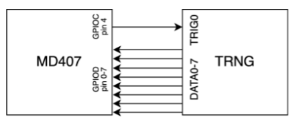
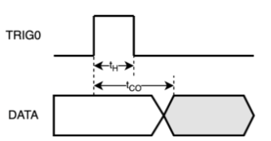
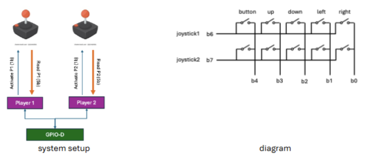

<style>
body {
    max-width: none !important;
}
h1 {
    background-color: #2c2c2c;
    color: #ffffff;
    padding: 0.4em 0.7em;
    border-radius: 4px;
}
td pre {
    padding: 0;
    margin: 0;
}
td pre code {
    padding: 0.3em 0.5em;
    white-space: pre;
}
td:has(pre) {
    padding: 0.2rem 0.3rem;
}
</style>


# Uppgift 1 (–2 … 4 p)

Följande deklarationer är givna som globala variabler i C:

```c
unsigned short a = 2;
unsigned char  b = 4;
short          c;
int            d[20];
```
---

**a)** Vilket av följande alternativ är en korrekt assemblerdeklaration av variablerna?
Om två eller fler alternativ är korrekta, välj det som använder **minst minne**.  (–1 … 2 p)

---


## Svarsalternativ


<table>
<tr>
<td>A</td><td>B</td><td>C</td><td>D</td>
</tr>
<tr>
<td>
```
.align 1
a: .hword 2
b: .byte 4
c: .space 2
.align 2
d: .space 80
```
</td>
<td>
```
.align 1
a: .space 2
b: .space 1
.align 1
c: .space 2
.align 2
d: .space 80
```
</td>
<td>
```
.align 1
a: .hword 2
b: .byte 4
.align 1
c: .space 2
.align 2
d: .space 20
```
</td>
<td>
```
.align 1
a: .hword 2
b: .byte 4
.align 1
c: .hword 2
.align 2
d: .space 80
```
</td>
</tr>

<tr>
<td>E</td><td>F</td><td>G</td><td>H</td>
</tr>
<tr>

<td>
```
.align 1
a: .hword 2
b: .byte 4
c: .hword 2
.align 2
d: .space 80
```
</td>

<td>
```
.align 1
a: .space 2
b: .space 1
c: .space 2
.align 2
d: .space 80
```
</td>

<td>
```
.align 1
a: .hword 2
b: .byte 4
.align 1
c: .space 2
.align 2
d: .space 80
```
</td>

<td>
```
.align 1
a: .space 2
b: .space 1
c: .hword 2
.align 2
d: .space 80
```
</td>
</tr>
</table>

<details><summary>Svar</summary>

**Svar: G**

- `a: .hword 2` deklarerar `unsigned short` (2 byte) med värdet 2 ✓
- `b: .byte 4` deklarerar `unsigned char` (1 byte) med värdet 4 ✓
- `.align 1` krävs innan `c` för att justera till 2-byte-gräns (nödvändigt efter den 1 byte stora `b`) ✓
- `c: .space 2` ger `short` (2 byte, nollinitieras vilket är korrekt för en global variabel) ✓
- `.align 2` och `d: .space 80` ger 4-byte-justerad `int[20]` (20 × 4 = 80 byte) ✓

Alternativ A saknar `.align 1` före `c` → `c` hamnar på en ojämn (feljusterad) adress.
Alternativ D initierar `c` till 2 med `.hword 2`, istället för 0.
Alternativ G är det enda korrekta alternativet (och minst minneskrävande bland korrekta).

</details>


---

Följande tilldelning skall göras:

```c
d[a + b] = c;
```

---

**b)** Vilket av följande alternativ är en korrekt implementation av tilldelningen i RISC-V assembler?  
(–1 … 2 p)

---

## Svarsalternativ

<table>
<tr>
<td>A</td><td>B</td><td>C</td><td>D</td>
</tr>
<tr>
<td>

```
la   t0, a
lhu  t0, 0(t0)
la   t1, b
lbu  t1, 0(t1)
add  t0, t0, t1
slli t0, t0, 2
la   t1, d
add  t0, t0, t1
la   t2, c
lh   t2, 0(t2)
sh   t2, 0(t0)
```

</td>
<td>

```
la   t0, a
lhu  t0, 0(t0)
la   t1, b
lbu  t1, 0(t1)
add  t0, t0, t1
slli t0, t0, 4
la   t1, d
add  t0, t0, t1
la   t2, c
lh   t2, 0(t2)
sw   t2, 0(t0)
```

</td>
<td>

```
la   t0, a
lhu  t0, 0(t0)
la   t1, b
lbu  t1, 0(t1)
add  t0, t0, t1
slli t0, t0, 2
la   t1, d
add  t0, t0, t1
la   t2, c
lh   t2, 0(t2)
sw   t2, 0(t0)
```

</td>
<td>

```
la   t0, a
lw   t0, 0(t0)
la   t1, b
lw   t1, 0(t1)
add  t0, t0, t1
slli t0, t0, 2
la   t1, d
add  t0, t0, t1
la   t2, c
lw   t2, 0(t2)
sw   t2, 0(t0)
```

</td>
</tr>

<tr>
<td>E</td><td>F</td><td>G</td><td>H</td>
</tr>
<tr>

<td>

```
la   t0, a
lhu  t0, 0(t0)
la   t1, b
lbu  t1, 0(t1)
add  t0, t0, t1
slli t0, t0, 2
la   t1, d
la   t2, c
lh   t2, 0(t2)
sw   t2, 0(t1)
```

</td>

<td>

```
la   t0, a
lhu  t0, 0(t0)
la   t1, b
lbu  t1, 0(t1)
add  t0, t0, t1
la   t1, d
add  t0, t0, t1
la   t2, c
lh   t2, 0(t2)
sw   t2, 0(t0)
```

</td>

<td>

```
la   t0, a
lhu  t0, 0(t0)
la   t1, b
lbu  t1, 0(t1)
add  t0, t0, t1
slli t0, t0, 2
la   t1, d
add  t0, t0, t1
la   t2, c
lhu  t2, 0(t2)
sw   t2, 0(t0)
```

</td>

<td>

```
la   t0, a
lhu  t0, 0(t0)
la   t1, b
lbu  t1, 0(t1)
add  t0, t0, t1
slli t0, t0, 2
la   t1, d
add  t0, t0, t1
la   t2, c
lh   t2, 0(t2)
sb   t2, 0(t0)
```

</td>
</tr>
</table>

<details><summary>Svar</summary>

**Svar: C**

- `lhu t0, 0(t0)` — laddar `a` (unsigned short) med nollutvidgning ✓
- `lbu t1, 0(t1)` — laddar `b` (unsigned char) med nollutvidgning ✓
- `slli t0, t0, 2` — multiplicerar index med 4 (sizeof(int)) ✓
- `lh t2, 0(t2)` — laddar `c` (signed short) med tecknutvidgning till 32 bit ✓
- `sw t2, 0(t0)` — lagrar 4 byte till `int`-arrayen `d` ✓

Alternativ A använder `sh` (lagrar bara 2 byte) istället för `sw` för en `int`-array → fel.
Alternativ G använder `lhu` (unsigned) för `c` som är en tecknad `short` → fel.
Alternativ C är korrekt.

</details>


---

# Uppgift 2 (–2 … 6 p)

**a)** Följande C-funktion skall översättas till assembler:

```c
int f(short a, short b) {
    for(int i = 0; i <= a; i++) {
        b = b + b;
    }
    return b;
}
```

Vilket av följande alternativ är en korrekt implementation?  (–1 … 3 p)

---

## Svarsalternativ

<table>
<tr>
<td>A</td><td>B</td><td>C</td><td>D</td>
</tr>
<tr>
<td>

```
f:
    li   t0, 0
l:
    bgt  t0, a0, r
    addi t0, t0, 1
    add  a1, a1, a1
    j    l
r:
    ret
```

</td>
<td>

```
f:
    li   t0, 0
l:
    bge  t0, a0, r
    addi t0, t0, 1
    add  a1, a1, a1
    j    l
r:
    mv   a0, a1
    ret
```

</td>
<td>

```
f:
    li   t0, 0
l:
    bgt  t0, a0, r
    addi t0, t0, 1
    add  a1, a1, a1
    j    l
r:
    mv   a0, a1
    ret
```

</td>
<td>

```
f:
    li   t0, 0
l:
    blt  t0, a0, r
    addi t0, t0, 1
    add  a1, a1, a1
    j    l
r:
    mv   a0, a1
    ret
```

</td>
</tr>

<tr>
<td>E</td><td>F</td><td>G</td><td>H</td>
</tr>
<tr>

<td>

```
f:
    li   t0, 0
l:
    bgtu t0, a0, r
    addi t0, t0, 1
    add  a1, a1, a1
    j    l
r:
    mv   a0, a1
    ret
```

</td>

<td>

```
f:
    li   t0, 0
l:
    bgt  t0, a0, r
    add  a1, a1, a1
    addi t0, t0, 1
    j    l
r:
    mv   a0, a1
    ret
```

</td>

<td>

```
f:
    li   t0, 0
l:
    ble  t0, a0, r
    addi t0, t0, 1
    add  a1, a1, a1
    j    l
r:
    mv   a0, a1
    ret
```

</td>

<td>

```
f:
    li   t0, 0
l:
    bgt  t0, a0, r
    addi t0, t0, 1
    add  a1, a1, a1
r:
    mv   a0, a1
    ret
```

</td>
</tr>
</table>

<details><summary>Svar</summary>

**Svar: C** (alternativt F – båda korrekta, samma antal instruktioner)

Loopondstillståndet `i <= a` i C-koden implementeras med `bgt t0, a0, r` (hoppa ut om `i > a`).
Returvärdet är `b` (i `a1`), som måste kopieras till `a0` med `mv a0, a1` innan `ret`.

- Alternativ A saknar `mv a0, a1` → returnerar fel värde.
- Alternativ B använder `bge` (hoppar ut om `i >= a`) → kör ett för få varv.
- Alternativ D använder `blt` (hoppar ut om `i < a`) → kör ett för många varv.
- Alternativ G använder `ble` (vilken är bakvänd – loopen körs aldrig) → fel.
- Alternativ H saknar `j l` → ingen loop.
- **C och F** är korrekta (ordningen increment/dubblering i loopkroppen spelar ingen roll).

</details>


---

**b)** Följande C-program skall översättas till assembler (RISC-V, RV32IMAC):

```c
int g(int a, int b, int c, int d);

int f(int a, int b, int c, int d) {
    return g(a, b, c, d) + g(d, b, c, a);
}
```

Vilket av följande alternativ är en korrekt implementation av funktionen `f`?  
(Om två eller fler är korrekta, välj den med minst instruktioner.)  
(–1 … 3 p)

---

## Svarsalternativ

<table>
<tr>
<td>A</td><td>B</td><td>C</td><td>D</td>
</tr>
<tr>
<td>

```
f:
    mv   t0, a0
    call g
    mv   a0, a3
    mv   a3, t0
    call g
    add  a0, a0, t1
    ret
```

</td>
<td>

```
f:
    addi sp, sp, -16
    sw   ra, 12(sp)
    mv   t0, a0
    call g
    mv   t1, a0
    mv   a0, a3
    mv   a3, t0
    call g
    add  a0, a0, t1
    lw   ra, 12(sp)
    addi sp, sp, 16
    ret
```

</td>
<td>

```
f:
    addi sp, sp, -16
    sw   s0, 8(sp)
    sw   ra, 12(sp)
    mv   s0, a0
    call g
    mv   a0, a3
    mv   a3, s0
    call g
    add  a0, a0, a1
    lw   s0, 8(sp)
    lw   ra, 12(sp)
    addi sp, sp, 16
    ret
```

</td>
<td>

```
f:
    addi sp, sp, -8
    sw   ra, 4(sp)
    mv   s0, a0
    call g
    mv   t0, a0
    mv   a0, a3
    mv   a3, s0
    call g
    add  a0, a0, t0
    lw   ra, 4(sp)
    addi sp, sp, 8
    ret
```

</td>
</tr>

<tr>
<td>E</td><td>F</td><td>G</td><td>H</td>
</tr>
<tr>

<td>

```
f:
    addi sp, sp, -16
    sw   ra, 12(sp)
    mv   t0, a0
    call g
    mv   t1, a0
    mv   a0, a3
    mv   a3, t0
    call g
    add  a0, a0, t1
    lw   ra, 12(sp)
    addi sp, sp, 16
    ret
```

</td>

<td>

```
f:
    mv   s0, a0
    call g
    mv   t0, a0
    mv   a0, a3
    mv   a3, s0
    call g
    add  a0, a0, t0
    ret
```

</td>

<td>

```
f:
    addi sp, sp, -16
    sw   s0, 8(sp)
    sw   ra, 12(sp)
    mv   s0, a0
    call g
    mv   t0, a0
    mv   a0, a3
    mv   a3, s0
    call g
    add  a0, a0, t0
    lw   s0, 8(sp)
    lw   ra, 12(sp)
    addi sp, sp, 16
    ret
```

</td>

<td>

```
f:
    addi sp, sp, -16
    sw   s0, 8(sp)
    sw   s1, 4(sp)
    sw   ra, 12(sp)
    mv   s0, a0
    call g
    mv   s1, a0
    mv   a0, a3
    mv   a3, s0
    call g
    add  a0, a0, s1
    lw   s0, 8(sp)
    lw   s1, 4(sp)
    lw   ra, 12(sp)
    addi sp, sp, 16
    ret
```
</td>
</tr>
</table>

<details><summary>Svar</summary>

**Svar: H**

Funktionen `f` anropar `g` två gånger. Inför det andra anropet måste:
1. Returvärdet från första `g`-anropet sparas (överlever nästa `call`) → måste ligga i ett **s-register** (callee-saved).
2. Originalt `a0` (= argument `a`) måste sparas för att skickas som `a3` i andra anropet → **s-register**.
3. `ra` måste sparas på stacken (funktionen anropar i sin tur andra funktioner).

Alternativ **G** använder `s0` för originalvärdet på `a0`, men sparar första resultatet i `t0` – som skrivs över av det andra `g`-anropet → **fel**.

Alternativ **H** använder `s0` för originalvärdet på `a0` och `s1` för första resultatet. Båda är callee-saved och överlever det andra anropet. Det är den enda lösning med korrekt registerhållning → **korrekt**.

Alternativ B/E använder `t0`/`t1` som överskrivs av `call g` → fel.

</details>


---

# Uppgift 3 (–1 … 6 p)

Funktionen `apply_bit_mask(v, m)` skall AND:a varje byte i en integer `v` med byten `m`.  
Den kallande funktionens värde på `v` skall uppdateras och funktionen skall returnera antalet ändrade bitar.

Exempel:  
Om masken `m = 0b00001111` appliceras på värdet  
`v = 0xFFFFFFFF`  
skall värdet på `v` efter funktionsanropet vara `0x0F0F0F0F`,  
och funktionen skall returnera att 16 bitar ändrats.

Ni får anta att det finns en funktion som returnerar hur många bitar som skiljer sig mellan två integers:

```c
int count_bit_diff (int a, int b);
```

Välj den kod som korrekt implementerar det beskrivna beteendet.

---

## Svarsalternativ

<table>
<tr>
<td>A</td><td>B</td>
</tr>
<tr>
<td>

```c
int apply_bit_mask(int *v, char m){
    int orig_v = *v;
    int *cptr = v;
    for (int i = 0; i < 4; i++){
        *cptr = *cptr & m;
        cptr++;
    }
    return count_bit_diff(orig_v, *v);
}

void main(void){
    int val = 0xAABBCCEE;
    char m = 0b00001111;
    int n_upd = apply_bit_mask(&val, m);
}
```

</td>
<td>

```c
int apply_bit_mask(int v, char m){
    int orig_v = v;
    int *cptr = &v;
    for (int i = 0; i < 4; i++){
        cptr = cptr & m;
        cptr++;
    }
    return count_bit_diff(orig_v, v);
}

void main(void){
    int val = 0xAABBCCEE;
    char m = 0b00001111;
    int n_upd = apply_bit_mask(val, m);
}
```

</td>
</tr>

<tr>
<td>C</td><td>D</td>
</tr>
<tr>
<td>

```c
int apply_bit_mask(int *v, char m){
    int orig_v = *v;
    char *cptr = (char*)v;
    for (int i = 0; i < 4; i++){
        *(cptr + i) &= m;
    }
    return count_bit_diff(orig_v, *v);
}

void main(void){
    int val = 0xAABBCCEE;
    char m = 0b00001111;
    int n_upd = apply_bit_mask(&val, m);
}
```

</td>
<td>

```c
int apply_bit_mask(int v, char *m){
    int orig_v = v;
    char *cptr = &v;
    for (int i = 0; i < 4; i++){
        *cptr = *cptr & *m;
        cptr += 8;
    }
    return count_bit_diff(orig_v, v);
}

void main(void){
    int val = 0xAABBCCEE;
    char m = 0b00001111;
    int n_upd = apply_bit_mask(val, &m);
}
```

</td>
</tr>

<tr>
<td>E</td><td>F</td>
</tr>
<tr>
<td>

```c
int apply_bit_mask(int *v, char m){
    int orig_v = *v;
    int *cptr = (char*)v;
    for (int i = 0; i < 4; i++){
        *cptr = *cptr & m;
        cptr += 8;
    }
    return count_bit_diff(orig_v, *v);
}

void main(void){
    int val = 0xAABBCCEE;
    char m = 0b00001111;
    int n_upd = apply_bit_mask(&val, m);
}
```

</td>
<td>

```c
int apply_bit_mask(int v, char m){
    int orig_v = v;
    int *cptr = &v;
    for (int i = 0; i < 4; i++){
        *cptr = *cptr & m;
        cptr++;
    }
    return count_bit_diff(orig_v, v);
}

void main(void){
    int val = 0xAABBCCEE;
    char m = 0b00001111;
    int n_upd = apply_bit_mask(val, m);
}
```

</td>
</tr>
</table>

<details><summary>Svar</summary>

**Svar: C**

- Parametern `v` måste vara `int *` (pekare) för att kunna modifiera originalet ✓
- `char *cptr = (char*)v` tolkar heltalet byte för byte ✓
- `*(cptr + i) &= m` AND:ar varje byte med masken ✓
- `count_bit_diff(orig_v, *v)` returnerar antal ändrade bitar ✓
- Anropas med `&val` ✓

Alternativ A använder `int *cptr` och ökar med 4 byte per iteration → går utanför variabeln.
Alternativ B tar `v` som värde, inte pekare → kan inte modifiera originalet.
Alternativ C är korrekt.

</details>


---

# Uppgift 4 (10 p)

En 8-bitars slumpgeneratormodul (TRNG) är kopplad till GPIO-port C och D på en CH32V307 enligt följande skiss.


<figure>
  
</figure>

Vid positiv flank på ingången TRIG0 genererar TRNG-modulen ett 8-bitars slumpmässigt tal som läggs ut på dess utgångar DATA0-7. Modulen opererar enligt följande tidskrav:

<figure>
  
</figure>


tH  = 23 mikrosekunder (kortaste tid som TRIG0 måste vara '1')  
tCO = 31 mikrosekunder (längsta tid från positiv flank på TRIG0 tills det slumpmässiga talet har genererats)

---

**a)** Skriv en funktion `delay_1us()` som med hjälp av SysTick åstadkommer en blockerande delay på 1 mikrosekund.

För full poäng skall du definiera och använda makrodefinitioner för SysTick-registren.

Antag att systemklockan är **144 MHz**.  
(4 p)

<details><summary>Svar</summary>

Vid 144 MHz ger 1 µs exakt 144 klockcykler. SysTick räknar uppåt och sätter `CNTIF` i `STK_SR` när räknaren når jämförelsevärdet `STK_CMPLR`.

```c
#define STK_CTLR  (*(volatile unsigned int*)0xE000F000)
#define STK_SR    (*(volatile unsigned int*)0xE000F004)
#define STK_CNTL  (*(volatile unsigned int*)0xE000F008)
#define STK_CMPLR (*(volatile unsigned int*)0xE000F010)

void delay_1us(void) {
    STK_SR    = 0;      /* Nollställ CNTIF-flaggan          */
    STK_CNTL  = 0;      /* Nollställ räknaren               */
    STK_CMPLR = 143;    /* 144 cykler - 1 = 143             */
    /* INIT=1(bit5), STCLK=1(bit2), STE=1(bit0) = 0b100101 = 0x25 */
    STK_CTLR  = 0x25;
    while (!(STK_SR & 1)); /* Vänta tills CNTIF sätts       */
    STK_CTLR  = 0;      /* Stäng av timern                  */
}
```

STK_CTLR-bitarna: STE=1 (aktivera), STCLK=1 (använd HCLK = 144 MHz), INIT=1 (nollställ räknaren vid start), MODE=0 (räkna uppåt), STRE=0 (ingen auto-reload), STIE=0 (inget avbrott).

</details>

---

**b)** Skriv en funktion `get_random_char()` som triggar slumpgeneratorn och därefter läser och returnerar det slumpmässiga talet.

Funktionen måste ta hänsyn till tidskraven ovan.

Följande makrodefinitioner är givna:

```c
#define GPIOC_OUTDR  (*(volatile unsigned int*)0x4001100C)
#define GPIOD_INDR   (*(volatile unsigned int*)0x40011408)
```

Antag:

- TRIG0 är kopplad till bit 4 på GPIOC
- DATA0–7 är kopplade till bit 0–7 på GPIOD
- Port C och D är korrekt konfigurerade som utgång respektive ingång
- Du får använda `delay_1us()` från a)
- Du får definiera ytterligare delay-funktioner om du vill (ej krav)

GPIO Port C används även för att trigga andra enheter, på andra pinnar, och du får inte påverka någon av dem.  
(4 p)

<details><summary>Svar</summary>

tH = 23 µs (TRIG0 måste vara hög minst 23 µs). tCO = 31 µs (data klart senast 31 µs efter positiv flank).

Strategi: sätt TRIG0 hög → vänta tH → sätt TRIG0 låg → vänta återstående tid (tCO − tH = 8 µs) → läs data.

```c
unsigned char get_random_char(void) {
    /* Sätt bit 4 hög, påverka ej övriga pinnar */
    GPIOC_OUTDR |= (1 << 4);

    /* Vänta minst tH = 23 µs */
    for (int i = 0; i < 23; i++) delay_1us();

    /* Sänk TRIG0 */
    GPIOC_OUTDR &= ~(1 << 4);

    /* Vänta tCO - tH = 31 - 23 = 8 µs till (data garanterat klart) */
    for (int i = 0; i < 8; i++) delay_1us();

    /* Läs DATA0-7 från bit 0-7 på GPIOD */
    return (unsigned char)(GPIOD_INDR & 0xFF);
}
```

`|=` och `&= ~` används för att inte störa övriga pinnar på Port C.

</details>

---

**c)** Antag att CH32V307 är kopplad till två knappar:

- En blå knapp (på PD0)
- En röd knapp (på PE1)

Interrupt-prioriteterna är konfigurerade i PFIC_IPRIOR-registren, och den röda knappen har högre prioritet än den blå.

1. Vad händer om någon trycker på den blå knappen medan den röda knappens interrupthanterare körs? (1 p)

2. Vad händer om någon trycker på den röda knappen medan den blå knappens interrupthanterare körs? (1 p)

<details><summary>Svar</summary>

1. **Blå knapp trycks under röd knapps interrupthanterare:**  
   Den blå knappen har lägre prioritet än den röda. Den röda hanteraren körs utan att avbrytas. Det blå avbrottet markeras som *pending* i PFIC och körs **efter** att den röda hanteraren avslutas med `mret`.

2. **Röd knapp trycks under blå knapps interrupthanterare:**  
   Den röda knappen har högre prioritet. Processorn avbryter (preemptar) den blå hanteraren, sparar tillståndet och hoppar till den röda knapprens hanterare. När den röda hanteraren avslutas med `mret` återupptas den blå hanteraren från den punkt där den avbröts.

</details>

---


---

# Uppgift 5 (12 p)

Vi vill använda CH32V307 som kärnan för en spelkonsol.  
Vi vill stödja två spelare, som båda har en inmatningsenhet (joystick) som kan flyttas upp, ner, vänster och höger, och som har en extra tryckknapp.

<figure>
  
</figure>

Systemet är kopplat till GPIO Port D.

Följande datatyper är givna:

```c
typedef enum {on, off} type_button;
typedef enum {none, up, down, left, right} type_move;

typedef struct {
    type_move move;
    type_button button;
} type_player_input;

typedef struct {
    int x;
    int y;
} type_player_position;
```

Implementera ditt program i C och följ stegen nedan:

---

**a)** Definiera en struct som representerar en GPIO-port enligt CH32V307:s registerlayout.
Visa sedan hur man refererar till CFGLR-registret i Port D med hjälp av denna struct. (2 p)

Om du väljer att inte göra uppgift a) måste du visa korrekta makrodefinitioner för de register du använder i följande uppgifter.

<details><summary>Svar</summary>

CH32V307 GPIO-registerlayout (offset från basadress):

| Offset | Register |
|--------|----------|
| 0x00   | CFGLR    |
| 0x04   | CFGHR    |
| 0x08   | INDR     |
| 0x0C   | OUTDR    |
| 0x10   | BSHR     |
| 0x14   | BCR      |
| 0x18   | LCKR     |

```c
typedef struct {
    volatile unsigned int CFGLR;
    volatile unsigned int CFGHR;
    volatile unsigned int INDR;
    volatile unsigned int OUTDR;
    volatile unsigned int BSHR;
    volatile unsigned int BCR;
    volatile unsigned int LCKR;
} GPIO_t;

#define GPIOD ((GPIO_t *)0x40011400)
```

Referens till CFGLR i Port D: `GPIOD->CFGLR`

</details>

---

**b)** Skriv en funktion

```c
void init_port(void);
```

där du gör de initialiseringar som behövs för att Port D skall fungera enligt beskrivningen ovan.

Antag:

- Ingångsstift skall konfigureras som **input pull-up**
- Utgångsstift skall konfigureras som **open-drain**
- Endast relevanta bitar i porten får påverkas

(2 p)

<details><summary>Svar</summary>

Från kopplingsschemat:
- **b0–b4**: delade ingångar (right=b0, left=b1, down=b2, up=b3, button=b4) → **input pull-up**
- **b5**: ej använd, påverkas ej
- **b6**: radvalsutgång för joystick 1 → **open-drain output**
- **b7**: radvalsutgång för joystick 2 → **open-drain output**

Konfigurationsvärden per pinne i CFGLR (CNF[3:2], MODE[1:0]):
- Input pull-up:   CNF=`10`, MODE=`00` → `0x8`
- Open-drain 2MHz: CNF=`01`, MODE=`10` → `0x6`

CFGLR-bitar: [3:0]=pin0, [7:4]=pin1, …, [31:28]=pin7.

```c
void init_port(void) {
    /* Mask: ändra pinnar 0–4 (bits 19:0) och 6–7 (bits 31:24),
       lämna pin 5 (bits 23:20) orörd */
    GPIOD->CFGLR = (GPIOD->CFGLR & 0x00F00000)
                 | 0x66088888;
    /*   bits[31:28] = 0x6 (pin7, open-drain)
         bits[27:24] = 0x6 (pin6, open-drain)
         bits[23:20] = behålls från original
         bits[19:16] = 0x8 (pin4, input pull-up)
         bits[15:12] = 0x8 (pin3)
         bits[11:8]  = 0x8 (pin2)
         bits[7:4]   = 0x8 (pin1)
         bits[3:0]   = 0x8 (pin0)  */

    /* Aktivera pull-up för ingångarna (b0–b4): sätt ODR-bitar till 1 */
    GPIOD->OUTDR |= 0x1F;

    /* Sätt radvalsutgångarna inaktiva (höga = öppen, ingen rad vald) */
    GPIOD->OUTDR |= (1 << 6) | (1 << 7);
}
```

</details>

---

**c)** Skriv en funktion

```c
int read_player_input(int pnum, type_player_input *pinput);
```

som läser av den joystick som anges av parametern `pnum` (1 eller 2) och sparar resultatet i strukturen `pinput`.

Funktionen skall returnera:

- 1 om någon signal från joysticken är aktiv
- 0 annars

(4 p)

<details><summary>Svar</summary>

Det är ett matrisupplägg: b6/b7 väljer rad (active-low), b0–b4 är delade kolumningångar (active-low med pull-up).

För att läsa spelare `pnum`: aktivera dess rad genom att dra b6 (P1) eller b7 (P2) låg, avaktivera den andra, läs sedan b0–b4.

```c
int read_player_input(int pnum, type_player_input *pinput) {
    /* Aktivera rätt rad (active-low), avaktivera den andra */
    if (pnum == 1) {
        GPIOD->OUTDR &= ~(1 << 6);   /* b6 låg  → joystick 1 aktiv  */
        GPIOD->OUTDR |=  (1 << 7);   /* b7 hög  → joystick 2 inaktiv */
    } else {
        GPIOD->OUTDR &= ~(1 << 7);   /* b7 låg  → joystick 2 aktiv  */
        GPIOD->OUTDR |=  (1 << 6);   /* b6 hög  → joystick 1 inaktiv */
    }

    unsigned int indr = GPIOD->INDR;

    /* Avaktivera båda rader efter läsning */
    GPIOD->OUTDR |= (1 << 6) | (1 << 7);

    /* Active-low: 0 = tryckt/aktiv */
    type_move move = none;
    if      (!(indr & (1 << 3))) move = up;
    else if (!(indr & (1 << 2))) move = down;
    else if (!(indr & (1 << 1))) move = left;
    else if (!(indr & (1 << 0))) move = right;

    type_button button = (indr & (1 << 4)) ? off : on;

    pinput->move   = move;
    pinput->button = button;

    return (move != none || button == on) ? 1 : 0;
}
```

</details>

---

**d)** Skriv en funktion

```c
void update_player_position(type_player_input *pinput,
                            type_player_position *player);
```

som tar in en struktur med spelarens input och använder den för att uppdatera spelarens position.

Varje gång en riktningssignal (up/down/left/right) är aktiv skall respektive koordinat ökas eller minskas med 1.

(1 p)

<details><summary>Svar</summary>

```c
void update_player_position(type_player_input *pinput,
                            type_player_position *player) {
    if (pinput->move == up)    player->y++;
    if (pinput->move == down)  player->y--;
    if (pinput->move == left)  player->x--;
    if (pinput->move == right) player->x++;
}
```

</details>

---

---

**e)** Skriv en huvudfunktion

```c
int main(void);
```

som:

1. Initierar alla nödvändiga variabler
2. Anropar `init_port()`
3. I en evig loop:
   - Läser av båda joysticks med `read_player_input()`
   - Uppdaterar de två spelarnas positioner med `update_player_position()`

Krav:

- De initiala positionsvärdena skall vara `{0, 0}`
- De initiala ingångsvärdena skall vara `{none, off}`
- Alla variabler som deklareras skall initieras

(2 p)

<details><summary>Svar</summary>

```c
int main(void) {
    type_player_position pos1   = {0, 0};
    type_player_position pos2   = {0, 0};
    type_player_input    input1 = {none, off};
    type_player_input    input2 = {none, off};

    init_port();

    while (1) {
        read_player_input(1, &input1);
        read_player_input(2, &input2);
        update_player_position(&input1, &pos1);
        update_player_position(&input2, &pos2);
    }
    return 0;
}
```

</details>

---

**f)** Spelkonsollen är också kopplad till en TV och chefen vill att anrop till `printf` skall skrivas ut på TV:n.

Vilket bibliotek behöver ändras för att detta skall fungera?

Alternativ:

- C standardbiblioteket  
- Runtimebiblioteket  
- Kompilatorbiblioteket  
- Endast användarbiblioteket  

Motivera kort ditt svar.  
(1 p)

<details><summary>Svar</summary>

**C standardbiblioteket.**

`printf` är definierad i C-standardbiblioteket (t.ex. newlib/newlib-nano). Internt anropar `printf` till slut en lågnivåfunktion `_write()` (en s.k. *syscall stub*) som skickar tecken till en utdataenhet. På en inbyggd plattform utan operativsystem måste man tillhandahålla en egen implementation av `_write()` – detta kallas *retargeting*. Det är alltså C-standardbibliotekets I/O-lager som behöver anpassas för att omdirigera utdata till TV:n.

Runtimebiblioteket hanterar uppstart/nedstängning, kompilatorbiblioteket intrinsics och matematikoperationer – ingen av dem hanterar `printf`-utdata.

</details>

---

# Uppgift 6 (12 p)

Betrakta nedanstående koppling, där en CH32V307 har kopplats till en saxlyft. Saxlyften kan
flyttas upp, flyttas ner och stoppas, från programvara som körs på CH32V307-kortet, med funktionerna
`move_up()`, `move_down()` och `stop()`. Du kan anta att dessa funktioner redan är
implementerade.

```
        ┌──────┐
PD14 ──►│      │
        │CH32V307│──── kontrollkommandon ──► saxlyft
PD15 ──►│      │
        └──────┘
```

Två fjäderbelastade knappar UP och DOWN är anslutna till stiften PD14 respektive PD15 på
CH32V307-kortet. När respektive knapp trycks in ställs det anslutna stiftet till '1'. När knappen inte är
nedtryckt är signalen flytande. Målet med denna uppgift är att konfigurera avbrott för stift PD14
respektive PD15, så att avbrott genereras när knapparna trycks ned eller släpps upp.

Antag att ingen av knapparna är nedtryckt och att saxlyften inte rör sig när programmet startar.
Avbrottshanteraren skall anropa `move_up()` funktionen om UP-knappen trycks ned och DOWN-knappen
ej är nedtryckt. På samma sätt skall avbrottshanteraren anropa `move_down()` funktionen
om DOWN-knappen trycks ned och UP-knappen ej är nedtryckt. Saxlyften får inte röra sig när båda
knapparna är nedtryckta, eller när ingen av knapparna är nedtryckta. Avbrottshanteraren skall anropa
`stop()` funktionen för att stoppa saxlyftens rörelse.

För resten av denna uppgift kan du anta att korrekt typkonverterade makrodefinitioner för pekare till
alla register för GPIO, AFIO, EXTI och PFIC-moduler redan är givna med namnkonventioner
enligt QuickGuide.

**a)** Pinnarna PD14 och PD15 skall ställas in som ingångar med pull-down motstånd. Visa hur
detta kan uppnås, med hjälp av makrodefinitionerna, utan att påverka inställningarna för de
andra stiften. (2p)

<details><summary>Svar</summary>

PD14 och PD15 konfigureras i `GPIOD_CFGHR` (pinnar 8–15). Varje pinne tar 4 bitar:
- Input pull-up/pull-down: CNF=`10`, MODE=`00` → `0x8` per pinne
- Sätt ODR-biten till 0 → aktiverar pull-**down**

Pin 14 sitter i bits [27:24], pin 15 i bits [31:28] av CFGHR.

```c
/* Konfigurera PD14 och PD15 som input pull-down, lämna övriga orörda */
GPIOD_CFGHR = (GPIOD_CFGHR & ~0xFF000000)
            | 0x88000000;      /* 0x8 för pin15, 0x8 för pin14 */

/* ODR-bitar 14 och 15 = 0 → pull-down */
GPIOD_OUTDR &= ~((1 << 14) | (1 << 15));
```

</details>

---

**b)** Visa hur AFIO konfigureras så att PD14 och PD15 kopplas till EXTI-modulen i CH32V307.
Tänk på att bara PD14 och PD15 ska konfigureras och att övriga EXTI-linor inte skall
påverkas. (2p)

<details><summary>Svar</summary>

AFIO_EXTICR4 (offset 0x14 från AFIO-bas 0x40010000) väljer vilken port som driver EXTI12–15.
Varje linje tar 4 bitar, Port D = `0x3`.

- EXTI14 → bits [11:8] = `0x3`
- EXTI15 → bits [15:12] = `0x3`

```c
/* Koppla EXTI14 och EXTI15 till Port D, lämna EXTI12/13 orörda */
AFIO_EXTICR4 = (AFIO_EXTICR4 & ~0x0000FF00)
             | (0x3 << 8)    /* EXTI14 → Port D */
             | (0x3 << 12);  /* EXTI15 → Port D */
```

</details>

---

**c)** Visa hur EXTI och PFIC konfigureras så att avbrott genereras på både positiv och negativ
flank för de två pinnarna. (3p)

<details><summary>Svar</summary>

**EXTI-konfiguration** (bas 0x40010400):

- `EXTI_INTENR`: aktivera avbrottsmask för linje 14 och 15
- `EXTI_RTENR`: aktivera stigande flank
- `EXTI_FTENR`: aktivera fallande flank

```c
EXTI_INTENR |= (1 << 14) | (1 << 15);  /* Aktivera interrupt-mask         */
EXTI_RTENR  |= (1 << 14) | (1 << 15);  /* Trigga på positiv (stigande) flank */
EXTI_FTENR  |= (1 << 14) | (1 << 15);  /* Trigga på negativ (fallande) flank */
```

**PFIC-konfiguration** (bas 0xE000E000):

PD14/PD15 delar IRQ-nummer **56** (EXTI15_10, se vektortabellen).
IRQ 56 → PFIC_IENR2 (täcker IRQ 32–63), bit 56 − 32 = **24**.

```c
PFIC_IENR2 |= (1 << 24);  /* Aktivera IRQ 56 (EXTI15_10) i PFIC */
```

</details>

---

**d)** Implementera avbrottshanteraren `void at_irq(void)` så att saxlyften kontrolleras som
beskrivet ovan. (3p)

<details><summary>Svar</summary>

```c
void at_irq(void) {
    /* Läs av PD14 (UP) och PD15 (DOWN) */
    int up   = (GPIOD_INDR >> 14) & 1;
    int down = (GPIOD_INDR >> 15) & 1;

    if (up && !down) {
        move_up();
    } else if (down && !up) {
        move_down();
    } else {
        /* Båda nedtryckta eller ingen nedtryckt */
        stop();
    }

    /* Kvittera avbrottet (skriv 1 för att nollställa flaggan) */
    EXTI_INTFR = (1 << 14) | (1 << 15);
}
```

</details>

---

**e)** Nedanstående assemblyfil är given. Visa hur avbrottsvektorn för `at_irq` initieras i
vektortabellen, och hur `mtvec` ställs in, under antagandet att systemet använder
**vektorat läge (mode 01)**. (1p)

```asm
.extern at_irq

.section .data
vector_table:
    # fyll i här

.section .text
init_interrupts:
    # fyll i här
    ret
```

<details><summary>Svar</summary>

I vektorat läge (mode 01) hoppar processorn till `mtvec_BASE + 4 × cause` vid ett avbrott.
EXTI15_10 har IRQ-nummer 56, så hopp-instruktionen placeras på offset `56 × 4 = 0xE0` från `vector_table`.

`mtvec` ställs in på adressen till `vector_table` med de två lägsta bitarna satta till `01`.

```asm
.extern at_irq

.section .data
vector_table:
    .org vector_table + 56 * 4   # Hoppa till rätt plats för IRQ 56 (EXTI15_10)
    j    at_irq

.section .text
init_interrupts:
    la   t0, vector_table
    ori  t0, t0, 1               # Sätt mode = 01 (vektorat läge)
    csrw mtvec, t0
    ret
```

</details>

---

**f)** För att spara pengar skulle man vilja att signalerna från UP och DOWN knappen gick över en
enda ledning, men man har hittills inte kommit på hur man skall kunna synkronisera
kommunikationen. Nämn ett av de protokoll vi pratat om i kursen som kan användas för
seriekommunikation utan klocksignal. (1p)

<details><summary>Svar</summary>

**UART** (Universal Asynchronous Receiver/Transmitter) — asynkron kommunikation
där sändare och mottagare är överens om baudrate i förväg. Ingen separat klocklinje behövs.

</details>

---
