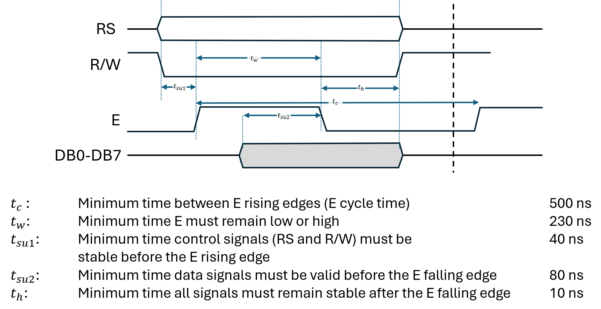
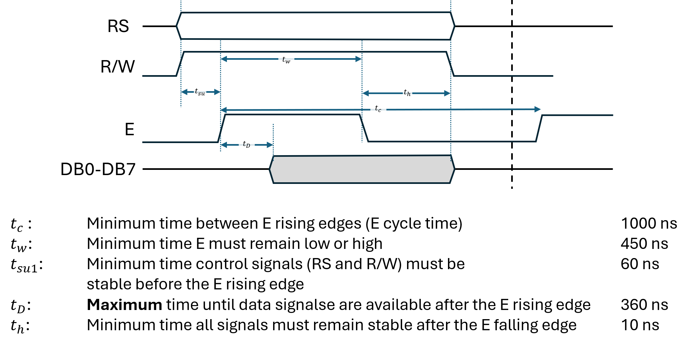

# ASCII Display
The PTB-111 development board is equipped with a 2-row LCD display. This page is a summary of how to communicate with it. 
The LCD display has three control signals, and 8 data signals: 

| Signal | Description | Pin |
|--------|-------------|-----|
|**Register Select (RS)** | This signal is used to tell the display whether it’s a command or data that we are sending/receiving. | 0 |
|**Read/Write (R/W)** | This signal is used to tell the display whether we want to send data to it, or receive data from it.| 1 |
|**Enable (E)**| This signal is used to synchronize communication with the display| 2 |
|**Data Lines (DB0-DB7)**| These 8 lines contain the command or data that we want to send (one byte).| 8-15 |

On the PTB-111, the control signals are connected to the first three pins of an 8-bit port that is in turn connected to the upper or lower byte of on of the GPIO ports on the MD307 with a gray flat cable. The data lines are connected to another port. For instance, control signals might be connected to `PE[0..2]` and data lines to `PE[8..15]`.

## Writing a command or data to the display
Before any command or data is written to the display, you must first ensure that the display is not busy with a previous command. This is done by reading the status bit, as explained in the next section. 

Whether you are writing a command or a character to the display, you must follow the procedure and timings specified in the diagram for a write cycle, below: 

The possible commands (RS = 0, R/W = 0) are given in this table: 

| Command       | D7 | D6 | D5 | D4 | D3 | D2 | D1 | D0 | Desacription | 
|---------------|----|----|----|----|----|----|----|----|--------------|
| Clear display | 0  | 0  | 0  | 0  | 0  | 0  | 0  | 1  | Clears the display | 
| Return Home   | 0  | 0  | 0  | 0  | 0  | 0  | 1  | -  | Reset cursor | 
| Entry mode set | 0  | 0  | 0  | 0  | 0  | 1  | ID  | SH | ID: Cursor dir  (0 left, 1 right) | 
|                |    |    |    |    |    |    |     |    | SH: Shift (0 off, 1 on) |
| Display control | 0  | 0  | 0  | 0  | 1  | D  | C  | B  | Display(D), Cursor(C), Blink(B) (0 off, 1 on) | 
| Function set | 0  | 0  | 1  | 1  | N  | F  | -  | -  | N = number of rows - 1 | 
|                |    |    |    |    |    |    |     |    | F: Character Size  (0: 5x8, 1: 5x11) |
| Set address  | 1  | A6 | A5 | A4 | A3 | A2 | A1 | A0 | Set address for next character | 

When writing data (a character) to the device (RS = 1, R/W = 0), the data bits contain the character to write in ASCII code. 

## Reading status or data from the display
When reading the display status (busy flag and current address), or data in display memory, you must follow the procedure and timings specified in the diagram for a read cycle, below: 

When reading status (RS = 0, R/W = 1), `D8` is the Busy Flag. Remaining data bits are the current address. 

When reading data (RS = 1, R/W = 1), the data bits are the character read at the current address. 